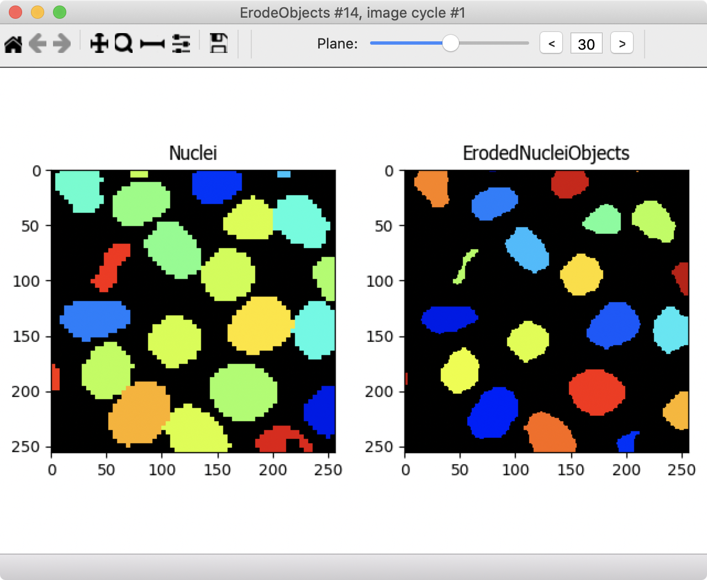
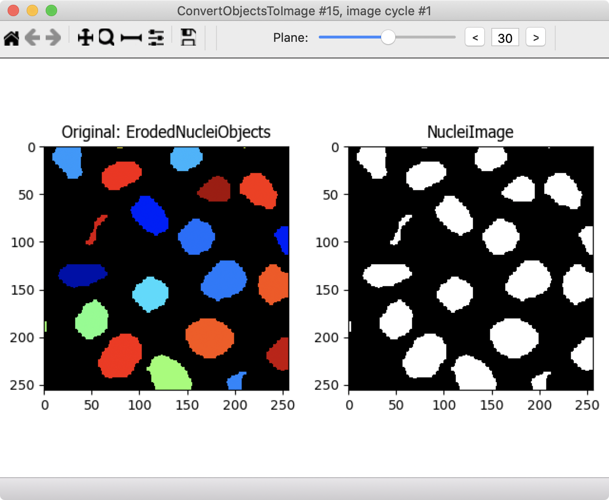
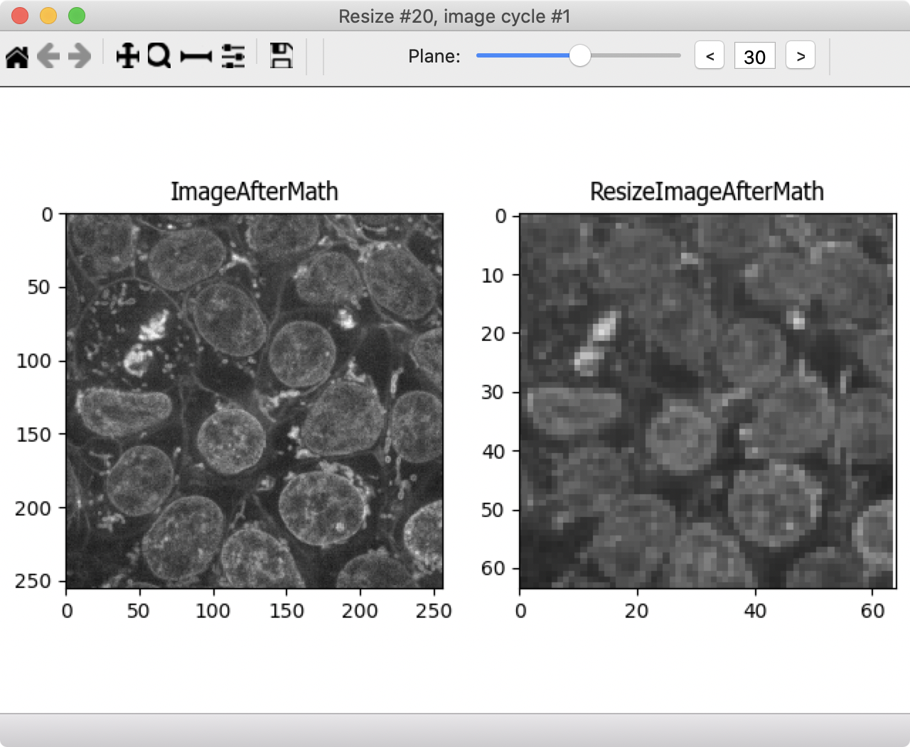
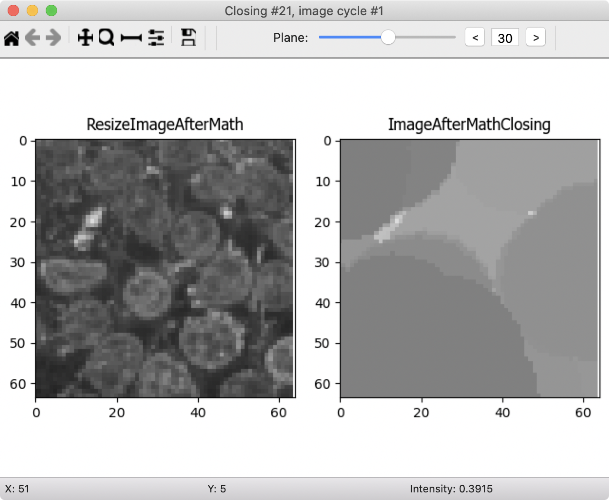
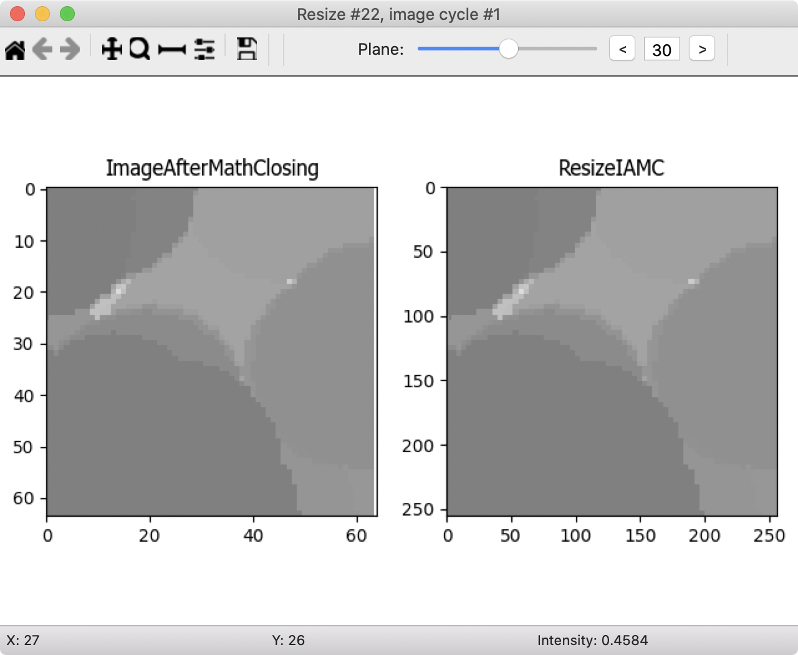
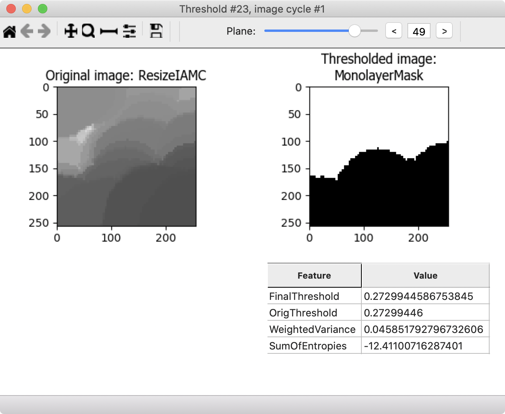
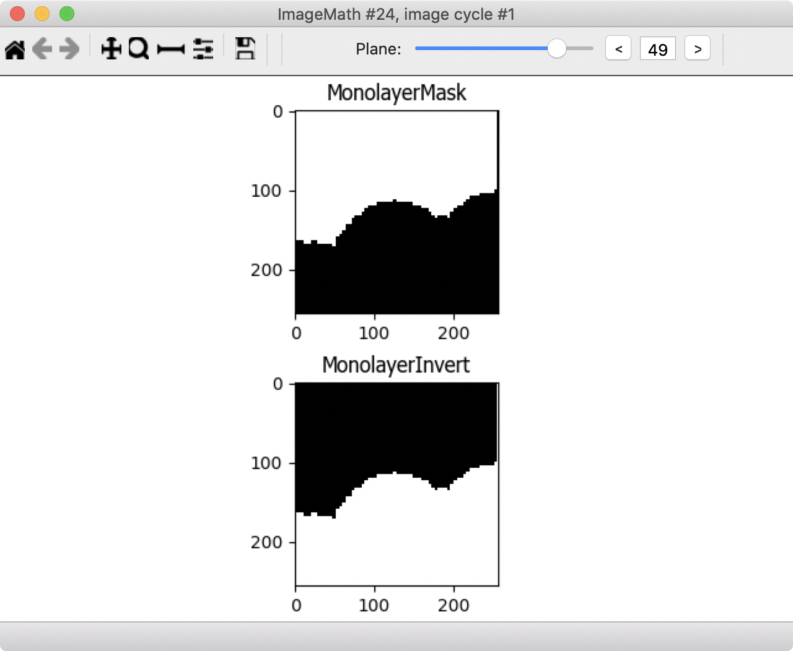
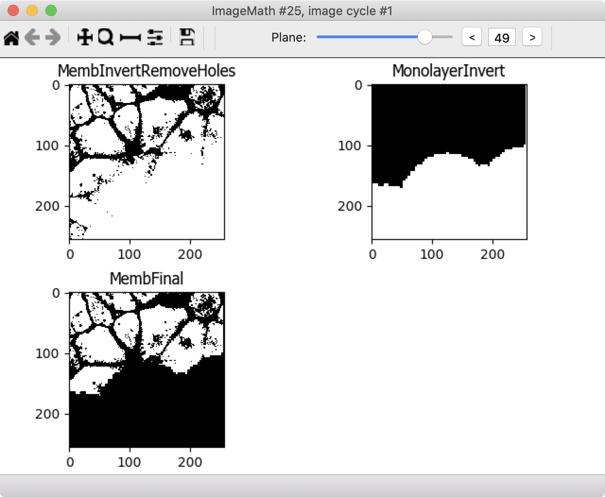
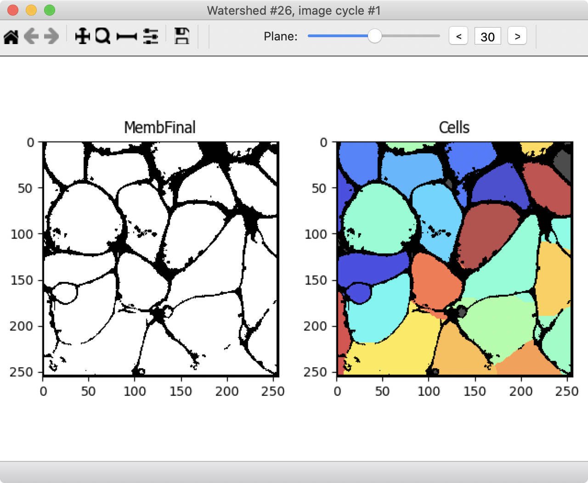
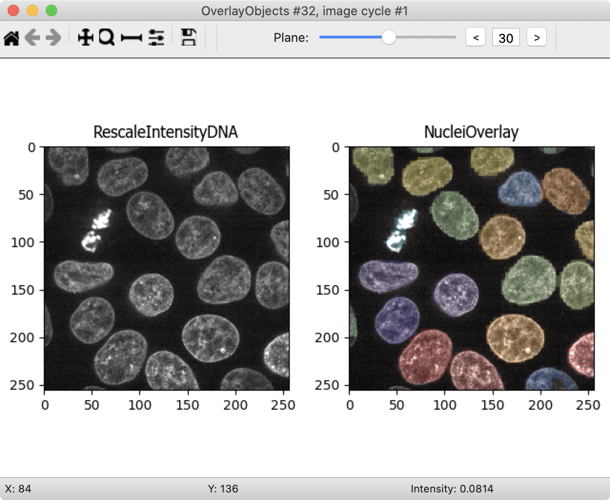

# CellProfiler Tutorial: 3d monolayer

# Organizing and importing images

## Z-stacks as TIFFs

* This tutorial features images of human induced pluripotent stem cells from the Allen Institute of Cell Science. More details are available at the following link: [https://bbbc.broadinstitute.org/BBBC034](https://bbbc.broadinstitute.org/BBBC034).  
* CellProfiler 3D currently only works with TIFF files. TIFF files can be rather complicated, having hyper-stack structures with all channels and z-planes in a single file. The acceptable CellProfiler format for storing z-stacks is to have a separate TIFF file for each channel.
* ImageJ or FIJI can be used to create TIFF stacks. Scripting can be used to create TIFF stacks.
* Note that this tutorial is an advanced tutorial. We recommend completing the Translocation tutorial in order to learn principles of image thresholding and segmentation prior to starting this tutorial.
* Helpful video tutorials are available on the Center for Open Bioimage Analysis YouTube page at [https://www.youtube.com/channel/UC_id9sE-vu_i30Bd-skay7Q](https://www.youtube.com/channel/UC_id9sE-vu_i30Bd-skay7Q). 

## Importing data in CellProfiler

1. Highlight the Images module.
1. Drag-and-drop the images you will analyze into the Images module window.
1. Highlight the Metadata module.
1. Enter the following regular expression `^(?P<Plate>.*)_xy(?P<Site>[0-9])_ch(?P<ChannelNumber>[0-9])`. This regular expression will parse the filenames and organize the data.
1. Highlight the NamesAndTypes module.
1. Assign a name to "Images matching rules".
1. Choose “Process as 3D”
1. Populate the fields for "Relative Pixel Spacing".
   * Fiji > Image > Show Info… (Ctrl + I)
   * Search for something like “Voxel size” or record this metadata when collecting own images
   * The actual units do not matter, rather their relative proportion. The numbers are unitless and therefore the decimal place does not matter.
1. Create "rule criteria" to identify an image by its color/channel. For example, using the Metadata you just extracted - `Metadata -> Does -> Have ChannelNumber matching -> 0` would match the first image.
1. Give the images "variable names" that describe the contents in the image. For example, use the name *dna* or *dapi* to describe an image stained with DAPI.
1. Add images with rulesets for the other channels in the experiment. In this case, Channel 0 contains images of the plasma membrane, Channel 1 contains images of mitochondria, and Channel 2 contain images of DNA.

# Find objects: nuclei

## Image preparation

Before attempting to segment the cells in the images, conditioning the images with filters and various image processing methods will improve the results.

1. Add a **RescaleIntensity** module for each channel. It is a good practice to rescale images when processing them in CellProfiler. This standardizes the input in a way that makes processing images more reproducible and suppresses experimental variation and batch effects in cases where those are significant. A RescaleIntensity module is needed for each channel, so there should be three of them.
    

1. Add a **Resize** module. Processing 3D images requires much more computation time than 2D images. Often, downsampling an image can yield large performance gains and at the same time smooth an image to remove noise. Final segmentation results will be minimally affected by downsampling if the objects of interest are relatively large compared to the pixel size. Choose a value of *0.5*.
    

1. Add a **MedianFilter** module. A median filter will homogenize the signal within the nucleus and reduce noise in the background. DNA is not uniformly distributed throughout the nucleus, which can lead to holes forming in the downstream object identification. A median filter will preserve boundaries better than other smoothing filters such as the Gaussian filter. Choose a filter size of *5*. This number was chosen empirically: it is smaller than the diameter of a typical nucleus; it is small enough that nuclei aren't merged together, yet large enough to suppress over-segmentation of the nuclei.
    

## Segmentation

1. Add an **Threshold** module. This will separate the foreground (nuclei) from the background. Emprically, we've found that a two-class Otsu threshold works well for this data. We encourage you to try other thresholding methods to compare the outputs.
    

1. Add a **RemoveHoles** module. This module implements an algorithm that will remove small holes within the nucleus. Any remaining holes will contribute to over-segmentation of the nuclei. Choose a size of *20*.
    

1. Add a **Watershed** module. This module implements the watershed algorithm, which will segment the nuclei. Select a Footprint of *10* and Downsample by *2*. Downsampling reduces processing time and decreases noise.  For more information on the watershed algorithm refer to this helpful [MATLAB blog post](https://www.mathworks.com/company/newsletters/articles/the-watershed-transform-strategies-for-image-segmentation.html).
    

1. Add a **ResizeObjects** module to return the segmented nuclei to the size of the original image. Since the original image was scaled down by *0.5*, it must be scaled up by *2*. The output of this module is the nuclei we are seeking, so name these objects accordingly, e.g. *Nuclei*.
    

# Find objects: cells

Now that we've segmented the nuclei we want to segment the cytoplasm for each nuclei whose boundaries are defined by the membrane channel. The membrane channel presents more of a challenge, because unlike the nuclei, the membrane signal is variable and the boundaries are connected together in a sort of mesh. This challenge is mitigated by the fact that the location of the nuclei can be used to help identify regions with cells.

## Transform nuclei into markers

1. Shrink the nuclei to make them more seed-like by adding an **ErodeObjects** module. Use the *disk* structuring element with a size of *5*.
    

1. Next convert the output from **ErodeObjects** to an image using the **ConvertObjectsToImage** module. Select the *uint16* color format. This image will serve as the seeds for segmenting the cells.
    

## Transform the membrane channel into cytoplasm signal

The Watershed module finds objects that have bright signal, so the cytoplasm that will define the cell volume should have bright signal. However, this is not the case in the membrane channel; it must be transformed into an image where the cytoplasm is bright and the boundaries between the cells are dark. Therefore, we will invert the membrane channel to achieve this effect.

1. Add a **Threshold** module and threshold the rescaled membrane image. We find that the *Minimum Cross-Entropy* method works well, but feel free to try others.
    

1. Add an **ImageMath** module. Within the ImageMath module choose the *Invert* operation, and invert the thresholded membrane.
    

1. Add a **RemoveHoles** module, again. Choose a size of *20*. This result will be referred to as the *Inverted Membrane*.
    

    We cannot use the inverted membrane image as the cytoplasm just yet. The space above and the below the monolayer is also of high signal. The Watershed module cannot distinguish that this is not cytoplasm, so it will have to be removed. To do this we will take advantage of the signal across all channels to define the boundaries of the monolayer.

1. Add another **ImageMath** module. Add all of the rescaled images together. This image will be referred to as the *Monolayer*
    

1. Add a **Resize** module to resize the Monolayer with a *Resizing factor* of *0.25*.  
    

1. Add a **Closing** module. Choose a size of *17* to blend the signal together. The result should look like a cloud of signal where the monolayer resides.
    

1. Add a **Resize** module to resize the closed Monolayer back to its original size, using a *Resizing factor* of *4*.  
    

1. Add a **Threshold** module and threshold the smoothed monolayer image. This will define what is and is not monolayer. Note that the space above and below the monolayer is primarily black.
    

    Now we will combine the information from the membrane channel with what we identified as the monolayer. We will do this by subtracting the NOT-monolayer region, i.e. the background above and below the monolayer, from the image that defines the cytoplasm of the cells.

1. Add an **ImageMath** module and invert the thresholded monolayer. This image will be referred to as the *background*.
    

1. Add another **ImageMath** module and subtract the background image from the inverted membrane image which was created earlier in the pipeline, the output of the second *Remove holes* module. The result of the image subtraction will be referred to as the *Cytoplasm*.
    

1. Add a **Watershed** module. The input is the result of the previous ImageMath module or the *Cytoplasm*. Change the *Generate from* option to *Markers*. The Markers will be the *Seeds* image, which is the output of the Erosion module. Finally, set the Mask to also be the *Cytoplasm*. This will help preserve the cell boundaries.
    

# Creating visuals

Congratulations! The nuclei and cells have been segmented in this monolayer. Visuals that reveal the details of the segmentation can be also be created within CellProfiler. The following steps will produce an image where the nuclei are pseudo-colored according to the segmentation and look like jelly beans.

1. Add a **OverlayObjects** module to the pipeline. The input will be the rescaled DNA image. Choose the *Nuclei* as the objects.
    

1. Add a *SaveImages* module. Save the output from the previous module.

After running these last two modules an output image will be created and saved to the output directory. Use FIJI to inspect the this image.

Thank you for completing the 3d monolayer tutorial!
