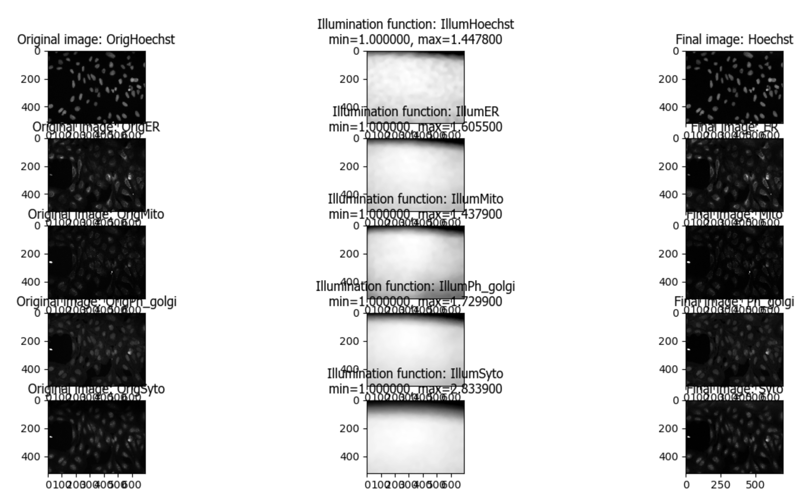
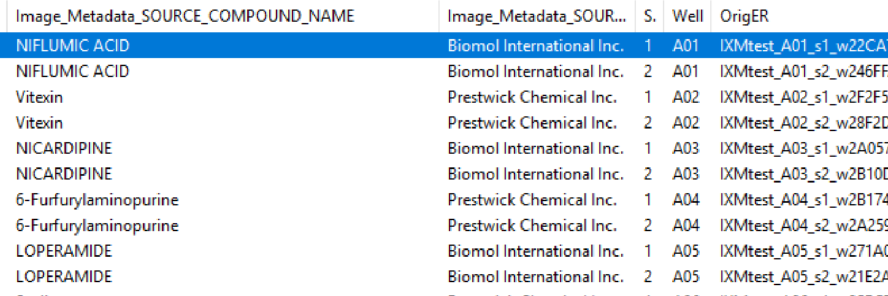

Advanced segmentation and organelle analysis: A computer exercise using CellProfiler & CellProfiler Analyst software
====================================================================================================================

Beth Cimini, Broad Institute
----------------------------

**Background information:**

The images in this experiment come from the `Broad Bioimage Benchmark
Collection <https://data.broadinstitute.org/bbbc/BBBC022/>`__. They are
240 of 69,120 fields of U2OS cells treated with a panel of 1600 known
bioactive compounds and imaged in five channels for a so-called Cell
Painting assay- see Gustafsdottir et al, 2013 for more information. The
compounds target a wide range of cell pathways, meaning that some cells
and organelles will have very different morphologies both from each
other and from the mock treated controls. This will give you an
opportunity to try to find segmentation parameters that work across a
wide range of conditions.

.. figure:: ./TutorialImages/Fig1.png
   :align: center
   :width: 600

   *Figure 1: Images and channels from a CellPainting assay.*

While in the traditional Cell Painting protocol we do not actually
segment out any organelles (other than the nucleus), the large number of
stained compartments make this an excellent set of images to find
subcellular features. Finding the average or count of smaller objects
inside a larger ‘parent’ object is a feature of many pipelines and an
important skill to have in setting up a CellProfiler analysis.

Cell Painting generally consists of a few simple segmentation steps
followed by adding as many measurement modules as can be reasonably
included in a single pipeline; we have found that by doing this we can
measure ~1500 features of each cell and from that create a
‘morphological profile’ that can be used to predict interesting biology
including drug mechanisms of action, gene-pathway interactions, and
more. See Bray et al 2016 and citations within for more information.

**Goals of this exercise: **

This exercise will give you practice at finding segmentation parameters
that will be robust across whatever variability may exist in your
sample. This is not always straightforward, so examining your
segmentation across a wide range of images will be necessary.

.. figure:: ./TutorialImages/Fig2.png
   :align: center
   :width: 600

   *Figure 2: Examples of varied nuclei found in this data set.*

This exercise will additionally show you some ways to pull out smaller
features in your image by segmenting organelles within the cells and
nuclei. You will also be shown how to use RelateObjects so that you can
study the average counts, distances, and measurements of the smaller
organelles inside their larger parent objects.

**Materials necessary for this exercise: **

These 1200 images (240 sites in 5 channels) represent 120 wells from a
single 384 well plate, either mock treated with DMSO or treated with a
variety of bioactive compounds. A CSV file containing associated drug
treatment information has also been included.

It is additionally expected that you are generally familiar with
CellProfiler, preferably after completing the Translocation tutorial or
a similar introductory exercise.

1) **Load images and metadata**

-  Start CellProfiler by double-clicking the desktop icon |Inline1|

.. |Inline1| image:: ./TutorialImages/Inline1.png
   :width: 25

-  Drag and drop the ‘BBBC022_Analysis_Start.cppipe’ file into the
   ‘Analysis modules’ box. 7 modules should pop up, and almost all of
   them will show errors. This is the expected behavior.

-  Drag and drop the ‘BBBC022_20585_AE’ folder into the ‘File list’ box.
   It should automatically populate. Notice that illumination correction
   images (with a file extension of ‘.npy’) are included in this data
   set.

2) **Import metadata from the CSV**

-  In the ‘BBBC022_Exercises’ folder there will be a CSV called
   ‘20585_AE.csv’ detailing drug treatment info for each image.

-  Three metadata extraction methods should already be present:

   -  The first pulls Well, Site, and Channel metadata from all of the
      image files except for the illumination correction functions

   -  The second pulls Plate metadata from the image folder

   -  The third pulls Plate metadata from the illumination correction
      functions

-  Add a fourth metadata extraction step by hitting ‘Add another
   extraction method’

   -  Select ‘Import from file’ as the metadata source

   -  Use the ‘20585_AE.csv’ file located in the ‘BBBC022_Exercises’
      folder

   -  Under ‘Match file and image’:

      -  Match Image_Metadata_PlateID to Plate

      -  Match Image_Metadata_CPD_WELL_POSITION to Well

      -  Match Image_Metadata_Site to Site

-  Click ‘Update’. You should now see a number of additional columns in
   the Metadata window.

3) **Examine the channel mappings in NamesAndTypes (optional)**

-  Two different ways of mapping images to channel names are
   demonstrated here. There are several others, and often you could
   create several correct mappings for a given set of images, but these
   may serve as a helpful example to refer to in your own work.

   -  The ‘.tif’ image files are assigned a name by the Metadata
      extracted in the previous module (specifically ChannelNumber)

   -  The ‘.npy’ illumination correction functions are assigned a name
      based on a unique string in the name (such as ‘IllumER’)

      As there is only one set of illumination correction functions for
      each entire plate, the image sets cannot simply be constructed by
      using ‘Image set matching’ as ‘Order’.

-  Scroll to the bottom of the ‘NamesAndTypes’ to see how the image sets
   are constructed

   -  ‘Image set matching’ is set to ‘Metadata’

   -  Each image channel is set to ‘Plate->Well->Site’.

   -  Each illumination correction function is set to
      ‘Plate->(None)->(None)’

-  Metadata based matching can be useful in any circumstance where a
   larger group of images needs to be mapped with a smaller one, such as
   every plate in an image set having its own illumination correction
   function or every movie in a series of timelapse movies being matched
   to its own unique cropping mask.

.. figure:: ./TutorialImages/Fig3.png
   :align: center
   :width: 600

  *Figure 3: A section of the ‘Image set matching’ dialog.*

4) **Examine the output of the CorrectIlluminationApply module
   (optional)**

-  Enter test mode and hit ‘Step’ to run the CorrectIlluminationApply
   module.

-  Briefly examine the output of the CorrectIlluminationApply module-
   you can see that the illumination correction functions show
   significant heterogeneity across the field of view.

   -  These functions were created by averaging and smoothing all 3456
      images from this plate, indicating the image captured is
      consistently dimmer in those regions for nearly all images.

-  Also note that while the illumination correction functions for each
   channel are similar, they aren’t identical; each channel in your own
   experiments should therefore be illumination corrected independently.

   *Figure 4: Application of the illumination correction functions.*

5) **IdentifyPrimaryObjects- Nuclei**

-  **After** the CorrectIlluminationApply module but **before** any
   others, add an IdentifyPrimaryObjects module (from the ‘Object
   Processing’ module category).

-  Create objects called Nuclei by segmenting on the Hoechst channel.
   Hit ‘Step’ to run the module. How does your segmentation look?

-  Use the magnifying glass at the top of the window to zoom in on an
   area that was segmented poorly, then update some of your parameters
   in IdentifyPrimaryObjects and hit ‘Step’ to rerun the segmentation.

-  Adjust the segmentation parameters until you feel you’re ready to
   move on to identifying the cells around the nuclei; as you will test
   the parameters for robustness later, however, the identification
   should be good but doesn’t need to be perfect before you move on.

6) **IdentifySecondaryObjects- Cells**

-  **After** the IdentifyPrimaryObjects module but **before** the
   EnhanceOrSuppressFeatures module, add an IdentifySecondaryObjects
   module.

-  Create an object called Cells that is seeded on the Nuclei primary
   objects that you just created; use the Ph_golgi image.

-  For the purposes of this exercise, you need not worry about excluding
   cell bodies that touch the edge of the image.

-  Examine the segmentation and adjust the segmentation parameters until
   you feel you’re ready to test them on another image; they need not be
   perfect before you move on.

7) **Test the robustness of your segmentation parameters across multiple
   compounds**

-  Go to Test->Choose Image Set to bring up a list of the images in your
   experiment.

   *Figure 5: A section of the ‘Choose Image Set’ menu.*

-  Look at the column titled ‘Image_Metadata_SOURCE_COMPOUND_NAME’ to
   see what chemical was used in each well of the experiment. You may
   click on the column to sort the whole table by the values in it if
   you so desire.

-  Choose a row where ‘Image_Metadata_SOURCE_COMPOUND_NAME’ is blank-
   this will be a mock treated well. Press the ‘OK’ button, then run
   that image in test mode for your first 3 modules (through your
   IdentifySecondaryObjects step). Examine the output – did your nuclear
   and cellular segmentation hold up compared to the first images you looked at?
   Once your segmentation is good, try it on one additional mock treated image.

-  Test your segmentation on images from a few different compounds- you
   may choose ones you’ve worked with before, random ones, or some
   combination therein; if possible avoid using multiple compounds you
   KNOW have the same mechanism of action, though it’s alright if they
   occasionally do. Update your segmentation parameters until they work
   well on a few different compound wells, then go back to a mock
   treated well to make sure it still works well there.

   -  You’re encouraged to explore the compound list on your own, but if
      you find yourself consistently ending up with images that look
      similar you can try adding images from the following list of
      wells- B18, C7, D6, D19, D22, E3

8) **IdentifyTertiaryObjects- Cytoplasm**

-  **After** the IdentifySecondaryObjects module but **before** the
   EnhanceOrSuppressFeatures module, add an IdentifyTertiaryObjects
   module.

-  Create an object called Cytoplasm using the Cell and Nuclei objects
   you’ve created; ‘Shrink smaller object prior to subtraction?’ and
   ‘Retain outlines of tertiary objects?’ should both be set to ‘No’.

9) **Examine the steps used to segment the Nucleoli**

-  The next 3 modules have to do with the creation of the Nucleoli
   objects. Look at the output from each to see how the image is
   transformed to aid in segmentation.

   -  EnhanceOrSuppressFeatures is a module that helps enhance
      particular parts of an image- in this case, punctate objects or
      ‘Speckles’. By specifying the feature size, you can enhance
      different parts of the object. As we are looking for nucleoli, we
      apply this to the RNA channel (Syto) image, and call the output
      ‘FilteredRNA’. (See Fig 6 below)

   -  MaskImage allows you to create a version of the ‘FilteredRNA’
      image called ‘SytoNuclei’ where all of the pixels except the ones
      you specify are set to an intensity of 0- in this case, we set to
      0 any pixel not inside a nucleus. By doing this, we can decrease
      the likelihood of detecting the cytoplasmic RNA dots.

   -  IdentifyPrimaryObjects is used to find the Nucleoli- this is a
      Primary object segmentation because we are not using another
      object as a seed to grow around, but only segmenting based off the
      intensity in our ‘SytoNuclei’ image.

      -  You should check the nucleolar segmentation in the Syto channel
         in the WorkspaceViewer to assure yourself that the segmentation
         not only matches the speckle-enhanced ‘SytoNuclei’ image, but
         also looks accurate on the unprocessed image as well.

-  Now that you’ve seen an example of how to segment an organelle, you
   will do so for Mitochondria in the following steps

.. figure:: ./TutorialImages/Fig6.png
   :align: center
   :width: 500

   *Figure 6: Enhancing the Syto image allows you to isolate nucleoli against the
   nucleoplasmic background signal.*

10) **Mask the Mito image by the Cytoplasm object**

-  **After** the IdentifyPrimaryObjects module for Nucleoli but
   **before** the RelateObjects modules, add a MaskImage module (from
   the Image Processing module category).

-  Call your output image ‘MaskedMito’.

-  As you saw above with the Nucleoli example, mask the image via
   Objects, and use the Cytoplasm objects to create the mask.

  *Figure 7: The MaskedMito image contains only the regions of interest.*

12) **IdentifyPrimaryObjects- Mitochondria**

-  **After** your MaskImage module but **before** the RelateObjects
   modules, add an IdentifyPrimary Objects module to identify
   Mitochondria from your MaskedMito image.

-  You should consider using a wide range of pixel sizes here; 2-20 is a
   reasonable first place to start.

13) **Add measurement modules to your pipeline**

-  **After** your segmentation of the mitochondria but **before** the
   RelateObjects modules, add as many object measurement modules as you
   would like.

-  Some suggested modules to add- MeasureObjectSizeShape,
   MeasureObjectIntensity, MeasureGranularity, MeasureObjectNeighbors.

   -  Which objects do you think would be valuable to measure with each
      of these modules? Which channels would you measure your objects
      in?

   -  For a typical Cell Painting experiment you would add as many
      measurements as possible, but that isn’t necessary here; however,
      do make sure every object gets at least some measurements.

-  While MeasureCorrelation, MeasureTexture, and
   MeasureObjectIntensityDistribution can produce valuable data for
   downstream profiling, they can be memory-intensive and/or slow so
   should not be added for this example pipeline in the interest of
   pipeline run time. MeasureNeurons is not well suited for this
   pipeline.

14) **Examine the settings of RelateObjects **

-  **After** your Measurement and **before** your Export modules you
   should find two RelateObjects modules. One relates Nucleoli to
   Nuclei, while the other relates Mitochondria to Cells.

-  Relating the objects allows you to create per-parent means (ie, for
   this cell what is the average size of an individual mitochondrion)
   and calculate distances from the child objects to the edge and/or the
   center of the parent (ie how far is each nucleolus from the center of
   the nucleus).

15) **Run the pipeline (optional)**

-  If you have time and/or if you’d like to play with the data in
   CellProfiler Analyst later, exit test mode, close the eyes next to
   each module, and run the pipeline

-  The pipeline will create a database called BBBC022.db, containing the
   output of all of the measurements you have added to your pipeline

-  Because you have different object counts for some of your different
   types of objects (the counts of Nuclei, Cells, and Cytoplasm will be
   the same, but the counts of Mitochondria and Nucleoli will not be),
   you will not be able to export the objects as a single data table but
   must instead use a different data table for each object. This will
   not affect the actual outcome of the experiment, but will mean that
   each object will get its own properties file and that you can only
   look at the measurement for one object at a time in CellProfiler
   Analyst.

   *Figure 8: The ExportToDatabase module.  The yellow warning symbol warns you
   that since you've chosen to make individual tables for each object, you will
   only be able to examine one object at a time in CellProfiler Analyst.*
