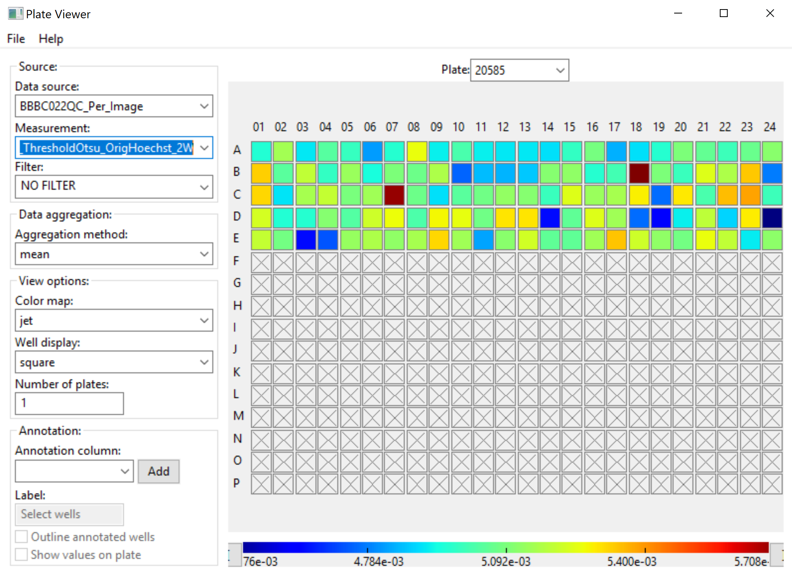
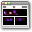

Using machine learning to perform image quality control: A computer exercise using CellProfiler & CellProfiler Analyst software
===============================================================================================================================

Beth Cimini, Broad Institute
----------------------------

**Background information:**

High-quality image analysis relies on having high-quality images to
analyze; the so-called ‘Garbage in, garbage out’ principle. If your
image set is small it is straightforward to curate it and remove images
that are not in focus or that contain debris that might disrupt
segmentation. In a high content screen containing tens or hundreds of
thousands of images, this is essentially impossible.

The images in this experiment come from the `Broad Bioimage Benchmark
Collection <https://data.broadinstitute.org/bbbc/BBBC022/>`__. They are
240 of 69,120 fields of U2OS cells treated with a panel of 1600 known
bioactive compounds and imaged in five channels for a so-called
CellPainting assay- see Gustafsdottir et al, 2013 for more information.
Given the large size of this experiment, it was necessary to come up
with an automated quality control method.

To learn more about machine learning for image quality control, please
see Bray et al 2012 and references therein.

**Goals of this exercise: **

This exercise will teach you how to measure aspects of image quality
with CellProfiler and how to use the machine learning tools in CPA to
create robust rules to distinguish low-quality images. It additionally
will show you how to incorporate these rules into an image analysis
pipeline so that they may guide your downstream data analysis.

**Materials necessary for this exercise: **

These 1200 images (240 sites in 5 channels) represent 120 wells from a
single 384 well plate, either mock treated with DMSO or treated with a
variety of bioactive compounds.

It is additionally expected that you are generally familiar with the
tools in CellProfiler and CellProfiler Analyst, preferably after
completing the Translocation tutorial or a similar introductory
exercise.

1) **Start the provided QC pipeline on the BBBC022 dataset**

In order to do quality control, we need to first measure the images in many ways.
This will allow us to do machine learning to use the measurements to identify the
good images from the bad.

-  Start CellProfiler by double-clicking the desktop icon |Inline1|

-  Drag and drop the ‘BBBC022_QC.cppipe’ file into the ‘Analysis
   modules’ box. Three modules should appear- two copies of
   ‘MeasureImageQuality’ and one ‘ExportToDatabase’ module.

-  Drag and drop the ‘BBBC022_20585_AE’ folder into the ‘File list’ box.
   It should automatically populate.

-  Hit the Analyze Images button.

-  You will get an error popup – ‘No prior instances of objectgroup were
   defined. Are you sure you want to continue?’ Hit ‘Yes’.

   -  This is due to the fact that there are no objects defined in the
      pipeline. It will not affect the final results.

-  The pipeline should take about 10-15 minutes to run. At the end,
   three files should be created- a .db database file, a .properties
   text file, and a .workspace text file.

2) **Examine the QC pipeline (~15 minutes)**

-  While the pipeline is running, take some time to look over the
   pipeline and make sure you understand the various parts. You will
   probably find it easiest to open a second CellProfiler window and
   open the pipeline in it.

   -  *Metadata*

      -  Plate, well, site, and channel information is being extracted
         from the file and folder names

   -  *NamesAndTypes*

      -  The images are matched to their channels by metadata and
         grouped by Plate, Well, and Site

   -  *Groups*

      -  This module is not used

   -  *MeasureImageQuality*

      -  ‘Include the image rescaling value?’, ‘Calculate intensity
         metrics?’, and ‘Calculate saturation metrics?’ are all set to
         yes. Open the help |Inline2| button to read about the
         measurements exported by each of these options.

      -  ‘Calculate blur metrics?’ is set to yes and given multiple
         spatial scales- 2, 5, 10, and 20 pixels. Open the help |Inline2|
         button to read about the different methods used to determine
         whether an image is in focus.

   -  *MeasureImageQuality*

      -  In this second image ‘MeasureImageQuality’ module, automatic
         thresholds are calculated for the ‘OrigHoechst’ and
         ‘OrigPh_golgi’ images using specific threshold metrics. Read
         about why by opening the help |Inline2| button.

         -  The choice of these two images and these two thresholding
            methods was not random; it corresponds to the methods used
            to segment nuclei and cell bodies in the corresponding
            analysis pipeline.

   -  *ExportToDatabase*

      -  This module has 4 main parts, separated by breaks |Inline3|

      -  **Creation of the database**: these options determine what kind
         of database will be created (SQLite in this case), whether
         CellProfiler should overwrite or add to previously existing
         data, and what the names of the tables will be.

      -  **Creation of the CPA properties file**: these options pre-set
         some parameters for CellProfiler Analyst to help make it easier
         for you to use such as

         -  Setting the plate type to 384, and stating that the
            Image_Metadata_Plate and Image_Metadata_Well determine which
            plate and well to assign each image to

         -  What color to assign each channel in the image display tools
            in CellProfiler Analyst

         -  That you are classifying ‘Image’s, not objects

      -  **Creation of the CPA workspace file**: instead of having to
         explore all the parameters at random to find features that
         separate good images from bad images, these options allow you
         to auto-create graphs for the features that are likely to be
         the most important. Here we’ve pre-populated 12 graphs for you-
         10 scatter plots and 2 histograms.

      -  **CellProfiler specific adjustments**: besides determining the
         location of the output database, most of these options deal
         with how CellProfiler should treat the objects it identifies
         (should it calculate means/medians/standard deviations for all
         of them, should it combine their measurements into a single
         table, etc). As we are not identifying any objects, we don’t
         need to worry about these.

3) **Open the CellProfiler Analyst workspace and determine reasonable
   parameter cutoffs (~20 minutes)**

In the first step of the quality control pipeline, we'll look at graphs of how
various measurements are distributed in the population.  This allows us to get
a sense of what the "normal" values are for each parameter.  We'll set gates
around the "abnormal" values for later usage.  You can feel free to graph and
examine additional parameters as well if you are interested in exploring the
dataset.

First-pass identification of the abnormal images is important since they are
hopefully going to be rare in our overall dataset.  By identifying as many
abnormal images as possible in this and the next step, we'll hopefully have
a large and robust enough training set that we can train a good classifier
in later steps.

-  Once your pipeline has finished, close CellProfiler and start
   CellProfiler Analyst by double-clicking the icon |Inline4|.

-  Load the properties file you’ve just created.

-  Go to File-> Load Workspace. 12 graphs should be created – 5 scatter
   plots about focus (ImageNumber vs ImageQuality_PowerLogLogSlope), 5
   scatter plots about oversaturation (ImageQuality_StdIntensity vs
   ImageQuality_PercentMaximal), and 2 histograms showing the automatic
   thresholds calculated for the nuclei and cell channels.

-  For some or all of the graphs (preferably at least two of each type),
   examine the shape of the data. Are there obvious outliers present?

   -  In the ‘gate’ dropdown, select CREATE NEW GATE and give it a name
      (like ‘HighSat_ER’ for high outliers in the oversaturation graph
      of the ER channel).

   -  Draw your gate, then right-click (PC)/Command-click (Mac) to bring
      up a window. You should see two options named ‘Show images in
      gate’ (one or both of these will be renamed in the next CPA
      release for the sake of clarity)

      -  The top one will open each of these images in a separate
         window. This is generally easiest if only a small number of
         images (<5) are in the gate.

      -  The bottom one will open a thumbnail viewer with thumbnails of
         each image; you can then double click on the thumbnail to open
         the full image. This is much faster when there are a lot of
         images inside the gate.

   *Figure 1: Examining the objects inside a gate.*

-  Look at some of the images inside the gate ( you may need to click
   ‘Show controls’ to adjust the zoom, contrast stretch, etc). Are they
   in focus, and are they free of bright debris? If they seem all or
   mostly like they’re high quality, adjust the gate to look at a
   different/smaller subset or delete it altogether by using the Gate
   Inspector (‘gate’-> ‘MANAGE GATES’).

4) **Optional- use the PlateViewer tool to check for other features to gate on
   (~10 minutes)**

If you want to see if you can find additional features that might distinguish good
images from bad images, feel free to explore the feature set more thoroughly.

- The PlateViewer tool and either choose a few ImageQuality measurements at random
  or just use the arrow keys to scroll up and down through the measurements.

  -  A good candidate measurement will be relatively constant within most of the wells
     but have a small number of outliers (Fig 2).

  -  Once you have a good candidate, double click on an outlier well to open the images
     from that well.  If one or both seem very aberrant, you may wish to look at this
     measurement further.

   *Figure 2: Using the PlateViewer tool to find features that may be good markers
   of poor quality images.*

- Once you have a measurement you'd like to gate based on, open that Histogram
  or the Scatter Plot tools and graph all the cells based on that (if you're using
  the Scatter Plot tool, you may wish to graph your chosen feature on the Y-axis vs
  ImageNumber on the X-axis as in the Workspace plots, but feel free to play around).
  If you find a gate that seems logical to make, proceed as in Step 3.

5) **Create filters based on the cutoffs you’ve determined (~10
   minutes)**

Now that we've created gates around our poor quality images, we need to convert
them into filters so that we can access them in the Classifier tool.  This
process will be unnecessary in later versions of CellProfiler Analyst, but knowing
how to manipulate the properties file is a worthwhile skill.

-  When you feel like you’ve examined enough graphs, it’s time to create
   filters based on the gates you’ve determined contain bad images.
   There are two ways to do this:

   -  **Edit the properties file manually (recommended):**

      This method has the advantage that the filters you create are
      permanent; they won’t be lost when you close and re-open CPA. It
      does however require you to edit the properties file, and
      potentially requires you to troubleshoot what’s wrong with the SQL
      call if you type it in incorrectly.

      -  From whatever graph you happen to have open, open the Gate
         Inspector by calling ‘gate’-> ’MANAGE GATES’.

      -  Open the properties file in a text editor.

      -  In the Image Filters section, create a new line and begin it
         with

         ::

           filter_SQL_Blurry = SELECT ImageNumber FROM BBBC022QC_Per_Image WHERE

      -  For each of the blur or threshold gates in your Gate Inspector,
         copy the text followed by the word OR; as an example if your
         first gate was:

         ::

           BBBC022QC_Per_Image.Image_ImageQuality_ThresholdOtsu_OrigHoechst_2W BETWEEN "0.0020927971719" AND "0.0042271321255"

         Edit your SQL statement to read

         ::

           filter_SQL_Blurry = SELECT ImageNumber FROM BBBC022QC_Per_Image WHERE BBBC022QC_Per_Image.Image_ImageQuality_ThresholdOtsu_OrigHoechst_2W BETWEEN "0.0020927971719" AND "0.0042271321255" OR

         DO NOT hit enter or otherwise add new lines between the
         different measurments; the statement must be one continuous
         line in order to work.

      -  Omit the ‘OR’ after your last gate measurement.

      -  Repeat for the saturated gates, again omitting the last OR,
         following the statement

         ::

           filter_SQL_Saturated = SELECT ImageNumber FROM BBBC022QC_Per_Image WHERE

      -  Save and close the properties file, then re-open CPA.

   -  **Create the filters inside CPA (not recommended)**

      This method does not require you to manually edit the properties
      file, but when filtering based on multiple features it takes
      longer to set up, cannot be edited, and would need to be repeated
      every time you closed and re-opened CellProfiler Analyst. It is
      therefore not recommended for use in this tutorial, but is
      presented in case you cannot or will not edit the properties file.

      -  From whatever graph you happen to have open, open the Gate
         Inspector by calling ‘gate’-> ’MANAGE GATES’.

      -  Copy the text of the relevant gates into a text editor so that
         you can access it later.

      -  Determine which is the important cutoff for each gate (ie for a
         gate where values are too high, it’s the minimum value, for
         gates on values that are too low it’s the maximum value)

      -  Open the filter creation dialog by selecting ‘filter’->’CREATE
         NEW FILTER’

      -  Name your filter Blurry

      -  Enter each important cutoff from the blur or threshold gates,
         selecting ‘Add column’ after each and changing the separator
         statement to OR

      -  Create a filter named Saturated containing the important
         cutoffs from the saturation gates

   *Figure 3: Creating filters inside CPA*

6) **Create classifier rules to distinguish good from bad images (~30
   minutes)**

Creating gates based on the 12 measurements we graphed has helped us identify
some low quality images so far, but we are not utilizing the rest of our
measurements and we can't be certain we've found them all.  By creating a machine
learning classifier we can find features that correlate well with bad images in
our experiment and increase our likelihood of identifying additional
low quality images.

-  Open the Classifier tool (|Inline5|, 2\ :sup:`nd` on left).

-  Fetch 50 random images from ‘experiment’, then 25 each from ‘Blurry’
   and ‘Saturated’

-  Create a good classifier by dragging images to the positive and
   negative bins and training with the Fast Gentle Boosting classifier.
   If needed feel free to refer to the Translocation tutorial
   instructions for reminders of how to fetch more images, check the
   confusion matrix of your classifier, etc.

   -  In a larger experiment, you might decide to add more bins (for
      images that are out of focus, have debris, contain the well edge,
      etc), but stick to two bins for this experiment.

   -  Don’t only fetch additional images from your filtered sets, make
      sure to pull some from ‘Random’ as well, since your gates may not
      contain every bad image in the experiment and since you want a
      robust set of good-quality images for your positive bin.

   -  You will likely have to use more than 5 rules to get good
      classification- try setting this number to 25

-  When you’re happy with your classifier (this is a small experiment,
   so perfect classification will not be possible, but aim for >60%
   accuracy in each bin at least), examine the rules created by using
   ‘Advanced’->’Edit rules…’.

-  Remove any rules that DO NOT have to do with ImageQuality (like
   ‘GroupIndex, etc), then copy the remainder Into a text editor and
   save as a ‘.txt’ file. Keep the text file open for now.

-  Save your training set for future reference if desired, then close
   CellProfiler Analyst.

7) **Add quality control steps to your analysis pipeline(~15 minutes)**

If you have time, you can add the list of rules you identified in your machine
learning classifier to the CellProfiler pipeline that corresponds to this data
set.  This can be valuable to do in processing your own large datasets, especially
if time or computational power is at a premium.

-  Reopen CellProfiler, then open the BBBC022_Analysis pipeline
   (provided or from an earlier tutorial).

-  Reopen the BBBC022_QC pipeline for reference, either in a separate
   CellProfiler window or in a text editor.

-  Click on the |Inline6| button to open the ‘Add modules’ window

-  If your rule set contains any rules based on
   ‘ImageQuality_Threshold’, add two ‘MeasureImageQuality’ modules (from
   the ‘Measurement’ category) to the very top of your pipeline,
   otherwise add one.

-  Configure the ‘MeasureImageQuality’ module(s) so that they’ll provide
   all the measurements specified in your rules file; you can refer to
   the settings in the QC pipeline and/or the rules file to determine
   which these are.

   -  For measurements that end in a number, like
      ‘Image_ImageQuality_Correlation_OrigER_10’, the number refers to
      the ‘Spatial scale for blur measurements’ scale specified. You
      started by measuring the blur at 4 scales, but you may or may not
      need all of them based on the rules selected.

-  Add the ‘FlagImage’ module from the ‘Data Tools’ category.

-  Leave the flag category as ‘Metadata’, and the name as ‘QCFlag’

   -  If you had created many bins in your classification, you would set
      this name as something more descriptive, such as ‘QCDebris’, since
      you’d have a different flag name for each bin in your classifier.

-  Leave the ‘Skip image set if flagged?’ setting at no

   -  Your classifier probably wasn’t incredibly accurate, so setting
      this to ‘yes’ might result in throwing out real data while still
      not excluding all the bad images. Nevertheless, if you had far
      more images than you felt you needed you *could* set this to yes.

-  Set ‘Flag is based on’ to ‘Rules’ and provide the path and file
   information to your rules text file.

-  Set the Class number to whatever class in your rule set represents
   the bad images- this is 2 if you kept the default bins and dragged
   bad images to the ‘Negative’ bin.

-  Save your pipeline.

.. |Inline1| image:: ./TutorialImages/Inline1.png
   :width: 25

.. |Inline6| image:: ./TutorialImages/Inline6.png
   :width: 20
