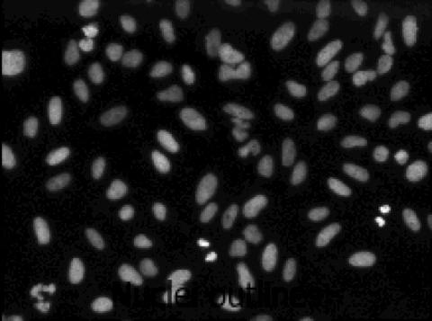
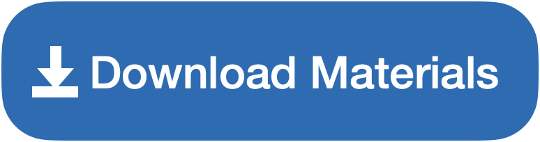
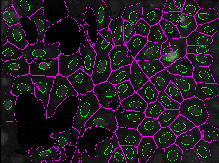
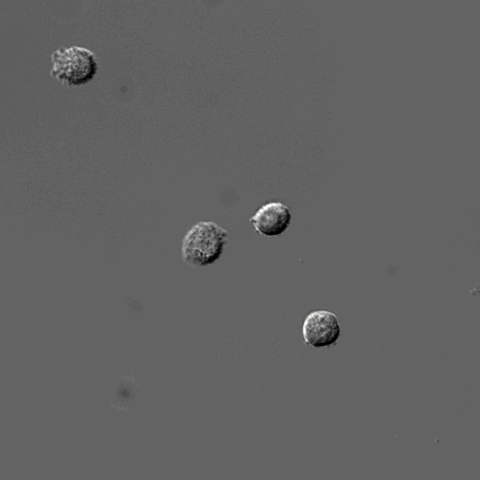
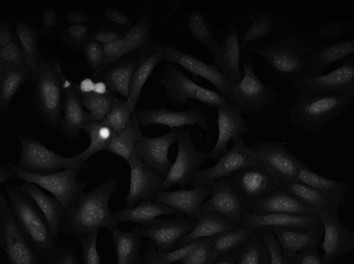
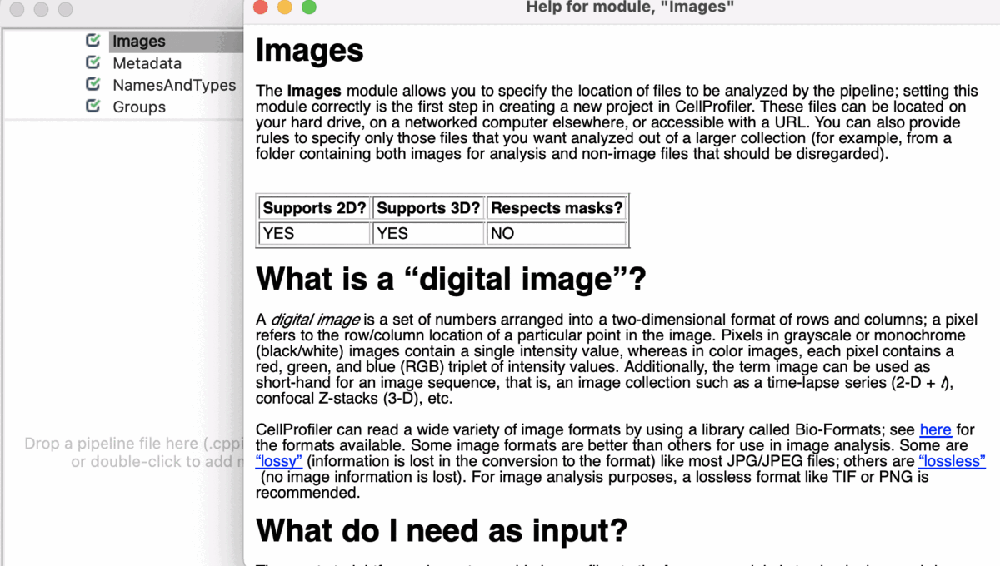
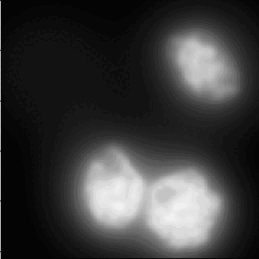
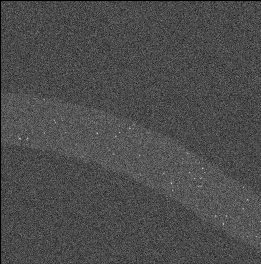
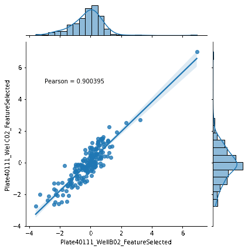
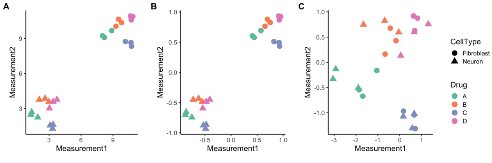

## Introduction to tutorials

CellProfiler tutorials are exercises we've guided groups of users through to help them better understand how to use CellProfiler. Please also check out our [examples page](https://cellprofiler.org/examples), which includes additional pipelines and materials for using CellProfiler with specific samples and imaging applications.

* auto-gen TOC:
{:toc}

## Beginner Segmentation

A tutorial that uses a CellPainting assay to find segmentation parameters for larger “parent” objects (nucleus, cell, and cytoplasm) and show you ways to pull out smaller features in your image by segmenting organelles within the nuclei. You will also be shown how to use RelateObjects so that you can relate the average counts, distances, and measurements of the smaller “child” organelles to their larger “parent” objects.   

Versión en español:

Versão em português:

### Bonus materials
 

We have also created bonus materials designed to go with this tutorial - in these exercises, you will practice using CellProfiler to interface with other software tools like ilastik and Cellpose. 

English version

Versión en Español

## Advanced Segmentation

 

This exercise will guide you through setting segmentation parameters that will be robust across your sample. Additionally, it will show you some ways to pull out smaller features in your image by segmenting organelles within the cells and nuclei. You will learn how to use RelateObjects module to obtain average counts, distances, and measurements of the smaller organelles inside their larger parent objects.   

 

En español:

## Translocation

 

A tutorial showing how to segment cells in CellProfiler and then classify them by phenotype in CellProfiler Analyst. This is our standard tutorial for those new to image analysis in general or CellProfiler in particular. 

  

En español:

## 3D segmentation of cell monolayer

A tutorial that describes building a pipeline to segment the nuclei and cell boundaries of a HeLa cell monolayer in 3d using the Watershed module.  

  
  

En español:

## Pixel-based Classification

A tutorial describing how to use ilastik in combination with CellProfiler to segment cells imaged only in phase contrast without any added fluorescence.   

  
  

## Quality Control

 

A tutorial to show how to use CellProfiler plus CellProfiler Analyst to perform quality control on large scale screens.   

 
  

## Annotation

A tutorial to outlines a method for annotating image data using CellProfiler together with another open source software, GIMP. This method is best for annotating or labeling objects to define their boundaries, exactly, as opposed to annotating an image with bounding boxes or centroids.   

 

## Input Modules

 

A tutorial to introduce you to four modules in CellProfiler; Images, Metadata, NamesAndTypes, and Groups (collectively known as the Input modules). 
These modules are crucial for any CellProfiler pipeline because they define how images are loaded and organized in CellProfiler for downstream analysis.

   

## 3D Noise Nuclei segmentation

 

A tutorial that describes building a pipeline to segment the nuclei boundaries in noise 3d images using the ReduceNoise and IdentifyPrimaryObjects modules.  

 
  

## 3D FISH in C. elegans segmentation

 

A tutorial that describes building a pipeline to segment spots (FISH staining) on C. elegans worms in noise 3d images using background subtraction and Watershed module.  

 
  

## UnmixColors Tutorial

 

A tutorial that describes how to use the UnmixColors module.  

  
  

-----
# Other video tutorials

See more video tutorials on the Center for Open Bioimage Analysis (COBA) [YouTube account](https://broad.io/COBAWorkshops)

-----
# Tutorials for image-based profiling

## Introduction to morphological profiling

A tutorial that introduces the concepts behind image-based profiling (aka morphological profiling), which allows you to extract additional and potentially unforseen biological insights from your image data  

 
  

## Normalization

A blog post on normalizing Cell Painting data for use in image-based profiling. 

 
  

-----
# Tutorials for older versions of CellProfiler

## ImagingFlowCytometry

A tutorial for high-content analysis of imaging flow cytometry (IFC) data with CellProfiler and machine learning can be found here:
https://github.com/holgerhennig/machine-learning-IFC

The tutorial is a step by step guide and contains example data, CellProfiler pipelines and a machine learning script (in python) which can serve as a starting point when analyzing your own IFC data.

## Spot counting for beginners

This [tutorial](https://github.com/tischi/cellprofiler-practical-NeuBIAS-Lisbon-2017/blob/master/practical-handout.md) from Carolina Wählby, Maxime Bombrun, and Christian Tischer is a great intro to using CellProfiler to find dots per cell.

## YouTube Tutorials

Neil Anthony from Emory's Integrated Cellular Imaging (ICI) core facility has a number of great image analysis tutorials on [YouTube](https://www.youtube.com/watch?v=IXsTba9Nxok&list=PL5Edc1v41fyBlbysy_1750IiT2xk6sDqO), including a 6-part series on CellProfiler.

