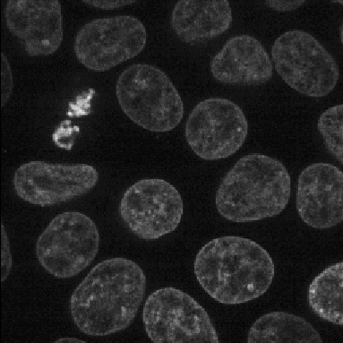

# Our tutorials
CellProfiler tutorial pipelines and images

## Translocation

| Description | Image |
|---|---|
|A tutorial showing how to segment cells in CellProfiler and then classify them by phenotype in CellProfiler Analyst.  This is our standard tutorial for those new to image analysis in general or CellProfiler in particular.      |

## Translocation

A tutorial showing how to segment cells in CellProfiler and then classify them by phenotype in CellProfiler Analyst. This is our standard tutorial for those new to image analysis in general or CellProfiler in particular.      

## Beginner Segmentation

| Description | Image |
|---|---|
| A tutorial that uses a CellPainting assay to find segmentation parameters for larger “parent” objects (nucleus, cell, and cytoplasm) and show you ways to pull out smaller features in your image by segmenting organelles within the nuclei. You will also be shown how to use RelateObjects so that you can relate the average counts, distances, and measurements of the smaller “child” organelles to their larger “parent” objects.       |

## Advanced Segmentation

| Description | Image |
|---|---|
| This exercise will guide you through setting segmentation parameters that will be robust across your sample. Additionally, it will show you some ways to pull out smaller features in your image by segmenting organelles within the cells and nuclei. You will learn how to use RelateObjects module to obtain average counts, distances, and measurements of the smaller organelles inside their larger parent objects.       |

## 3D segmentation of cell monolayer

| Description | Image |
|---|---|
| A tutorial that describes building a pipeline to segment the nuclei and cell boundaries of a HeLa cell monolayer in 3d.   |

## Pixel-based Classification

| Description | Image |
|---|---|
| A tutorial describing how to use ilastik in combination with CellProfiler to segment cells imaged only in phase contrast without any added fluorescence.    |

## Quality Control

| Description | Image |
|---|---|
| A tutorial to show how to use CellProfiler plus CellProfiler Analyst to perform quality control on large scale screens.       |

-----
# Tutorials we like from elsewhere

## ImagingFlowCytometry

A tutorial for high-content analysis of imaging flow cytometry (IFC) data with CellProfiler and machine learning can be found here:
https://github.com/holgerhennig/machine-learning-IFC

The tutorial is a step by step guide and contains example data, CellProfiler pipelines and a machine learning script (in python) which can serve as a starting point when analyzing your own IFC data.

## Spot counting for beginners

This [tutorial](https://github.com/tischi/cellprofiler-practical-NeuBIAS-Lisbon-2017/blob/master/practical-handout.md) from Carolina Wählby, Maxime Bombrun, and Christian Tischer is a great intro to using CellProfiler to find dots per cell.

## YouTube Tutorials

Neil Anthony from Emory's Integrated Cellular Imaging (ICI) core facility has a number of great image analysis tutorials on [YouTube](https://www.youtube.com/watch?v=IXsTba9Nxok&list=PL5Edc1v41fyBlbysy_1750IiT2xk6sDqO), including a 6-part series on CellProfiler.

