Segmentation and organelle analysis:
====================================
A computer exercise using CellProfiler
=====================================
Beth Cimini, Barbara Diaz-Rohrer and Rebecca Senft
------------------------------------------------------
Broad Institute
-------------------
**Background information:**

The images in this experiment come from the `Broad Bioimage
Benchmark Collection <https://data.broadinstitute.org/bbbc/BBBC022/>`__.
They are fields of U2OS cells imaged in five channels (Cell Painting
assay; see Gustafsdottir et al., 2013)

|image1|\

     *Figure 1: Images and channels from a Cell Painting assay.*

**Goals of this exercise:**

This exercise will give you practice finding segmentation parameters for
larger “parent” objects (nucleus, cell, and cytoplasm) and show you ways
to pull out smaller features in your image by segmenting organelles
within the cells and nuclei. You will also be shown how to use
RelateObjects so that you can relate the average counts, distances, and
measurements of the smaller “child” organelles to their larger “parent”
objects (i.e., cell and nucleus).

**Materials necessary for this exercise:**

The images are contained in the **images** folder; these 50 images (10
sites imaged in 5 channels) represent 5 mock treated wells from a single
384 well plate experiment.

**Exercise instructions:**

Read through the steps below and follow instructions where stated. Steps where
you must figure out a solution are marked with 🔴 *TO DO.*

**1. Load starting pipeline (2 min)**

-  Start CellProfiler by double-clicking the desktop icon: |image2|\

-  Drag and drop the ‘segmentation_start.cppipe’ file into the ‘Analysis modules’ pane on the left.

-  2 modules should pop up.

**2. Set up the input modules (10min)**

The four input modules (Images, Metadata, NamesAndTypes, and Groups) are
crucial for any CellProfiler pipeline because they define how images are
loaded and organized in CellProfiler.

-  Click on the ‘Images’ module in the top left corner of the
   CellProfiler window.

-  Drag and drop the ‘images’ folder into the ‘Drop files and folders
   here’ pane. It should automatically populate. Notice that
   illumination correction images (with a file extension of ‘.npy’) are
   included in this data set.

-  Notice that if the ‘Filter images?’ is set to ‘Images only’ the ‘.npy’
   files appeared grey out.

|image3|\

    *Figure 2: The Images module, grey out files will not be available for
    downstream modules*

-  ** 🔴 TO DO**: Change the filter to a custom filter to **include** the ‘.npy’ files.

-  In the ‘Metadata’ module three metadata extraction methods should
   already be present and configured:

   -  The first pulls Well, Site, and Channel metadata from all the image
      files except for the illumination correction functions.

   -  The second pulls Plate metadata from the image folder.

   -  The third pulls Plate metadata from the illumination correction
      functions.

-  Click on the magnifying glass at the end of the regular expression
   box for each extraction method to see how it works.

-  Return to the ‘Metadata’ module and press ‘Update’. You
   should now see several columns, look through them you should have 5
   different channel numbers, 1 plate, 2 sites and 5 different wells.

|image4|\ *Figure 3: The Metadata module, columns in table correspond to metadata
categories*

-  In the ‘NamesAndTypes’ module, we assign names to the images and
   configure image sets (i.e., all the different channels for a field of
   view). The channel mapping here is a bit complicated – we have a
   single set of illumination correction images (one ‘.npy’ file per
   channel) that map to each and every well and site. We will use the
   metadata we extracted in the previous module to make that association
   possible.

-  The ‘NamesAndTypes’ module is fully configured already but scroll and
   look through the configuration to see the two different ways of
   mapping images to channel names that are demonstrated here. (There
   are several other ways to create correct mappings, but these may
   serve as a helpful example to refer to in your own work).

   -  The ‘.tif’ image files are assigned a name by the Metadata
      extracted in the previous module (specifically ChannelNumber)

|image5|\ *Figure 4: Image mapping using extracted metadata*

-  The ‘.npy’ illumination correction functions are assigned a name
   based on a unique string in the filename (such as ‘IllumER’)

|image6|\ *Figure 5: Image mapping using filename*

-  As there is only one set of illumination correction functions for
   each entire plate, the image sets cannot simply be constructed by
   using ‘Image set matching’ as ‘Order’.

-  Scroll to the bottom of the ‘NamesAndTypes’ to see how the image sets
   are constructed ‘Image set matching’ is set to ‘Metadata’

   -  Each image channel is set to ‘Plate → Well → Site’.

   -  Each illumination correction function is set to ‘Plate → (None) →
      (None)’

|image7|\ *Figure 6: Image set matching using extracted metadata*

-  For this exercise the ‘Groups’ module is not needed so it is set to
   ‘No’, this module can be useful when you have more than one plate, or
   different movies.

-  For more information and examples on how to configure the Input
   modules we have created a blog and video tutorial that can be
   accessed here:
   https://carpenter-singh-lab.broadinstitute.org/blog/input-modules-tutorial.

**3. Examine the output of the CorrectIlluminationApply module. (2min)**

Since microscope objectives don’t typically have a completely uniform
illumination pattern, applying an illumination correction function can
help improve our segmentation and measurements by compensating for this.
Pay close attention to the top of the field of view to see the greatest
effect of correction.

-  Enter test mode by clicking on the ‘Start Test Mode’ button at the
   bottom left corner of the window and hit ‘Step’ to run the
   CorrectIlluminationApply module.

-  Briefly examine the output of the CorrectIlluminationApply module—you
   can see that the illumination correction functions show uneven
   illumination across the field of view.

-  These functions were created by averaging and smoothing all 3456
   images from this plate, so dim areas in the illumination correction
   function are areas of the field of view that are consistently dimmer
   across many images.

-  Also note that while the illumination correction functions
   for each channel are similar, they aren’t identical; each channel in
   your own experiments should therefore be illumination corrected
   independently.

|image8|\ *Figure 7: Application of the illumination correction function*

**4. IdentifyPrimaryObjects – Nuclei (10min)**

Next, we’ll take a first pass at identifying nuclei and cells in our
initial image.

-  After the CorrectIlluminationApply module, add an
   IdentifyPrimaryObjects module (from the ‘Object Processing’ module
   category). Do this by clicking on the ‘+’ sign in the bottom left
   corner of the CellProfiler window, which will pop up a small window
   called ‘Add modules.’.

   -  Tip: You can also use the search bar at the top of the ‘Add
      modules’ window to search all modules by name.

|image9|\ *Figure 8: The Add modules window, modules are divided in
categories based on their function*

-  Create objects called Nuclei by segmenting on the Hoechst channel.

   -  Select ‘Hoechst’ image as your input image from the drop-down
      menu.

   -  Change the name of the output objects to ‘Nuclei’.

-  Hit’ Step’ to run the module. How does your segmentation look?

-  On the outlines display pane (bottom left) you can see three
   different colors; green is for accepted objects, orange for objects
   touching the border, and pink for objects outside the diameter range.

-  On the table pane (bottom right) there is useful information that you
   can use to adjust your segmentation settings, like the median
   diameter, and the threshold.

|image10|\ *Figure 9: The IdentifyPrimaryObjects module output, you can
use the information in this window to modify your segmentation
parameters*

-  Use the magnifying glass at the top of the window to zoom in on an
   area that was segmented poorly.

-  **🔴 TO DO**: Improve your segmentation of nuclei:

   -  Select ‘Yes’ for the ‘Use advance settings?’ option, then change
      some of the parameters:

      -  Adjust the threshold method, may lead to better (or worse!)
         results.

      -  Adjust the declumping settings.

   -  Hit ‘Step’ to rerun and see how the changes affect the
      segmentation.

   -  Adjust the segmentation parameters until you feel you’re ready to
      move on to identifying the cells around the nuclei; the
      identification should be good but doesn’t need to be perfect before
      you move on.

5. **IdentifySecondaryObjects – Cells (5min)**

-  After the IdentifyPrimaryObjects, add an IdentifySecondaryObjects
   module.

-  Create an object called Cells that is seeded on the Nuclei primary
   objects that you just created; select the Ph_golgi image for your
   input image, nuclei for input objects and change the name to ‘Cells’.

-  Hit’ Step’ to run the module. How does your segmentation look?

-  For this module the outline colors correspond to the
   object seed (green-nuclei) and the segmented objects (pink-cell)

|image11|\ *Figure 10: The IdentifySecondaryObjects module output*

-  **🔴 TO DO**: Improve cell segmentation

   -  Examine the segmentation and adjust the segmentation parameters
      until you feel you’re ready to test them on another image; they
      don’t need to be perfect.

   -  Adjust the threshold method.

   -  Test the effects of using the various methods for identifying
      secondary objects (Propagation, Watershed-Image, Distance-N, etc)
      and, if using Propagation, the regularization factor.

**6. Test the robustness of your segmentation parameters across images (5min)**

It’s (relatively!) easy to come up with a good set of segmentation
parameters for a single image however we aim to create a set of
parameters that can segment cells on all the images on an experiment.

-  To test the parameters, there are two options to change the image you
   are working on in Test Mode

   -  Click on the ‘Next Image Set’ at the bottom left corner, or

   -  Go to ‘Test’ on the top menu bar → Choose Image Set to bring up a
      list of the images in your experiment, select the image you want
      to test, and press the ‘OK’ button.

      -  Tip: you can also use the Test menu to choose a random image
         set

|image12|\ *Figure 11: A section of the ‘Choose Image Set’ menu.*

-  Then run that image in test mode for your first 3 modules (through
   your IdentifySecondaryObjects step).

   -  You can do it by clicking the step button, or

   -  You can add a pause button on the module after
      IdentifySecondaryObjects and hit ‘Run’, this will run all modules
      before the pause.

|image13|\ *Figure 12: A section of the ‘Analysis modules’ pane.*

-  Examine the output – did your nuclear and cellular segmentation hold
   up compared to the first images you looked at?

-  **🔴 TO DO**: Adjust the parameters to get comparable results to the
   first image. Once your segmentation is good, try it on another image.

**7. IdentifyTertiaryObjects- Cytoplasm (2min)**

-  After the IdentifySecondaryObjects module, add an
   IdentifyTertiaryObjects module.

-  Create an object called Cytoplasm using the Cell and Nuclei objects
   you’ve created.

   -  Select the larger and smaller identified objects from the
      drop-down menu.

   -  Change the name of the objects to be identified.

   -  ‘Shrink smaller object prior to subtraction?’ should both set to
      ‘No’.

**8. Examine the steps used to segment the Nucleoli (15min)**

So far, we have used untransformed images for object detection, but not
all objects can be segmented from raw images. CellProfiler contains a
variety of image processing modules that can aid segmentation. For this
exercise, we will use two such modules, but there are other ones you can
explore.

The next 3 modules have to do with the creation of the Nucleoli objects.
Look at the output from each to see how the image is transformed to aid
in segmentation.

-  After the IdentifyTertiaryObjects module, add an
   EnhanceOrSuppressFeatures module.

-  EnhanceOrSuppressFeatures is a module that helps enhance parts of an
   image- in this case, punctate objects or ‘Speckles’. As we are
   looking for nucleoli, we apply this to the RNA channel (Syto) image
   and call the output ‘FilteredRNA’.

   **🔴 TO DO: Enhance nucleoli spots**

   -  Change the input image from the drop-down menu to ‘Syto’

   -  Change the name of the output image to ‘FilteredRNA’

   -  Change the feature size to see how this affects the output and find a
      value that works well.

   -  See below for an example of results to aim for:

|image14|\ *Figure 13. The EnhanceOrSuppress module output, enhancing
the Syto image allows you to isolate nucleoli against the nucleoplasmic
background signal.*

-  After the EnhanceOrSuppressFeatures module, add an MaskImage module.

-  MaskImage allows you to create a version of the ‘FilteredRNA’ image
   called ‘SytoNuclei’ where all the pixels except the ones you
   specify are set to an intensity of 0. In this case, we set to 0
   any pixel not inside a nucleus. By doing this, we can decrease the
   likelihood of detecting cytoplasmic RNA dots.

   **🔴 TO DO: Mask the RNA image to show only the ‘Nuclei’**

   -  Change the input image from the drop-down menu to ‘FilteredRNA’

   -  Change the name of the output image to ‘SytoNuclei’

   -  Use the objects ‘Nuclei’ as the mask.

   -  See below for an example of results to aim for:

|image15|\ *Figure 14. The MaskImage module output, the contrast was adjusted to
show that the intensity of the pixels outside the nuclei are now set to
0.*

-  IdentifyPrimaryObjects is used to find the Nucleoli. This is a Primary
   object segmentation because we are not using another object as a seed
   (i.e., starting point), and are only segmenting based off the
   intensity in our ‘SytoNuclei’ image.

   **🔴 TO DO: Segment nucleoli**

   -  Change the input image from the drop-down menu to ‘SytoNuclei’

   -  Change the name of the objects to ‘Nucleoli’

   -  Adjust the segmentation parameters until you are satisfied with the
      segmentation results.

   **🔴 TO DO**: Add an ‘OverlayOutlines’ module at this point to overlay
   the identified nucleoli on the original Syto image to assure yourself
   that the segmentation not only matches the speckle enhanced
   ‘SytoNuclei’ image, but also looks accurate on the unprocessed image
   as well. This is not strictly necessary but can be a nice “sanity
   check”.

   -  Goal: display outlines of your nucleoli and your nuclei on the
      unprocessed ‘Syto’ image.

   -  Here’s an example of what that could look like (red=nuclei, green=nucleoli):

   -  Tip: you can use a similar strategy to segment mitochondria using
      the ‘Mito’ channel

|image16|\ *Figure 15. The OverlayOutlines module output, all detected
nucleoli are within the nuclei.*

**9. 🔴 TO DO: Add measurement modules to your pipeline (10min)**

-  After your segmentation of the nucleoli, add as many object
   measurement modules as you would like, we have added a
   MeasureObjectIntensity.

-  Some suggested modules to add: MeasureObjectSizeShape,
   MeasureObjectIntensity, MeasureGranularity, MeasureObjectNeighbors.

-  Which objects do you think would be valuable to measure with each of
   these modules? Which channels would you measure your objects in? For
   a typical Cell Painting experiment you would add as many measurements
   as possible, but that isn’t necessary here; however, do make sure
   every object gets at least some measurements.Note: While
   MeasureCorrelation, MeasureTexture, and
   MeasureObjectIntensityDistribution can produce valuable data for
   downstream profiling, they can be memory-intensive and/or slow so
   should not be added for this example pipeline in the interest of
   pipeline runtime.

**10. RelateObjects (5min)**

-  **🔴 TO DO:** Add a RelateObjects module and configure it to relate
   ‘Nucleoli’ to ‘Nuclei’.

|image17|\ *Figure 16: The RelateObject module output.*

Relating the objects allows you to create per-parent means (e.g., for
this cell, what is the average size of an individual mitochondrion) and
calculate distances from the child objects to the edge and/or the center
of the parent (e.g., how far is each nucleolus from the center of the
nucleus).

**11. Run the pipeline (optional)**

-  If you have time, add a ExportToSpreadsheet module at the end.

-  Exit test mode.

-  Click on ‘Output Settings’ button at the bottom left corner.

-  Change the default output folder.

-  Click on ‘Analyze Images’ button at the bottom left corner.

-  Explore the spreadsheets created for each object.

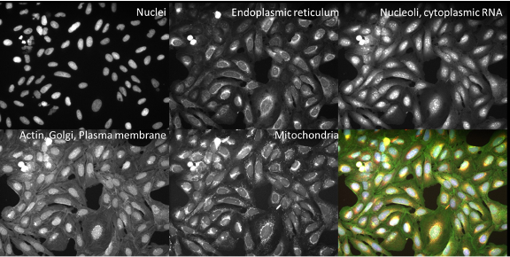
.. |image2| image:: ./TutorialImages/icon.png
   :align: center
   :width: 0.26065in
   :height: 0.26065in
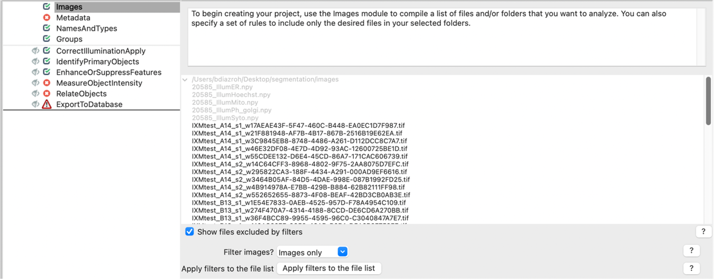
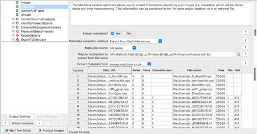
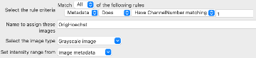
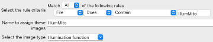
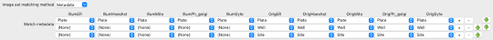
.. |image8| image:: ./TutorialImages/Fig7.png
   :align: center
   :width: 5.5in
   :height: 7.68103in
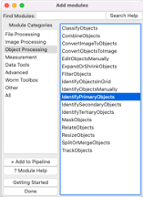
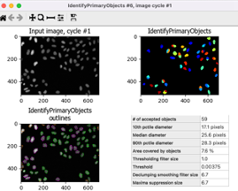
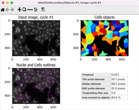
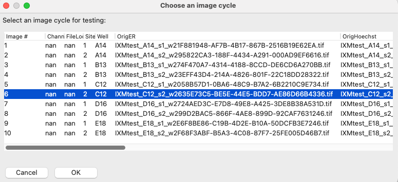
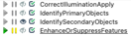
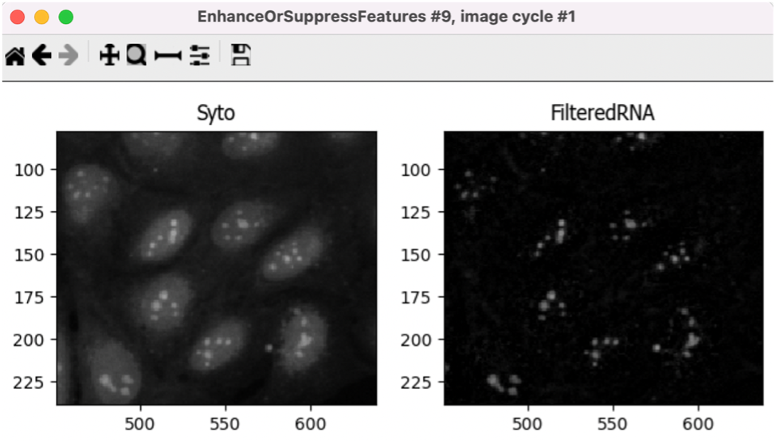
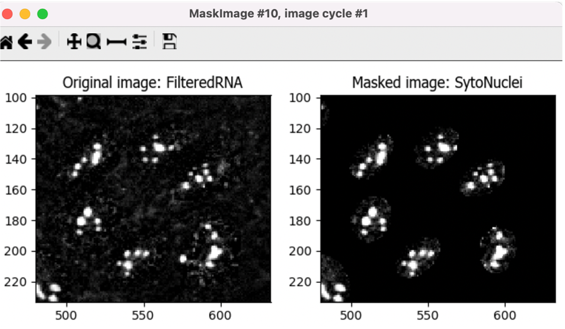
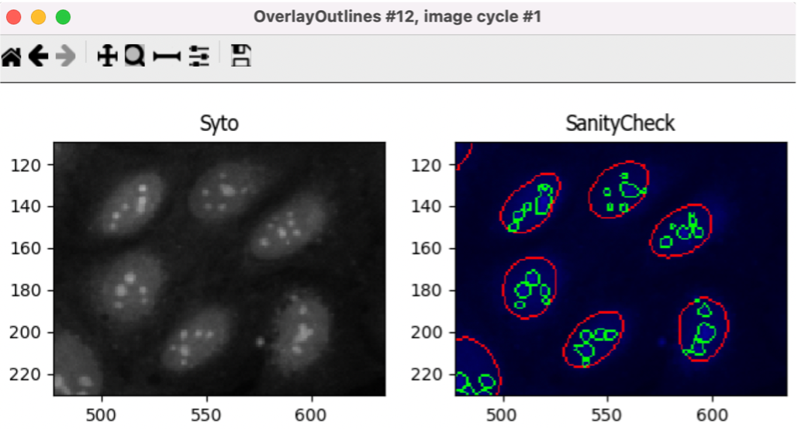
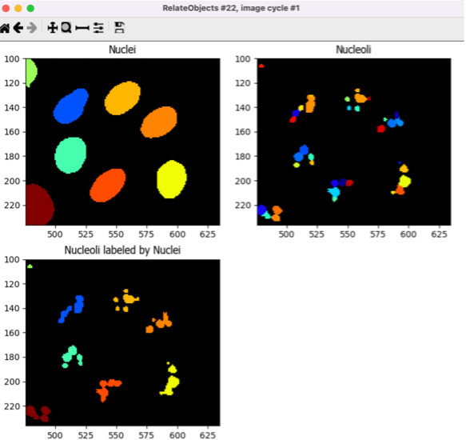
