**ABRF/LMRG**

**Image Analysis Study**

FISH in *C. elegans* (and associated calibration image[s])

**Proposal:**

Segment the objects in a fluorescence z-stack image and provide:

-  Centroid location in microns (um) for each spot: x, y, and z
      coordinates listed in separate columns. Labels x, y, and z.

-  Integrated Intensity. Label intensity.

-  3D volume image of your segmented image

-  Download CSV template
      `here <https://drive.google.com/file/d/10Y3er22JJAVUjtivFoP0fxJRAz9ma057/view?usp=sharing>`__.
      (LastName_FirstName_ImageName.csv)

**Input:**

Four different z-stack images that vary in their signal-to-noise ratio
and the clustering of their objects of FISH staining in *C. elegans*.

Voxel dimensions: 0.162x0.162x0.200 um

https://drive.google.com/drive/folders/1dT25oJweQZejjCxWIuVJ6vm7rZAzKFwi?usp=sharing

Calibration file

Voxel dimensions: 1x1x1 um

**FishPipeline** - 3m 22s

/Users/mcruz/Documents/Tutorials/ABRFTutorial/Fish/Documentation/NewFishPureCP.cppipe

**Importing data in CellProfiler**

1. Highlight the **Images** module.

   a. Drag-and-drop the images you will analyze into the Images module
         window.

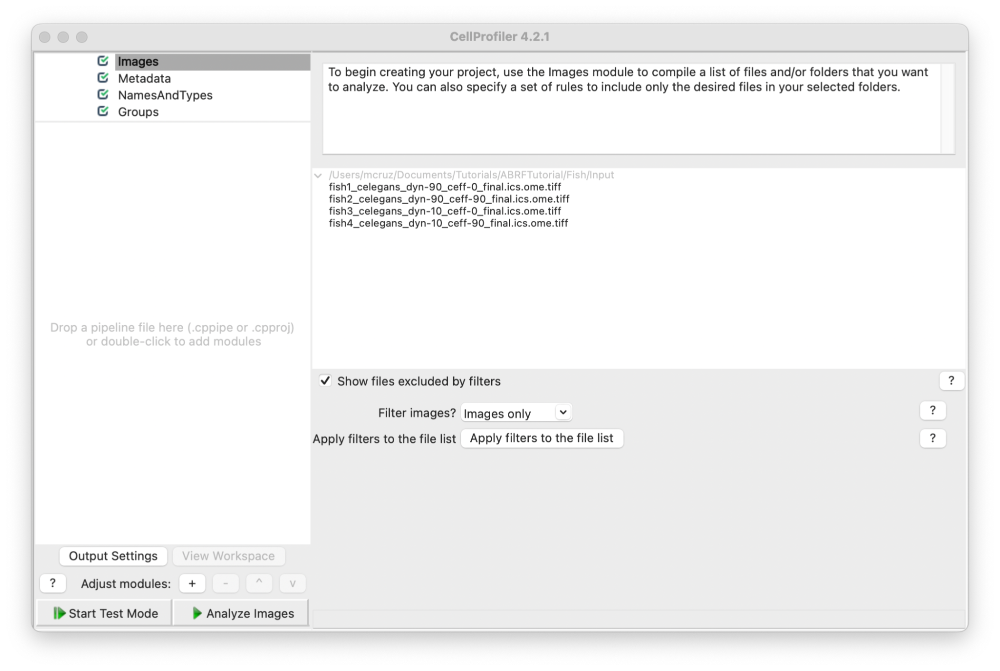

Load the pipeline file (.cppipe). Drag-and-Drop the file or go to
File->Import->Pipeline from File…

Note: The pipeline should populate all information needed, but it’s
always a good practice to check if everything is fine.

|image4|\ **Tip: Use the question marker button to learn more or if you have any
doubt.**

2. Highlight the **NameAndType** module.

..

   The **NamesAndTypes** module gives each image a meaningful name by
   which modules in the analysis pipeline will refer to it. This module
   will also let you define an image stack that should be processed as a
   whole 3D volume.

a. Assign a name to: All images This is the simplest choice and the
      appropriate one because we have only one kind of image.

b. Process as 3D: Yes Selecting “Yes” will load the files as volumes

c. Populate the fields for “Relative Pixel Spacing”. This calibration
      affects modules that handle 3D images as volumes.

The relative pixel spacing was provided and is 0.162 um in x and y and
0.200 um in z. To run the calibration file please change the relative
pixel spacing to 1x1x1 um.

d. Assign the images “variable names” that describe the contents in the
      image. For example, use the name "FISH" or "Worm" or something
      else that will remind you what the image is.

e. Hit the "update" button to populate

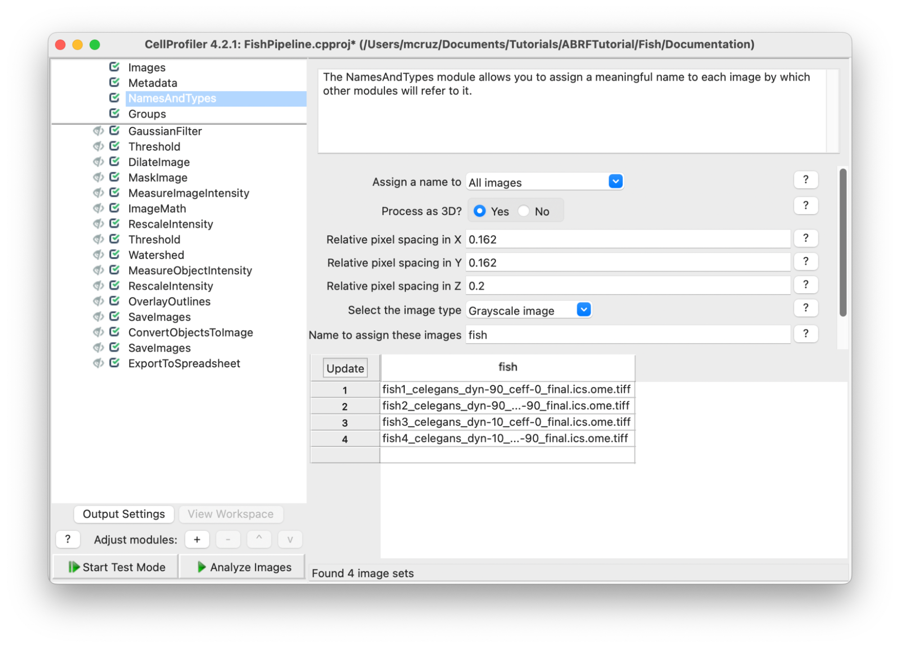

This pipeline can be divided into three main parts: Image processing,
segmentation and measurement/export.

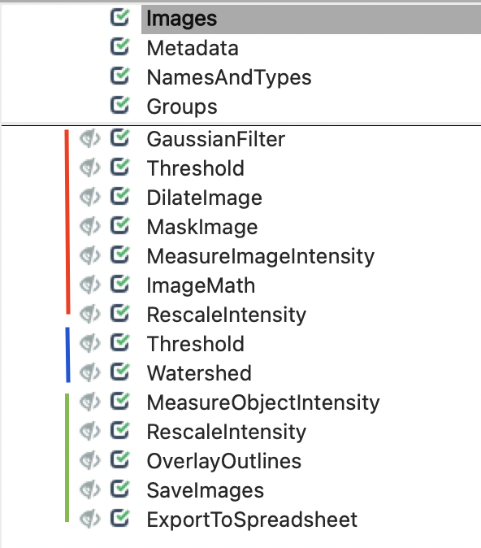

**Image processing:**

The image processing is used to prepare the image for a correct
segmentation, in this case we have images with different signal-to-noise
ratio (SNR) and an important background signal from the worm. We will
first create a mask image of the worm and use this to remove the noise
and background from the original image. These modules should normalize
the images making the segmentation process work through all image sets.

1. Hit the start test mode button.

**Tip:** You can select different image sets. For that you can go to the
main tab, hit the test tab and choose another image set or you can hit
the Next Image Set button.

|image1|\ |image2|

2. **GaussianFilter** module: select the input image “fish” (or whatever
      the name you give for your images in **NamesAndTypes** module),
      name the output image as “GaussianFilter” and a Sigma value of “3”
      (larger sigmas induce more blurring). This module will blur the
      image and make the worm/background more evident for the threshold
      filter.

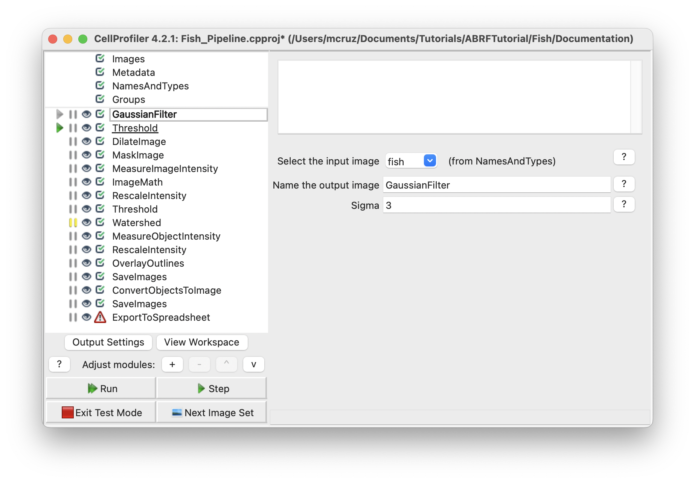

Hit the Step button and a new window will pop up with a resulting image
that should look like this. The image can vary depending on the Image
set chose.

|image3|

In this part of the pipeline we want to identify the worm and
not the spots, so we added a Threshold module to segment the worm.

3. **Threshold** module. This module produces a binary, or black and
      white, image based on a threshold that can be pre-selected or
      calculated automatically using one of many methods. After the
      threshold value has been determined, the Threshold module will set
      pixel intensities below the value to zero (black) and above the
      value to one (white).

   a. Select the input image: GaussianFilter (from **GaussianFilter**
         module)

   b. Name the output image: Threshold

   c. Threshold strategy: Global (We choose a global threshold strategy
         here because the out of worm background is relatively uniform
         after the gaussian filter).

   d. Threshold method: Minimum-Cross-Entropy (analyze the intensity
         distribution probability using the image histogram and define
         foreground and background)

   e. Threshold smoothing scale: 0.0 (Smoothing improves the uniformity
         of the resulting objects, by removing jagged edges caused by
         noise in the acquired image, because we used a gaussian filter
         module before this module, it’s not necessary to smooth the
         image prior to the threshold).

   f. Threshold correction factor: 1

**Tip:** To view pixel intensities in an open image, move your mouse
over the image, the pixel intensities will appear in the bottom bar of
the display window.

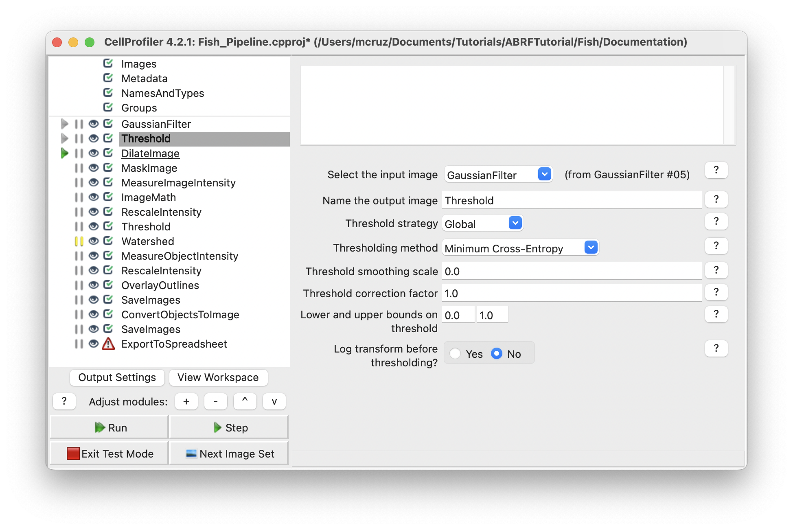

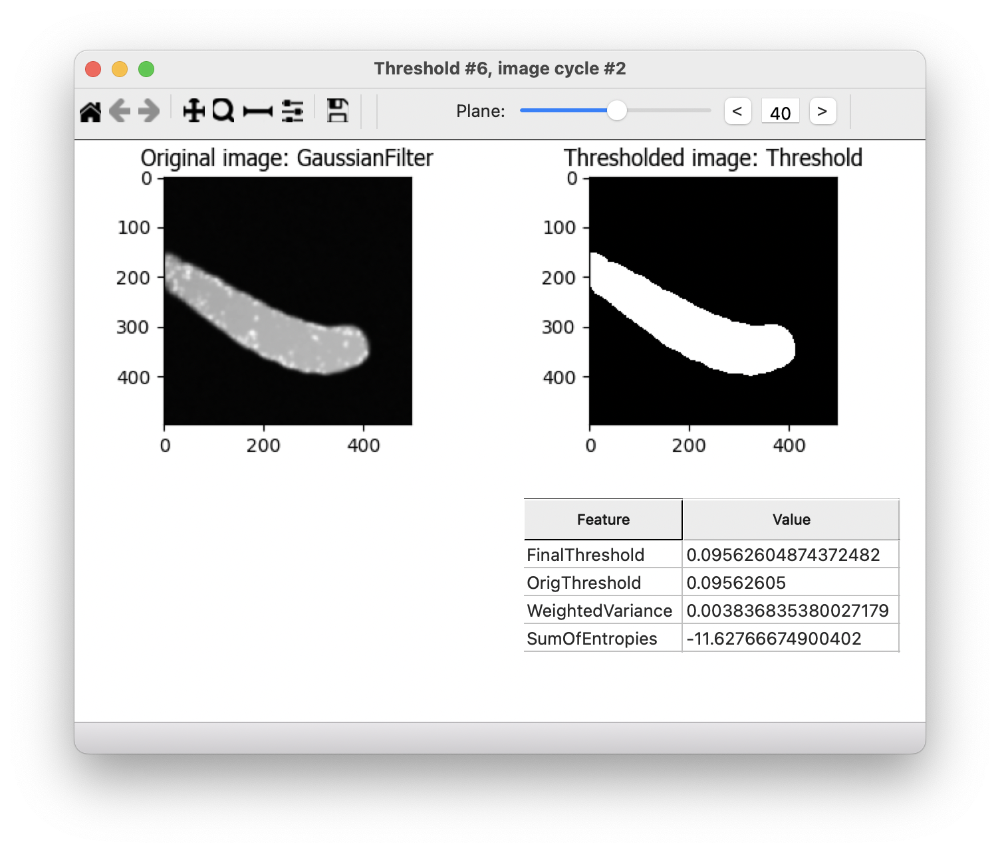

4. **DilateObjects** module. The objective of this first part of the
pipeline is to remove the background and the noise on images without
removing information, so dilate the object will prevent objects touching
the edge of the worm to be removed in the following steps.

a. Select the input object: Threshold

b. Name the output object: DilateImage

c. Structuring element: Ball (Size: 3) ( dilate the objects using a ball
      shape with size of 3).

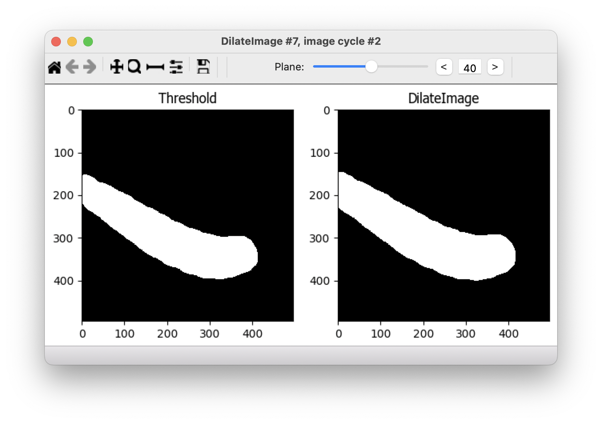

5. **MaskImage** module. This module will hide the out of worm portions
of an image (based on previously identified objects or a binary image)
so they are ignored by subsequent mask-respecting modules in the
pipeline.

a. Select the input image: fish (from **NamesAndTypes** module)

b. Name the output image: MaskWorm

c. Use objects or an image as a mask?: Image

d. Select image for mask: DilateImage (from **DilateImage** module)

e. Invert mask?: No (select the worm and not the background)

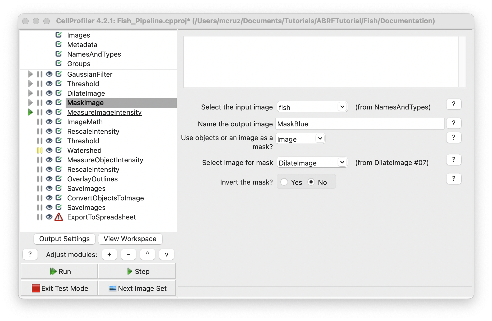

The resulting image looks the same as the original image, but the pixels
out the worm has a value of 0.

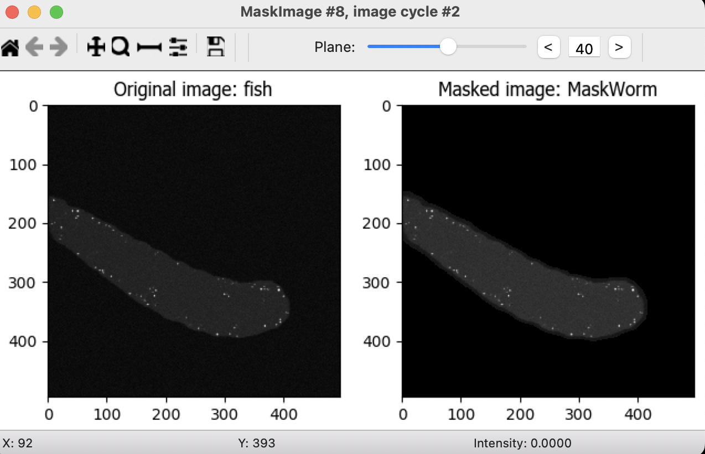

   5. **MeasureImageIntensity** module. This module measures several
   intensity features across an entire image (excluding masked pixels).
   So we use the MaskWorm image to measure the only worm intensity. The
   background (most of the pixels) pixels have a huge height on the
   mean, median or mode intensity and can be used in the next module to
   extract the background image.

a. Select images to measure: MaskWorm (from **MaskImage** module)

b. Measure the intensity only from areas enclosed by objects: No

c. Calculate custom percentiles: No

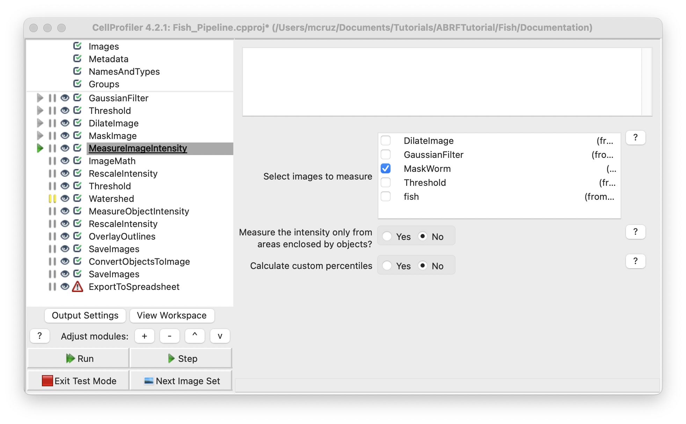

   **6. MeasureImageIntensity** module. Performs simple mathematical
   operations on image intensities. This module can perform addition,
   subtraction, multiplication, division, or averaging of two or more
   image intensities, as well as inversion, log transform, or scaling by
   a constant for individual image intensities.

a. Operation: Subtract

b. Name the output image: ImageAfterMath

c. Image or measurement?: Image

d. Select the first image: MaskWorm (from **MaskImage** module)

e. Multiply the first image by: 1.0

f. Image or measurement?: Measurement

   i.   Category: Intensity (Select a measurement made on the image. The
           value of the measurement is used for the operand for all of
           the pixels of the other operand’s image)

   ii.  Measurement: MedianIntensity

   iii. Image: MaskWorm (the image you choose in the
           **MeasureImageIntensity** module)

g. Multiply the second image by: 1.0

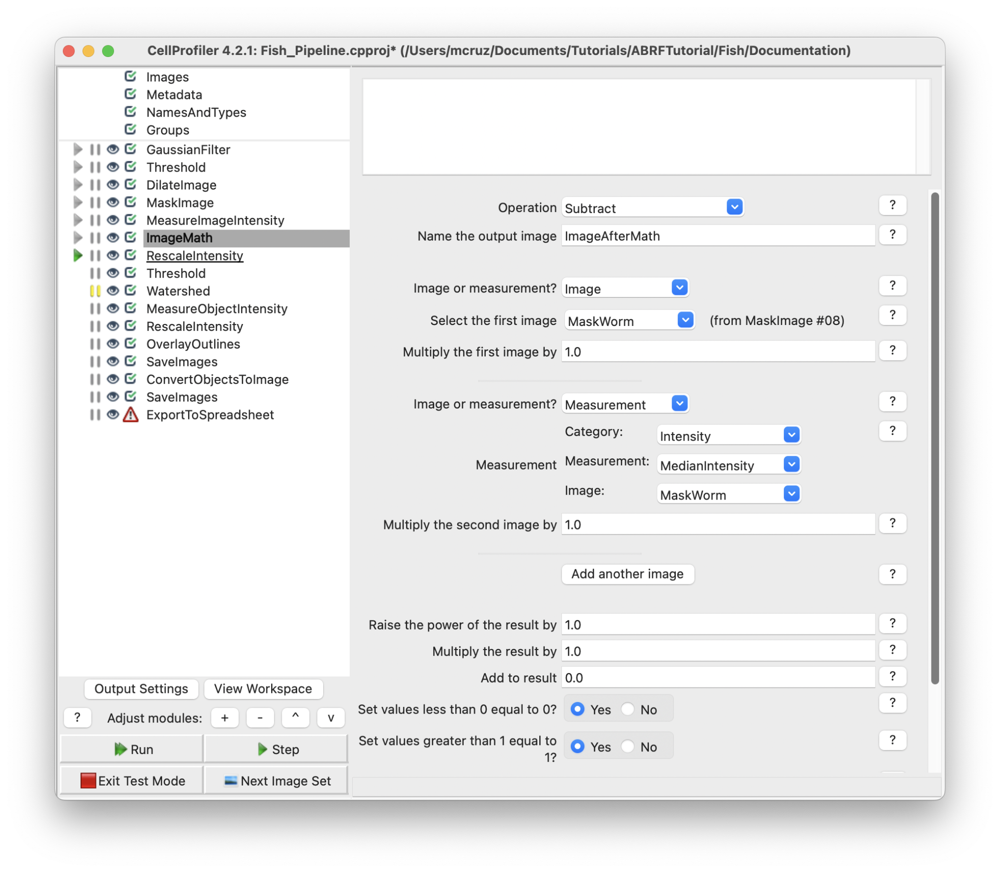

The resulting image shows just the spots without the background of the
worm.

**Tip: The image tools on the top toolbar may be helpful to see the
details on your image/objects:**

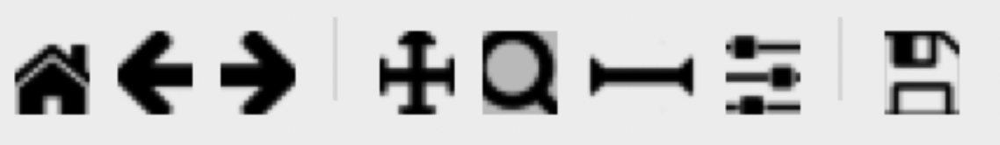

The 1st icon from the left lets you reset the view back to the original
view.

The 2nd and 3rd icons let you step backwards and forwards through any
changes you made to the view.

The 4th icon lets you change the view by moving in any direction in the
display, by clicking and dragging.

The 5th icon lets you change the view by zooming, by dragging and
drawing a box to zoom in on.

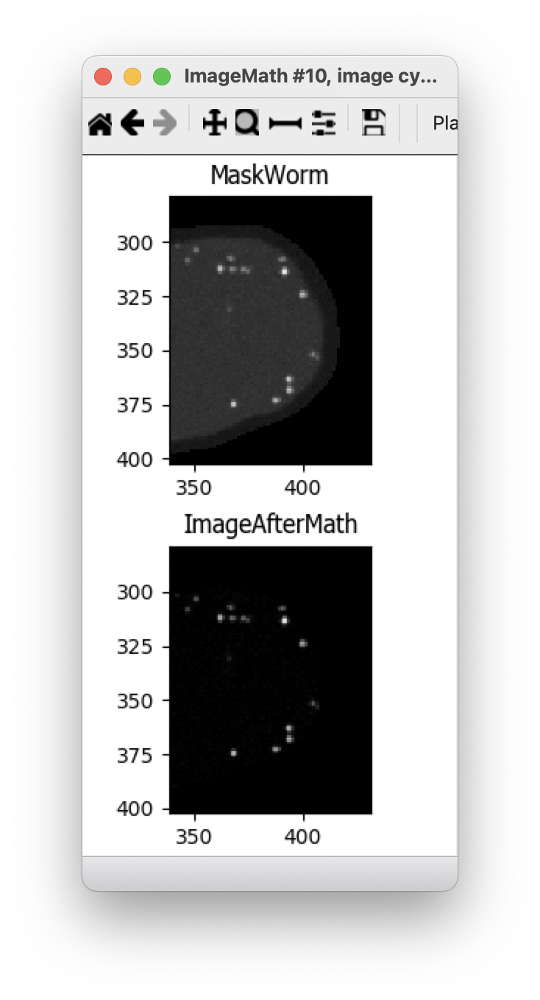

   7. **RescaleIntesity** module. This module lets you rescale the
   intensity of the input images by any of several methods. The
   ImageMath module results in a final image with a substantially
   different range of pixel intensities than the original and this could
   make the segmentation process harder because the pixel intensities
   could have a small range.

a. Selecting the input image image: ImageAfterMath (from
      **ImageAfterMath** module)

b. Name the output image: RescaleIntensity

c. Rescaling method: Stretch each image to use the full intensity range
      (Find the minimum and maximum values within the unmasked part of
      the image (or the whole image if there is no mask) and rescale
      every pixel so that the minimum has an intensity of zero and the
      maximum has an intensity of one).

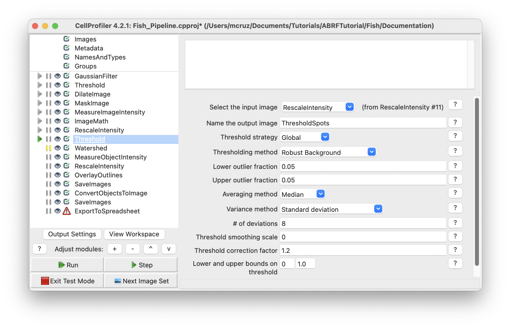

The resulting image looks the same, but the pixel value differs between
images.

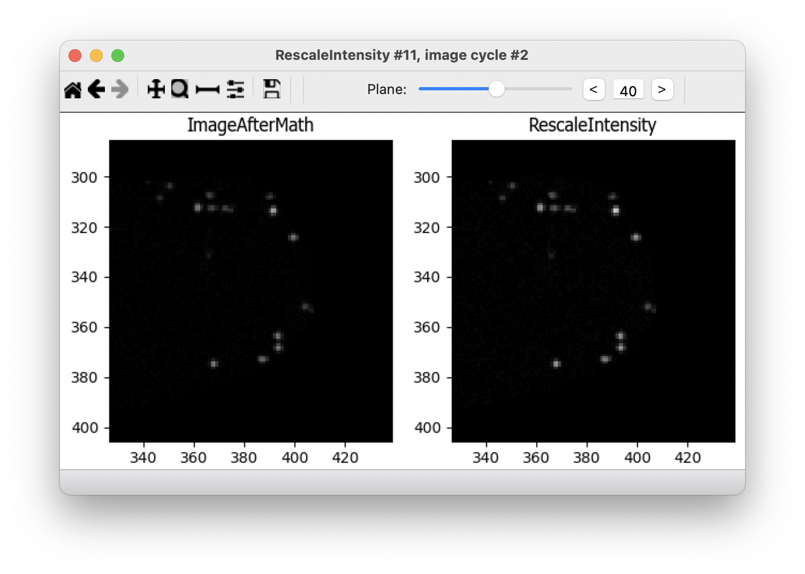

**Segmentation**

After removing the worm background on different image sets we can start
the segmentation process.

1. **Threshold** module.

   a. Select the input image: ReduceNoise (from **ReduceNoise** module)

   b. Name the output image: ThresholdSpots

   c. Threshold strategy: Global

   d. Threshold method: Robust Background (This method can be helpful if
         the majority of the image is background).

   e. Lower outliner fraction: 0.05 (discard this fraction of dim
         objects).

   f. Upper outliner fraction: 0.05 (discard this fraction of bright
         objects).

   g. Averaging method: Median (This is a good choice if the spot
         density is variable or high).

   h. Variance method: Standard deviation

   i. # of deviations: 8 (value to multiply the calculated variance.
         Adding several deviations raises the threshold well above the
         average).

   j. Threshold smoothing scale: 0 (the objects are too small, smoothing
         before the threshold results in a larger object)

   k. Threshold correction factor: 1.2 (adjust the threshold to be more
         strict)

   l. Lower and upper bounds on threshold: 0, 1.0 (default)

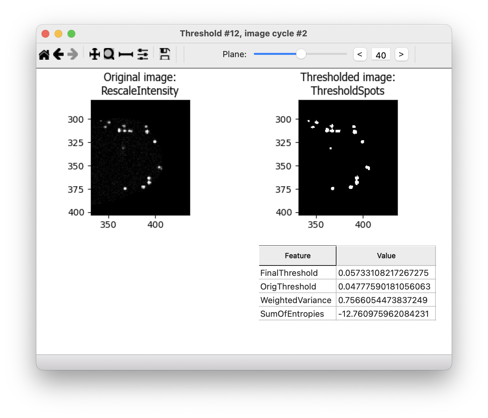

2. **Watershed** module. This module is used to separate different
      objects in an image, which in this case will segment the nuclei.

   a. Use advanced settings: Yes

   b. Select the input image: ThresholdSpots (from **Threshold** module)

   c. Name the output object: Spots

   d. Generate from: Distance (we don’t have markers to guide the
         segmentation process so the markers and other inputs for the
         algorithm will be automatically generated based on the
         footprint size).

   e. Footprint: 2 (define the dimensions of the window used to scan the
         input image for local maxima, this will create a local maxima
         from a binary image that will be at the centers of objects.
         Large footprint will suppress local maximas that are close
         together into a single maxima, so two or more objects will be
         segmented as one. Small footprint can lead to oversegmenation,
         this means one nuclei segmented as two or more objects.

   f. Downsample: 1 (if the factor is 1, the image is not downsampled,
         the spots are too small, downsampling will remove objects).

   g. Declump method: Intensity

   h. Reference Image: MaskWorm (from **MaskImage** module)

   i. Segmentation distance transform smoothing factor: 0

   j. Minimum distance between seeds: 1

   k. Minimum absolute internal distance: 0.0

   l. Pixels from border to exclude: 0 (Default)

   m. Maximum number of seeds: -1 (Default no limit)

   n. Structuring element for seed dilation: Octahedron (Size: 1)

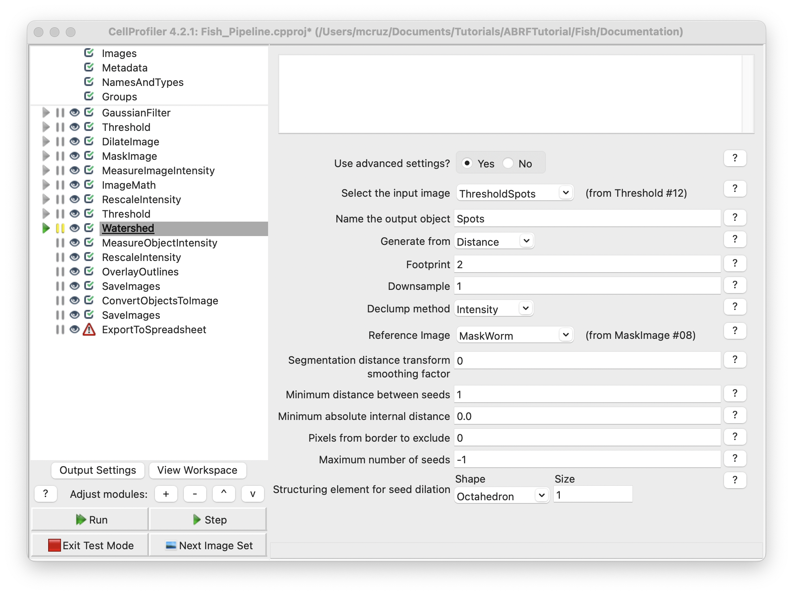

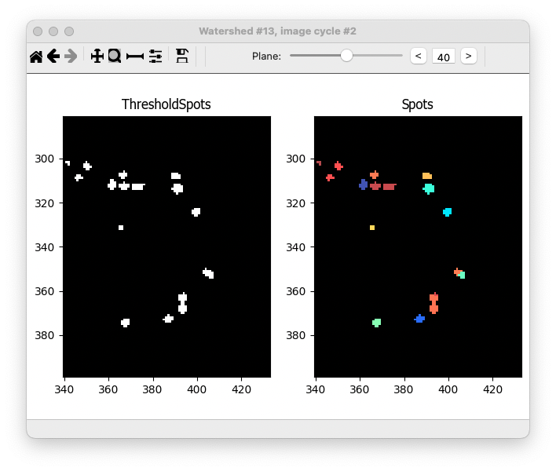

**Measure and export data**

Now that the spots have been segmented, measurements can be made using
modules from the **Measurements** category. This study is asking for two
particular measurements:

Centroid location (x, y and z),

Integrated intensity and

In this case we need the **MeasureObjectIntensity** module to extract
this information.

**Note:** When applying these measurements, be careful to measure the
original images, not rescaled or processed images.

1. **MeasureObjectIntensity** module

   a. Select images to measure: fish (original image from
         **NamesAndTypes** module)

   b. Select objects to measure: Spots (from **Watershed** module) to
         have all the intensity measurements from the object.

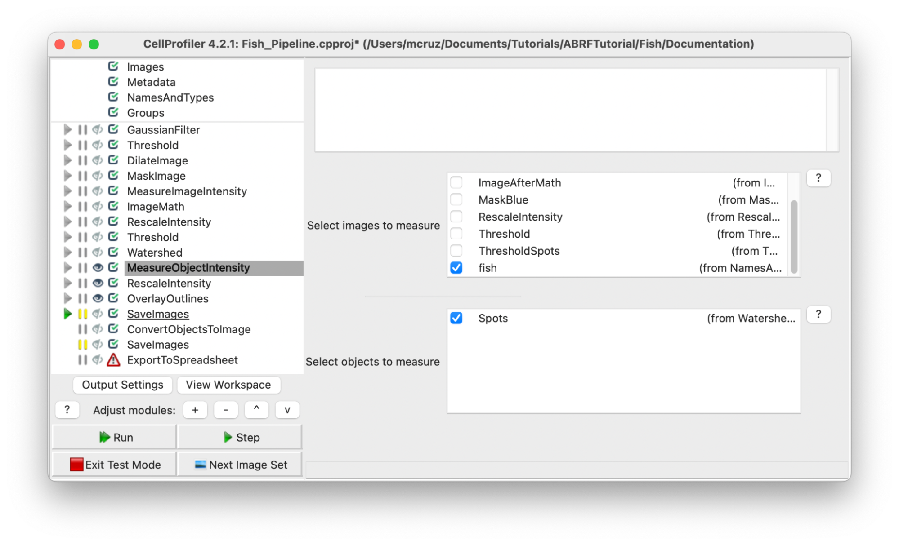

**Note:** The measure modules will provide several features for
identified objects and at this point we cannot choose which measurement,
so the module will extract all intensity features possible.

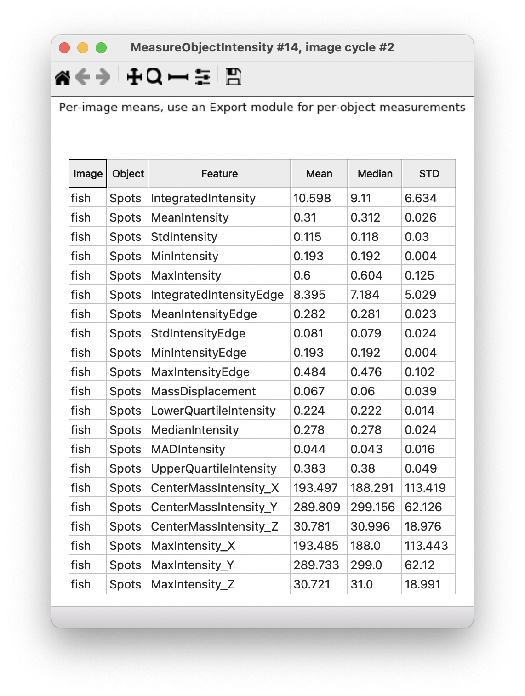

**Creating visuals**

1. Add the **RescaleIntesity** module to your pipeline. This module lets
      you rescale the intensity of the input images by any of several
      methods. You should use caution when interpreting intensity and
      texture measurements derived from images that have been rescaled
      because certain options for this module do not preserve the
      relative intensities from image to image.

   a. Selecting the input image image: fish (from **NamesAndTypes**
         module)

   b. Name the output image: RescaleIntensityFish

   c. Rescaling method: Stretch each image to use the full intensity
         range (Find the minimum and maximum values within the unmasked
         part of the image (or the whole image if there is no mask) and
         rescale every pixel so that the minimum has an intensity of
         zero and the maximum has an intensity of one).

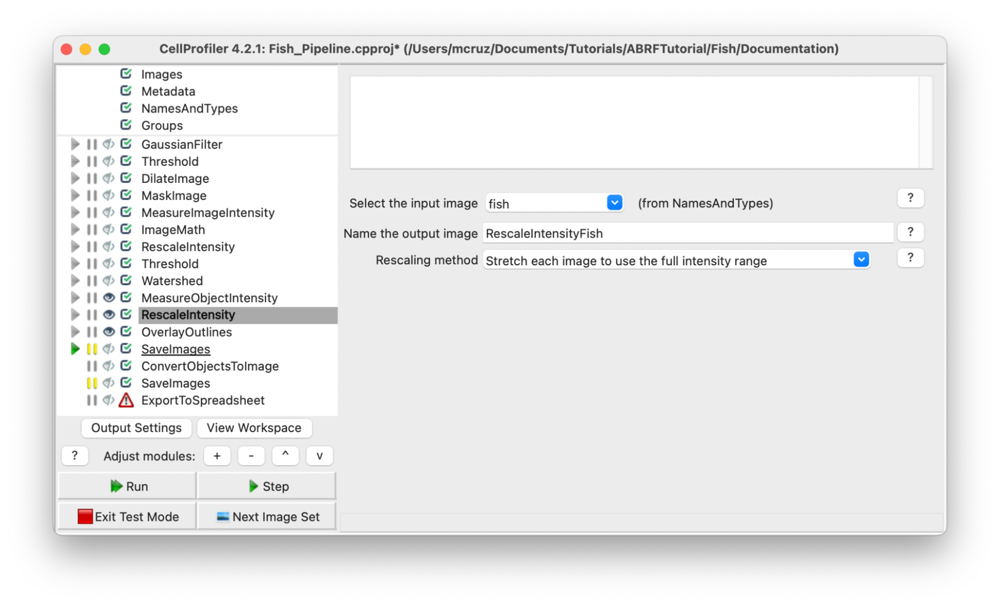

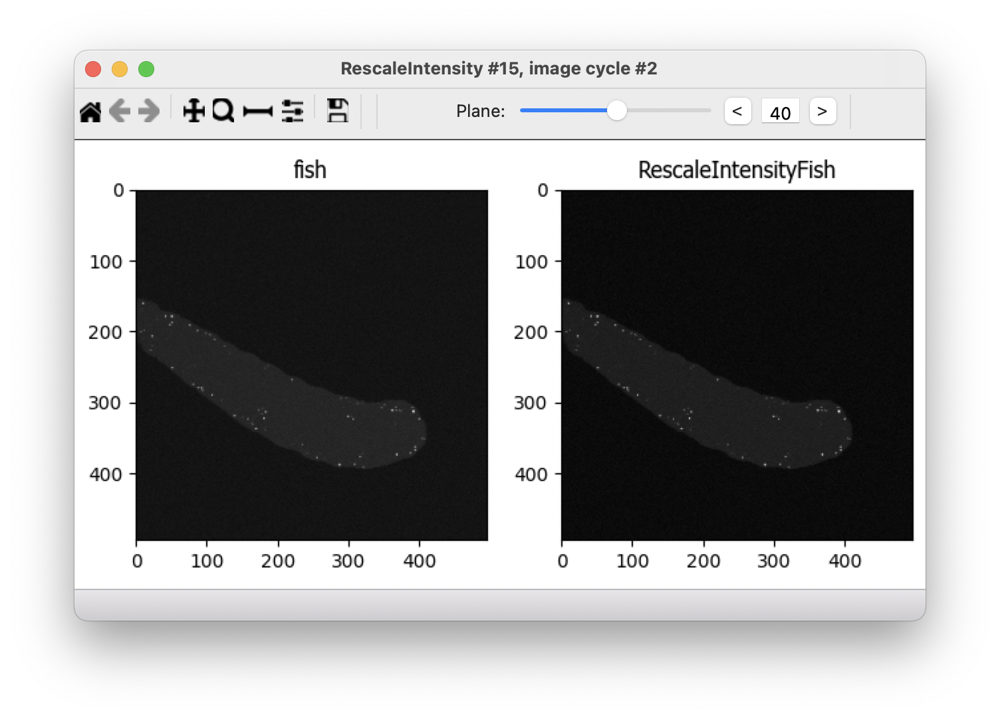

2. **OverlayOutlines** module. This module places outlines of objects
      over a desired image. We recommend overlaying onto rescaled
      images, which will be easier to visualize outside of CellProfiler.

   a. Display outlines on a blank image: No

   b. Select image on which to display outlines: RescaleIntensityFish
         (from **RescaleIntensity** module)

   c. Outline display mode: Color

   d. How to outline: Outer

   e. Select objects to display: Spots (from **Watershed** module)

   f. Select outline color: Red (Default).

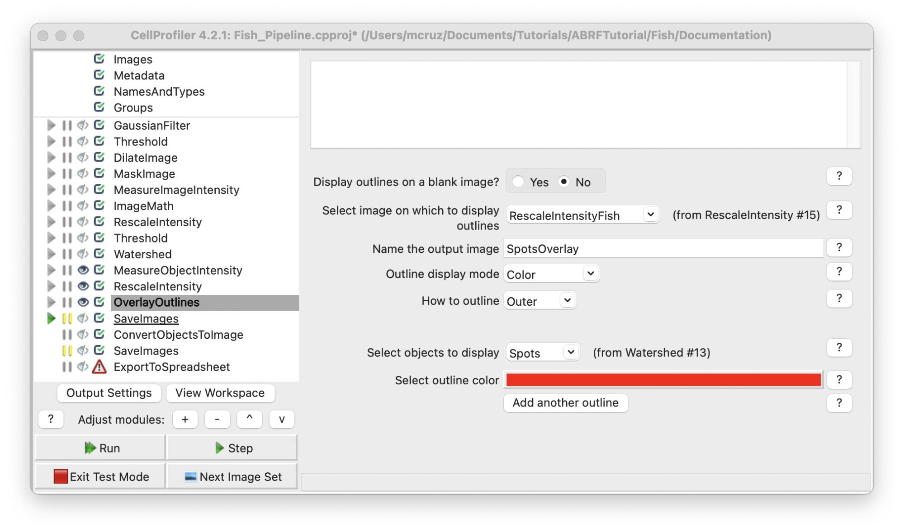

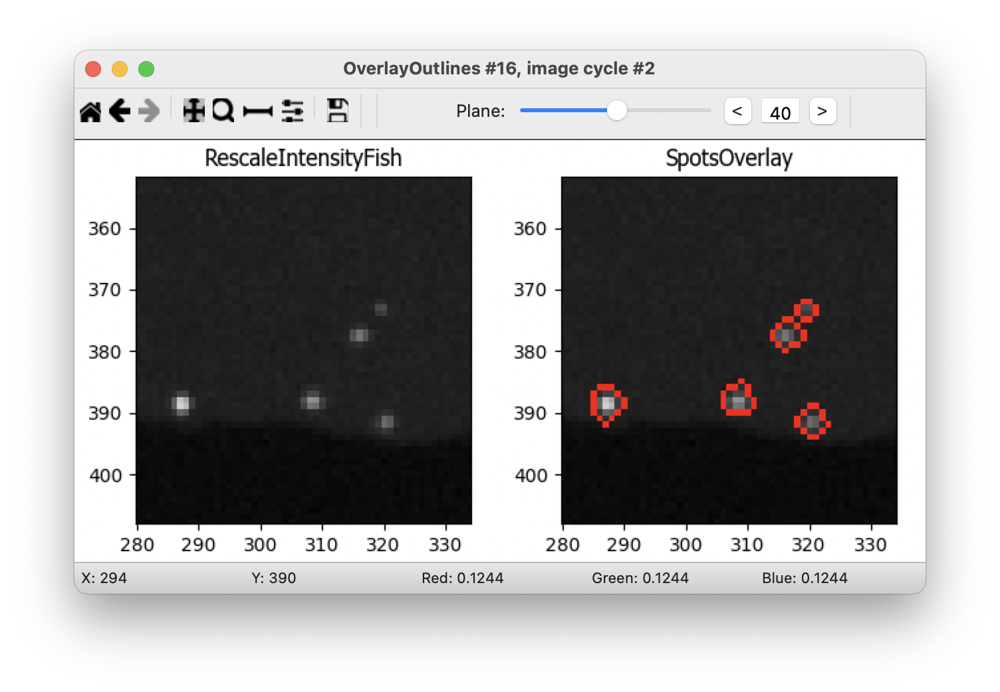

   3. **SaveImages** module. This module saves image or movie files.
   Because CellProfiler usually performs many image analysis steps on
   many groups of images, it does not save any of the resulting images
   to the hard drive unless you specifically choose to do so with the
   SaveImages module. You can save any of the processed images created
   by CellProfiler during the analysis using this module. You can choose
   from many different image formats for saving your files. This allows
   you to use the module as a file format converter, by loading files in
   their original format and then saving them in an alternate format.

a. Select the type of image to save: Image

b. Select the image to save: SpotsOverlay (from **OverlayOutlines**
      module)

c. Select method for constructing file names: From image filename (use
      this option to avoid reassignment of your images)

d. Select image name for file prefix: fish (select the original image
      name from NamesAndTypes module)

e. Append a suffix to the image file name?: No

f. Saved file format: tiff (tiff is a lossless format, but you can
      choose others depending on what you need to do with this images)

g. Image bit depth: 8-bit integer (this bit depth is easily read outside
      Cell Profiler)

h. Save with lossless compression: Yes

i. Output file location: Default Output Folder (or create a new folder
      just for this images)

j. Overwrite existing files without warning?: No (prevent file
      overwritten)

k. When to save: Every cycle (Save every image set)

l. Record the file and path information to the saved image?: No

m. Create subfolders in the output folder: No

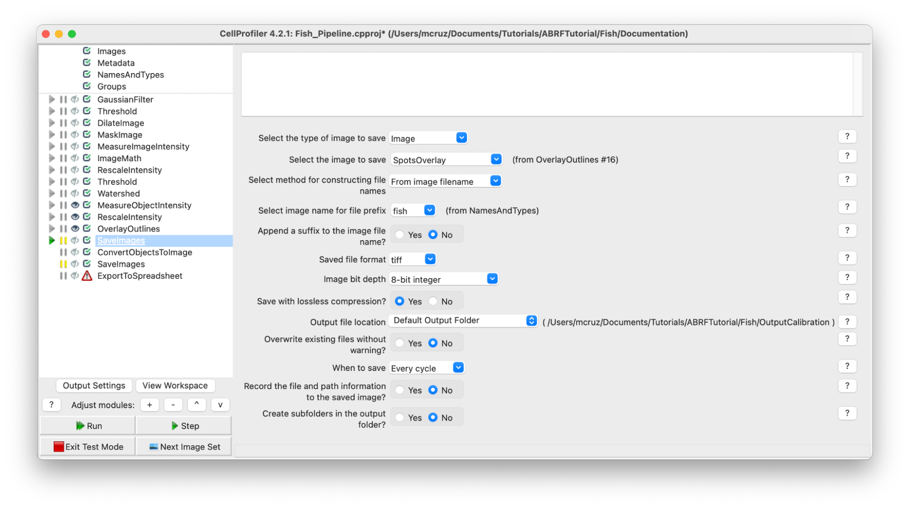

   4. **ConvertObjectsToImage** module. Transform objects in image
   (provide a 3D volume image of the segmented image)

a. Select the input objects: Spots (from Watershed module)

b. Name the output image: SpotImage

c. Select the color format: Grayscale

.. image:: media/image24.png
   :width: 5.82813in
   :height: 4.36175in

   5. **SaveImages** module. This option will allow you to visualize the
   segmentations outside Cell Profiler.

**Export measurements**

It’s good practice to place all export modules at the end of your
pipeline. CellProfiler automatically calculates execution times for each
module that was run before the export module. By placing your export
modules at the end of your pipeline, you will have access to module
execution times for each module in your pipeline. Save the output of the
measurement modules using **ExportToSpreadsheet** or
**ExportToDatabase**.

**ExportToSpreadsheet** module. This module exports measurements into
one or more files that can be opened in Excel or other spreadsheet
programs. This module will convert the measurements to a comma-, tab-,
or other character-delimited text format and save them to the hard drive
in one or several files, as requested.

a. Select the column delimiter: Comma (“,”)

b. Output file location: Default Output Folder

c. Add a prefix to file names: Yes

d. Filename prefix: FISH

e. Overwrite existing files without warning: No

f. Add image metadata columns to your object data file: No

g. Add image file and folder names to your object data file: No

h. Representation of Nan/Inf: NaN

i. Select the measurements to export: Yes

j. Press button to select measurements:

   i.  Spots:

       1. Intensity: IntegratedIntensity

   ii. Location

       1. Center: X, Y and Z

k. Calculate the per-image mean values for object measurements?:No

l. Calculate the per-image median values for object measurements?:No

m. Calculate the per-image standard deviation values for object
      measurements?:No

n. Output file location:Default Output Folder\|

o. Create a GenePattern GCT file?:No

p. Export all measurement types?:No

q. Data to export: Spots

r. Use the object name for the file name?: No

s. File name: Spots.csv

t. Data to export: Experiment

u. Use the object name for the file name?: No

v. File name: Metadata.csv

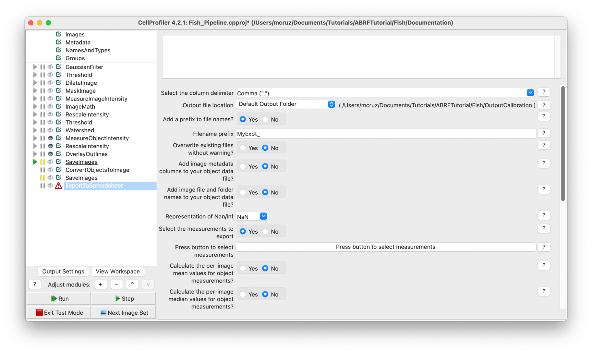

**Congratulations!** The spots have been segmented, measured and
exported. Now we need to convert the units from the csv file generated
in Cell Profiler to microns and create a new table with just the values
asked by the Study (X, Y, Z positions and Integrated Intensity for each
spot).

For this purpose we create an interactive colab notebook that will ask
you the X, Y and Z values, upload the csv generated by Cell Profiler to
finally export a new csv file with the normalized values.

https://colab.research.google.com/drive/19Xmna9BKQIkm2qmoW9IOZn-smwuAg-vu?usp=sharing

**End**

.. |image1| image:: media/image16.png
   :width: 1.88034in
   :height: 2.53646in
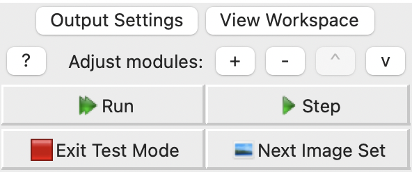
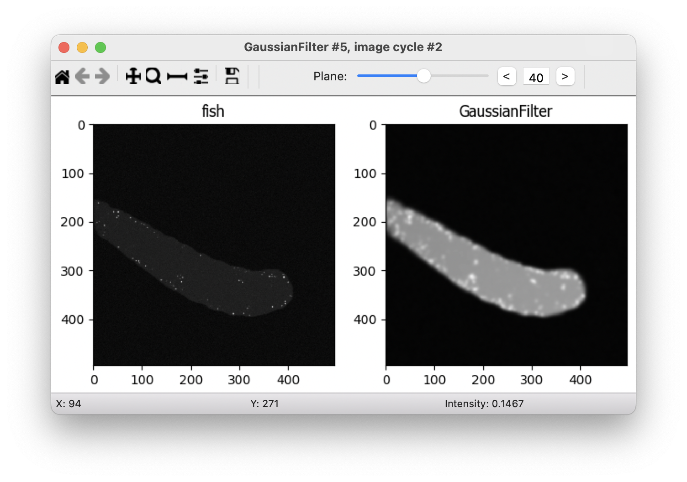

