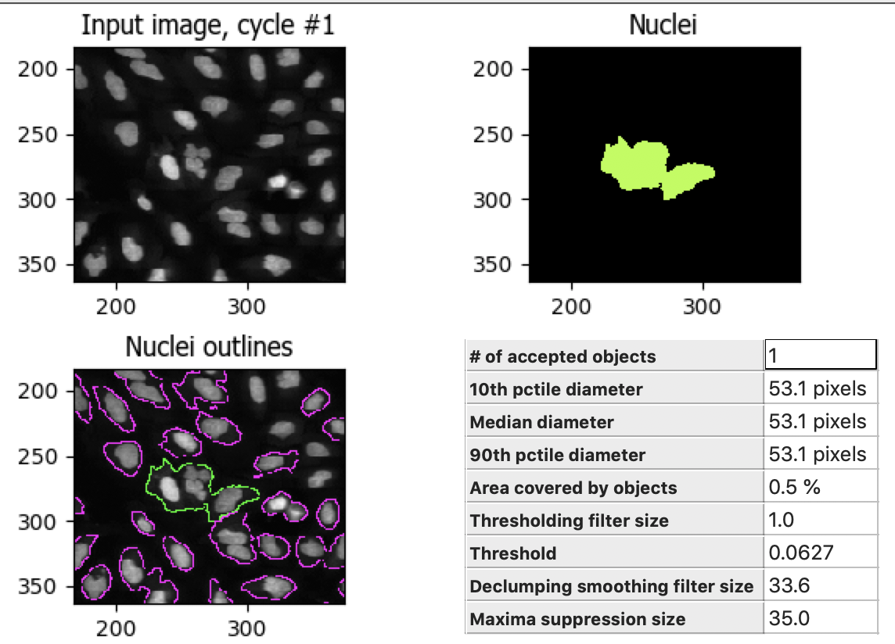

Image-based screening using subcellular localization of FOXO1A in osteosarcoma cells: A computer exercise using CellProfiler & CellProfiler Analyst software
============================================================================================================================================================

Beth Cimini, Carolina Wählby, Martin Simonsson, Megan Rokop and Mark
Bray, Broad Institute

***Background information:***

In this experiment, we are working with human U2OS osteosarcoma (bone
cancer) cells, in which a Forkhead-protein FOXO1A has been labeled with
GFP (Green Fluorescent Protein). In proliferating cells, FOXO1A is
localized in the cytoplasm; it is constantly moving into the nucleus,
but is transported out again by export proteins. Upon inhibition of
nuclear export, FOXO1A accumulates in the nucleus. We know that 150nM of
Wortmannin (the drug we are using as a positive control in this
experiment) inhibits transport of the FOXO1A protein from the nucleus
back out to the cytoplasm (Fig. 1). Labeling FOXO1A with GFP allows us
to visualize its subcellular localization. The goal of developing
image-based screens of this type is to aid in the search for unknown
drugs that have the same effect as Wortmannin on FOXO1A subcellular
localization (and hence may be possible treatments for osteosarcoma
patients), but possess fewer side effects than the known drugs.

   +---------+---------+
   | |Fig1A| | |Fig1B| |
   +---------+---------+

.. |Fig1A| image:: ./TutorialImages/Fig1A.png
      :width: 300
.. |Fig1B| image:: ./TutorialImages/Fig1B.png
      :width: 300

*Figure 1: Examples of FOXO1A-GFP localization. Left: Cytoplasmic
localization in untreated cells. Right: Nuclear localization in
Wortmannin treated cells. GFP: Green, DNA: red.*

**Goals of this exercise:**

In this exercise, we aim to: (1) determine this lowest possible dose
necessary to observe this effect, and (2) to optimize the analysis of
images in which FOXO1A is cytoplasmic versus nuclear, in order to
separate positive controls and negative controls as best as possible.

**Materials necessary for this exercise:**

The images you will be analyzing were taken from cells growing in a
standard 96-well plate, but you will work with a subset of only 26 of
these images: 8 wells were left untreated (and were therefore negative
controls), 8 wells were treated with the maximum dose of the drug
Wortmannin (and were therefore positive controls), and 10 wells were
used to create a dose gradient with increasing concentration of the
drug. In addition to these images, a text file called
“Translocation\_doses\_and\_controls.csv” is provided, containing
information about where on the 96-well plate the wells were located, and
how the cells were treated.

**Methods to be used in this exercise:**

In this exercise, you will use CellProfiler and CellProfiler Analyst to
identify and delineate (or “segment”) each nucleus and cell body, and
extract a number of measurements from each cell. You have a total of 26
images, with approximately 200 cells per image, so you want to automate
the process of identifying and segmenting the cells. The first task is
to set up a CellProfiler **pipeline** consisting of a number of
individual **modules**; each module performs a unique image-processing
step, and multiple modules can be arranged such that they are executed
in sequential order. You will test your pipeline on a few images so that
you can optimize the settings. Once optimization is complete, you will
run the pipeline on all the images in the experiment, collect
measurements from each cell and store them in a database. At this point,
you will use CellProfiler Analyst to visualize your data, and use its
machine learning tool to train the computer to distinguish between
treated and untreated cells.

Exercise I: Using the CellProfiler software to identify features and obtain measurements from cellular images.
--------------------------------------------------------------------------------------------------------------

1) **Starting CellProfiler and configuring the input data for analysis**

-  Start CellProfiler by double-clicking the desktop icon |Inline01|

-  In the CellProfiler interface, you will see the File list panel, a
   blank panel indicated by the text “Drop files and folders here”. The
   File list panel is the main interface of the *Images* module, which
   compiles a list of files and/or folders that you want to analyze;
   this module is highlighted in the Input modules panel which is
   located at the upper-left of CellProfiler.

-  From File Explorer (Windows) or Finder (Mac), drag and drop the
   “TranslocationData” folder into this panel. The names of your files
   in the TranslocationData folder should now appear in the File list
   panel. Double-click on “BBBC013\_A01\_s1\_w1.tif” and
   “BBBC013\_A12\_s1\_w1.tif” to see what examples of negative and
   positive GFP controls look like, respectively.

-  Scroll to the bottom of the File list and note that in addition to
   the image files, there is a file called
   “Translocation\_doses\_and\_controls.csv”. We only want image files to
   be analyzed in CellProfiler so this file needs to be removed from
   consideration.

-  Under the Module settings panel (below the File list), you will see a
   control for specifying which files should be used from the above
   list. Click on the “Update file list” button to filter out the
   non-image files using the default settings. You will see that the CSV
   file is then grayed-out in the list, indicating that it will not be
   used.

-  Click on the *Metadata* module, which is the second module in the
   Input module panel; this module allows you to provide information
   about the drug dosages and location on the plate.

-  The first extraction set up for you in the *Metadata* module extracts
   information about the plate, well, site, and channel of each image by
   parsing the file name.

-  Click the magnifying glass icon |Inline02| to the right of the text box
   labeled “Regular expression”.

   -  A new dialog box will appear to assist in comparing the entered
      regular expression against an example image filename.

   -  You will see the color of the “Plate”, “Well”, “Site” and
      “ChannelNumber” text match the color of the corresponding portion
      in the Test text below.

   -  Once finished, click the “Submit” button to use this expression in
      the *Metadata* module.

-  The second metadata extraction step requires you to tell CellProfiler the
   location of a CSV file.  It is looking for it in CellProfiler's Default
   Input Folder, which we must therefore configure.

   -  This is the file describing the image names, locations in the
      96-well plate, and doses.

   -  Click the file selection box next to "Metadata file name" line and navigate
      to the location of the TranslocationData folder on your computer, then
      select the **Translocation_doses_and_controls.csv** file within.

-  Return to the ‘Metadata’ module and press ‘Update’. You should now see a number of
   columns in the Metadata window.

   -  If you examine the metadata matching, you can see that  “Well”
      is selected from both drop-downs under “CSV Metadata” and “Image
      Metadata”. This indicates that the information stored in the CSVs
      "Well" column should be matched to the well metadata values obtained
      from the filename in the first extraction step.

-  Next to the setting labeled “Metadata data type”, make sure “Choose for
   each” is selected from the drop-down. For the “Dose” metadata, select “Float” as
   the data type. Leave the remaining metadata at the default “Text”
   values.

-  Click on the *NamesAndTypes* module, which is the third module in the
   Input module panel; this module allows you to assign a meaningful
   name to each image by which other modules will refer to it.

-  Note how the images are assigned to channels: images containing "w1" in their file name
   are assigned to the name "rawGFP", while those with "w2" are assigned "rawDNA".

-  Click the “Update” button below the divider to display a table that
   shows each channel pair matched up for the 26 wells in the assay.

2) **Identifying the nuclei as the “primary objects” that you will
   analyze**

Now that the module inputs and outputs are set up, in your module, the
remaining settings need to be adjusted to best detect the nuclei. The
most effective approach for this task is to use CellProfiler’s “Test
mode,” which will allow you to see the results of your chosen settings,
and adjust them as needed.

-  Click the “Start Test Mode” button to the bottom-left of the
   CellProfiler interface. You will see |Inline04| icons appear next
   to the modules in the pipeline, as well as new buttons appear below
   the modules.

-  Click on the “Step” button below the pipeline panel, in order to
   progress through each module in the pipeline, one by one. Upon
   stepping through the *IdentifyPrimaryObjects* module, a module
   display window will appear similar to that shown in Figure 2 below.

.. figure:: ./TutorialImages/Fig2.png
   :align: center
   :width: 500

   *Figure 2: Example module display window for IdentifyPrimaryObjects .*

For the *IdentifyPrimaryObjects* module, the goal is to have the
outlines match the actual nuclei boundaries as well as possible, as well
as separating touching objects accurately. Said another way, you do not
want the program to split a single object (in this case, a single nucleus)
into multiple objects, and you do not want the program to merge multiple
objects into a single object.

The results of *IdentifyPrimaryObjects* are displayed in four panels in
the display window, as shown in Fig. 2:

-  Upper left: The raw image, titled as “Input image, cycle #” plus the
   image number

-  Upper right: A colored image of the identified and labeled objects,
   titled with the object name (in this case, “Nuclei”). Note that the
   colors themselves are arbitrary, intended to distinguish each
   identified object from its neighbors.

-  Lower left: An image of the object outlines superimposed on the raw
   image, titled with the object name. Green outlines around an object
   indicate that the object has passed the selection criteria in the
   module. Yellow outlines indicate that the object touches the image
   edge, and has therefore been excluded. Pink outlines indicate objects
   that do not pass a size criterion, and have therefore been excluded.

-  Lower right: A table of module setting values and statistics

There are some image tools on the top toolbar that may be helpful to see
the individual objects:

|Inline05|

The 1st icon from the left lets you reset the view back to the original
view.

The 2nd and 3rd icons let you step backwards and forwards through any
changes you made to the view.

The 4th icon lets you change the view by moving in any direction in the
display, by clicking and dragging.

The 5th icon lets you change the view by zooming, by dragging and
drawing a box to zoom in on.

-  Zoom in the image in order to see the quality of the nuclei
   identification. The result may look like Figure 3.

   *Figure 3: A zoomed-in view of the display window for IdentifyPrimaryObjects*

3) **Improve identification of primary objects**

In this instance, in Figure 3, you can see that the outlines capture too
much of the background around the nuclei. This means that the default
automated thresholding method calculated a threshold value that is too
low. We can correct this with a change in the thresholding method used.
Since we are in Test Mode, we can easily adjust the module settings and
quickly preview the results.

-  Objects outlined in pink are outside the "Typical diameter" pixel range
   specified in the pipeline. Use the "Tools->Measure length" tool to determine
   if the size range specified is correct given the size of your objects.

-  We can figure out why the thresholding method is overly lenient by
   looking closer at the original image.

   -  Right-click on the “Input image, cycle #” panel in the
      IdentifyPrimaryObjects display window and select “Image Contrast”
      and then “Log normalized.” This log-transforms the image intensity
      such that the contrast between low pixel intensities is enhanced
      and that between high pixel intensities is reduced.

   -  Do the same for the “Nuclei outlines” image in the display window.

Most thresholding methods assume that there are two intensity
distributions present in the image, one of which is categorized as
foreground and the other as background; the objective is then to find a
single value that separates them. There are different methods to calculate this intensity threshold automatically. In order to learn more about these methods, click on the question mark icon to the right of the "Thresholding method" to open the CellProfiler help.

You'll note that the Translocation_start pipeline uses the Robust Background method initially. This method can be helpful if the majority of the image is background. In this example, however, the nuclei cover a large percentage of the image and Robust Background method is not the optimal choice. We recommend selecting the Otsu method instead.

Now, examine your original image again. In this image, there appear to be
instead three classes of staining intensity: the nuclei (high
intensity), the actual background (low intensity), and the non-specific
staining outside the nuclei but within the cell body (medium intensity).
An alternative thresholding method would need to take these intensity
gradations into account in order to improve the nuclei detection.

-  Click the *IdentifyPrimaryObjects* setting labeled “Two-class or
   three-class thresholding?” and select “Three
   classes.”

-  Change the setting “Assign pixels…” that subsequently appears
   underneath from “Foreground” to “Background.”

-  Click the “Step” button again to see the result from your new
   settings.

-  Adjust the "Threshold correction factor" to 1.

This thresholding approach takes the medium-intensity pixels and assigns
them as background pixels, leaving only the highest intensity pixels as
background. The identified outlines should now better match the actual
nuclei boundaries.

4) **Identifying the cell body as a “secondary object” that you will
   analyze**

Now that you have confirmed, by eye, that the settings we provided you
in this exercise do allow for identification and segmentation of the
nuclei, you can now find the entire cell using
*IdentifySecondaryObjects* module.

-  Click on the |Inline03| button and add the module *IdentifySecondaryObjects*,
   which is located under the module category *“Object Processing”.* Add
   it to the pipeline by clicking the “+ Add to Pipeline” button.

-  For the “Select the input image” module setting, select “rawGFP” from
   the drop-down list.

-  For the “Select input objects” setting, select “Nuclei” from the
   drop-down list.

-  For the “Name the objects to be identified” setting, enter “Cells” as
   a descriptive name for the secondary objects.

-  Click the drop-down box next to “Threshold strategy” and select
   “Global.” Then, click the drop-down next to “Thresholding method to
   select “Otsu”.

-  Click the setting labeled “Two-class or three-class thresholding?”
   and change it from “Two classes” to “Three classes.” Change the
   setting “Assign pixels…” that subsequently appears underneath to
   “Foreground”

-  Click on the “Step” button to execute the module and see the results
   of secondary object identification using the module settings (Fig.
   4).

   -  By default, secondary objects are identified with the Propagation
      method, which defines cell boundaries by “growing” outwards from
      the primary objects, i.e. the nuclei, and taking into account both
      the distance from the nearest primary object, and the local
      intensity in the GFP image.

   -  Note that the pink and green outlines do not have the same meaning
      as in the *IdentifyPrimaryObjects* display window. In
      *IdentifySecondaryObjects*, the pink outlines indicate the
      secondary object boundaries and the green outlines indicate the
      primary object boundaries.

.. figure:: ./TutorialImages/Fig4.png
   :align: center
   :width: 500

   *Figure 4: Example module display window for IdentifySecondaryObjects*.

In contrast to the DNA stain in *IdentifyPrimaryObjects*, the middle
intensity levels associated with the dim cells are assigned as
foreground pixels, so that the secondary objects captures both the dim
and bright cells.

However, for this assay, we may prefer to use a segmentation method that
reflects the actual cell boundaries and is not dependent on an intensity
that varies from treatment to treatment. We will take a look at the
Distance-N method which expands outward from the nucleus a fixed number
of pixels without regard to the underlying fluorescence.

-  Change the “Select method…” setting from “Propagation” to
   “Distance-N.”

-  Change the setting “Number of pixels by which to expand…” that
   appears underneath to 10 pixels.

-  Click the “Step” button to see the result from your new settings.

5) **Identifying the cytoplasm as a “tertiary object”**

Once we have identified the nucleus and the cell body, these two objects
can be used to define the cell cytoplasm as the region outside the
nucleus, but within the cell boundary. We will use the
*IdentifyTertiaryObjects* module which will take the smaller identified
objects and “subtract” (or remove) them from the larger identified
objects, effectively identifying the cytoplasm.

-  Click on the |Inline03| button and add the module *IdentifyTertiaryObjects*
   located under the module category *“Object Processing”.* Add it to
   the pipeline by clicking the “+ Add to Pipeline” button.

-  In this module, for the “Select the larger identified objects” module
   setting, select “Cells” from the drop-down list.

-  For the “Select the smaller identified objects” setting, select
   “Nuclei” from the drop-down list.

-  For the “Name the tertiary objects to be identified” setting, enter
   “Cytoplasm” as a descriptive name for the tertiary objects.

-  Enable the ‘Shrink smaller object prior to subtraction?’ option; this
   will ensure that all of your Cytoplasm objects have an area of at
   least 1 pixel.

-  Click the “Step” button to execute the module, and preview the
   results of tertiary object identification (Fig. 5).

.. figure:: ./TutorialImages/Fig5.png
   :align: center
   :width: 500

   *Figure 5: Example module display window for IdentifyTertiaryObjects*.

6) **Measuring the cells’ characteristics (i.e. the “object features”)**

Now that the objects have been identified using settings that have been
optimized for the phenotypes of interest, the next step is to make
measurements of the various cellular features. Later, we will be using
CellProfiler Analyst to classify the cells into phenotypes, based on
whether they contain cytoplasmic or nuclear FOXO1A-GFP using the
measurements collected here. The important point is to collect
measurements that would be useful for distinguishing one phenotype from
the other.

CellProfiler has the ability to measure many cellular characteristics,
and what we could do in this exercise, is ask it to measure all of them,
and then let the classification tool decide which features are most
useful. In this exercise, however, we will use three of the possible
measurements.

**Measurement of pixel intensity of GFP in nuclei and cytoplasm:** One
example of a particularly useful measurement is the pixel intensities of
the various objects (i.e. nuclei and cytoplasm) as measured from the
images showing the subcellular location of the FOXO1A-GFP fluorescence.

-  Click on the |Inline03| button and add the module *MeasureObjectIntensity*
   located under the module category *“Measurement”.* Add it to the
   pipeline by clicking the “+ Add to Pipeline” button.

-  In this module, select “rawGFP” from the drop-down list, which is
   next to the “Select an image to measure” setting.

-  Choose “Nuclei” from the drop-down list next to the “Select objects
   to measure” setting. Press the “Add another object button” and select
   “Cytoplasm” (from the drop-down list of the new “Select objects to
   measure” setting that appears when you do this).

**Measurement of the correlation of GFP in nuclei to DNA in nuclei:**
Another potentially useful measure is the correlation within the objects
of the pixel intensities in the GFP and DNA channels. If the FOXO1A-GFP
protein is not translocated, the intensity correlation within the
nucleus between the two images would be expected to be negative, whereas
upon translocation, the correlation would be positive.

-  Click on the |Inline03| button and add the module *MeasureColocalization* located
   under the module category *“Measurement”.* Add it to the pipeline by
   clicking the “+ Add to Pipeline” button.

-  In this module, select “rawGFP” and “rawDNA” from the drop-down lists
   next to the two “Select an image to measure” settings.

-  For the “Select where to measure correlation” setting, select “Within
   objects” and then select “Nuclei” from the “Select an object to
   measure” setting.

**Measurement of the ratio of GFP in cytoplasm to GFP in nuclei:** Since
we are interested in the transportation of GFP from the cytoplasm to the
nucleus, it would be useful to measure the ratio of cytoplasmic stain to
nuclear stain. In this case, we will use the *CalculateMath* module
because it performs arithmetic operations between various object
measurements.

-  Click on the |Inline03| button and add the module *CalculateMath* located under
   the *“Data Tools”* module category\ *.* Add it to the pipeline by
   clicking the “+ Add to Pipeline” button.

-  For the “Name the output measurement,” enter the “IntensityRatio” as
   a descriptive name.

-  Since we calculating a ratio of two measures, select “Divide” from
   the drop-down for the “Operation” setting.

-  For the numerator measurement:

   -  Select “Object” for the “Select the numerator type,” and select
      “Nuclei” from the drop-down for the “Select the numerator
      objects.”

   -  Select “Intensity” from the drop-down for the “Select the
      numerator measurement” category. A “Measurement” drop-down box
      will subsequently appear underneath.

   -  Select “MeanIntensity” from the “Measurement” drop-down list. Then
      select “rawGFP” from the “Image” drop-down that appears.

-  For the denominator measurement:

   -  Select “Object” for the “Select the numerator type,” and select
      “Cytoplasm” from the drop-down for the “Select the
      numerator objects.”

   -  Select “Intensity” from the drop-down for the “Select the
      numerator measurement” category. A “Measurement” drop-down box
      will subsequently appear underneath.

   -  Select “MeanIntensity” from the “Measurement” drop-down list. Then
      select “rawGFP” from the “Image” drop-down that appears.

7) **Creating an image with your cell and nuclear outlines on it
   (optional)**

It’s often nice to create an image showing the segmentation of your
objects so that you can refer back to it later; in addition to the
ability to quickly scan all the output images to make sure your
segmentation was successful, you can re-check them later in case you
have questions about an unusual result.

**Creation of a color image to display the segmentation:**

-  Click on the |Inline03| button and add the module *GrayToColor* located under
   the *“Image Processing”* module category\ *.* Add it to the pipeline
   by clicking the “+ Add to Pipeline” button.

-  For the “Select a color scheme”, leave the setting at “RGB”.

-  For the channels

   -  “Set the image to be colored red” set to “Leave this black”.

   -  “Set the image to be colored green” set to “rawGFP”.

   -  “Set the image to be colored blue” set to “rawDNA”.

-  “Name the output image” can be set to “GFPandDNA” .

-  “Relative weight”s for each of the channels can be left at 1.

**Overlaying the outlines onto the color image:** This module will
overlay the outlines of your identified objects onto the color image.
You may choose whatever color you like to show the outlines, but you may
find it easiest to use something that contrasts with your color image.
You may also overlay outlines on a grayscale image; if you have many
types of objects and/or more than 3 channels it is often easier to
overlay the objects for each channel onto that channel’s grayscale image
and simply view them one at a time.

-  Click on the |Inline03| button and add the module *OverlayOutlines* located
   under the *“Image Processing”* module category\ *.* Add it to the
   pipeline by clicking the “+ Add to Pipeline” button.

-  “Display outlines on a blank image” should be set to “No”.

-  The “Select image on which to display outlines” should be set to the
   “GFPandDNA” image we created in the last step.

-  “Name the output image” can be set to “CellAndNucleiOverlay” or some
   other descriptive name.

-  The “Outline display mode” dropdown menu should be left at “Color”.

-  “How to outline” can be left at the default (Inner).

-  For “Select objects to display” select “Nuclei” from the dropdown
   menu.

-  “Select outline color” can be left as red or set to some other
   contrasting color.

-  Click the “Add another outline” button, then repeat the previous 3
   steps for “Cells”; you should select a different color for the
   outlines.

**Saving the overlay image:** The SaveImages module can be used to
either save images generated in any step of the pipeline or masks of the
objects created. Here we will save the images to the DefaultOutput
folder, but you can specify any other location, and additionally create
subfolders based on the extracted metadata if you like.

-  Click on the |Inline03| button and add the module *SaveImages* located under the
   *“File processing”* module category\ *.* Add it to the pipeline by
   clicking the “+ Add to Pipeline” button.

-  For “Select the type of image to save”, select “Image”.

-  For “Select the image to save”, select your “CellAndNucleiOverlay”
   image you just created.

-  For “Select method for constructing file names”, keep it set at “From
   image filename”.

-  For “Select image name for file prefix”, select the “rawGFP” image.

-  Change the “Append a suffix to the image file name?” radio buttons to
   “Yes”.

-  Give the “Text to append to the image name” a descriptive name;
   “\_Overlay” is appropriate.

-  All the other settings may be left at their default values.

8) **Exporting the measurements to a database**

Since we will be using the data visualization and machine learning tools
in CellProfiler Analyst, the measurements will need to be saved to a
database using the *ExportToDatabase* module in order for CellProfiler
Analyst to access them.

-  Click on the |Inline03| button and add the module *ExportToDatabase* located
   under the module category *“File Processing”.* Add it to the pipeline
   by clicking the “+ Add to Pipeline” button.

   -  Note that while in Test mode, the *ExportToDatabase* module will
      have a yellow warning sign in the pipeline panel and yellow-
      highlighted text in the module settings. Holding the mouse over
      the yellow-highlighted text informs the user that measurements
      produced in Test mode are not written to the database. This is
      normal behavior and does not indicate an error.

-  Select “Database type” as “SQLite.”

-  Check the box labeled “Create a CellProfiler Analyst properties
   file.” A number of new settings will subsequently appear underneath.

-  For “Which objects should be used for locations?”, select “Nuclei”.

-  For “Select the plate type”, choose “96.”

-  For “Select the plate metadata,” choose “Plate.”

-  For “Select the well metadata,” choose “Well.”

-  For “Output file location”, select “Default Output Folder”.

-  Check the box “Write image thumbnails directly to database?” From the
   list-box that subsequently appears, select “rawDNA” and “rawGFP”; you
   can make multiple selections by using Ctrl-click (Windows) or
   Command-click (Mac). Leave the rest of the settings at the default
   values.

9) **Using the optimized pipeline to automatically analyze all images
    generated by the screening experiment**

At this point, the settings you have entered were chosen for you because
those settings specifically, when used with these images, result in an
optimized pipeline for a suitable number of images. Therefore your
pipeline is now ready to run on the full data set of 26 images.

-  Exit Test Mode by clicking the “Exit Test Mode” button at the
   bottom-left of the CellProfiler interface.

-  Click the “View output settings” button at the bottom-left of the
   interface. Then, in the module settings panel, click the folder
   button to the right of “Default Output Folder” box, and browse to
   select your Desktop. This location is where your CellProfiler
   measurements will be saved.

-  Select the “Window” item from the menu bar and select “Hide all
   windows on run;” the “eyeball” icons next to the modules will switch
   from open (|Inline06|) to closed (|Inline07|). This display indicates that the module
   display windows for each module will not be shown as each is
   processed. The rationale behind this step is because the pipeline is
   optimized, we no longer need to see the results. Additionally, the
   analysis will be quicker this way, since CellProfiler does not have
   to take the time to create and draw each window.

-  Save your pipeline by selecting *File > Save Project As…*, give the
   pipeline a name and save it to your Desktop.

-  To analyze all images, click “Analyze images” button in the lower
   right corner of the CellProfiler interface.

   -  (Windows only) A Windows Security Alert box may pop up asking for
      network access permission for CellProfiler.exe. Check the “Private
      networks” box, then click “Allow access”.

The pipeline will run beginning with the first of 26 images. This full
run may take a few minutes.

Exercise II: Using the CellProfiler Analyst software to visualize the data from the experiment, and classify the cells exposed to each drug condition by their phenotype (FOXO1A-GFP subcellular localization)
--------------------------------------------------------------------------------------------------------------------------------------------------------------------------------------------------------------

You can now start CellProfiler Analyst (CPA) to explore the data you
have extracted from the cells.

-  Start CellProfiler Analyst by double-clicking the icon on the desktop |Inline08|.

-  When CPA is started, it will ask to select a *properties file*.
   Select the properties file named *DefaultDB .properties*, located in
   the Default Output Folder. The properties file was created by the
   *ExportToDatabase* module in your pipeline.

   -  This file is a text file that contains the settings necessary for
      CPA to connect to the database that CellProfiler generated.

   -  As a reminder, this database currently contains the measurement
      data obtained from all 26 images, and pointers to the location of
      those images on your hard drive.

1) **Visualizing the measurements in a 96-well plate layout view**

CPA has several tools available for displaying the data for exploration.
If your data came from a multi-well plate, such as the 96-well plate for
this particular translocation assay, then one of the most useful data
visualization tools available is the plate layout format.

-  Click on the Plate Viewer icon in the CPA menu (|Inline09|, 3rd from the left).
   This selection brings up a 96-well formatted display of the plate
   from which your images originated. The colored squares represent
   wells for which measurement data is present; crossed-out wells
   indicate wells with no measurements. Notice that 26 out of the 96
   wells have data associated with them. Mouse over a few of the wells
   to see a “tool-tip” box appear, which states the actual per-well
   value.

-  The initial color coding represents the image index, a bookkeeping
   measurement which is not relevant for the level of analysis that we
   are doing in this exercise. Under the *Measurements* drop-down list,
   choose *“Image\_Metadata\_Dose”* from the list, in order to visualize
   the drug concentrations added to each well. In particular, take note
   of the following:

   -  Column 1, rows A-D, column 12, rows E-H and well E02: Negative
      controls, i.e., no drug added

   -  Column 1, rows E-H and column 12, rows A-D: Positive controls,
      i.e., 150 nM Wortmannin

   -  Row E, columns 2-11: Nine doses of 2-fold dilutions of Wortmannin,
      increasing from left to right.

   *Figure 6: The Plate Viewer visualization tool illustrating the drug dosages applied to the plate.*

-  Select “\ *Image\_Count\_Nuclei”* from the *Measurement* drop-down to
   show the nuclei count for each image.

-  Per-object measurements can also be displayed using this tool. Select
   “Per-object” as the Data Source, and
   “\ *Cytoplasm\_Math\_IntensityRatio”* as the Measurement. Since each
   well can display only one value, but there are multiple objects per
   well, the Plate Viewer displays an aggregate statistic of the
   per-object measurements for each well. (Note that you can change the
   statistic used, at this step, by selecting it from the “Aggregation
   method” drop-down in the “Data aggregation” panel.)

-  In this step, you will see how the image thumbnails can also be shown
   in the viewer. To do this, under “Well display” in the “View options”
   panel, select “thumbnail.” The colored well squares will be replaced
   with merged color thumbnails of the original images.

-  In order to see that the original images are linked to the well
   display, you should right-click on a well and select the image number
   corresponding to the image of interest, in order to display the full
   image. (Note that the default color for each channel can be changed
   by selecting the desired colors in the menu bar; any changes will be
   applied to subsequent images that you open.)

-  Lastly, you will view the thumbnail montages by right-clicking on a
   well and selecting “Show thumbnail montage” from the resulting
   pop-up. Click anywhere outside of the thumbnail to dismiss it from
   view. (Note that, if there had been multiple snapshots of multiple
   fields of view for each well in the plate, then the montage would be
   shown as a tiled display.)

-  Do not close the Plate Viewer tool, as you will be referring to it
   later in the exercise.

2) **Using the Classifier function of CPA to distinguish the cells’
   FOXO1A-GFP subcellular localization phenotypes**

CellProfiler Analyst contains a machine-learning classification tool,
which will allow you to distinguish different phenotypes automatically.
In this case, we will “train” the classifier to recognize cells in which
FOXO1A-GFP is located exclusively in the nucleus (“positives”) versus
outside the nucleus (“negatives”) by sorting examples of each into bins.

-  Select the *Classifier* icon in the CPA menu (|Inline10|, 2nd on left). The
   Classifier interface will appear, similar to that shown in the top of
   Fig. 7.

-  Click on the “Fetch!” button, which instructs CPA to display pictures
   of a default number (i.e. 20) of randomly selected cells from this
   experiment. You will see the middle “unclassified” panel start to be
   populated with thumbnail images of these randomly selected cells.

-  Use your mouse to “drag & drop” whichever cells you consider clearly
   positive (i.e. FOXO1A-GFP located exclusively in the nucleus) into
   the “positive” bin. See the bottom-left panel of Fig. 7 for examples
   of positive cells.

   -  A small dot is displayed in the center of each thumbnail image as
      your mouse hovers over it. The cell that falls under this dot is
      the cell to “drag & drop” which will be used for classification.

.. figure:: ./TutorialImages/Fig7a.png
         :align: center
         :width: 600

+---------------------------------+---------------------------------+
| |Fig7b| |Fig7c| |Fig7d| |Fig7e| | |Fig7f| |Fig7g| |Fig7h| |Fig7i| |
+---------------------------------+---------------------------------+
| **Examples of positive cells**  | **Examples of negative cells**  |
+---------------------------------+---------------------------------+

.. |Fig7b| image:: ./TutorialImages/Fig7b.png
   :width: 50
.. |Fig7c| image:: ./TutorialImages/Fig7c.png
   :width: 50

.. |Fig7e| image:: ./TutorialImages/Fig7e.png
   :width: 50

.. |Fig7g| image:: ./TutorialImages/Fig7g.png
   :width: 50
.. |Fig7h| image:: ./TutorialImages/Fig7h.png
   :width: 50
.. |Fig7i| image:: ./TutorialImages/Fig7i.png
   :width: 50

*Figure 7: * ***Top:*** *The Classifier interface showing 5 positive and 5
negative cells. Thirty unclassified cells remain and are ready for
sorting. * ***Bottom:*** *Examples of positive cells (left) and negative cells
(right).*

-  Now “drag & drop” whichever cells you consider clearly negative (i.e.
   FOXO1A-GFP located exclusively in the cytoplasm) into the “negative”
   bin. See the bottom-right panel of Fig. 7 for examples of negative
   cells.

-  Once you have at least 5 cells in the positive bin and 5 cells in the
   negative bin, change the classifier from ‘Random Forest’ to ‘Fast
   Gentle Boosting’ and click the “Train Classifier” button. If you did
   not receive 5 clearly positive & 5 clearly negative cells, in the
   first batch of 20 randomly selected cells you received, then hit the
   “Fetch!” button again, until you receive enough cells to be able to
   put 5 in each bin.

   -  Note that in this portion of the exercise, the cell images that
      are provided to you are a random sampling of the data. Thus,
      depending on which cell images are allocated to you, your sorting
      into these two bins will take varying amounts of time.
      Subsequently, the results of this portion of the exercise will not
      look the same from user to user.

   -  We refer to this set of positive and negative cells you have
      assembled as the “training set.”

3) **Reviewing the rules that CPA established (based on your training
   set) to classify positive and negative cells**

The classification rules you will examine below are CPA’s way of
defining the measurements (and the cutoff values the measurements need
to have) in order to distinguish the positive from the negative
phenotypes.

-  Read the text that is now located in the text box in the upper half
   of the Classifier window. This text contains the rules CPA found
   based on the training set you provided to it.

   -  Each rule is in the form an “IF” statement evaluating whether a
      measurement is greater than some value.

   -  The closer to the top of the list a measurement appears, the more
      significant it is in distinguishing the phenotypes.

-  Questions to consider: (1) What is the top-most measurement that
   shows up in your classification rules? (2) Is the top-most
   measurement one that you would expect to be the most significant one
   to use, in distinguishing the phenotypes?

4) **Reviewing the accuracy of the classification with the confusion
   matrix**

Once you have trained a classifier, you can test the ability of the of
the classification rules to predict which class each cell in your
training set belongs to. CPA does this by taking each cell in the
training set, using its measurements and the rules generated in training
to ‘guess’ whether it should be positive or negative, then comparing
that answer with the bin you actually placed it in. The accuracy of
these predictions can be graphed in a matrix with the ‘True label’ (the
bin you assigned) on the Y axis and the ‘Predicted label’ (CPA’s guess)
on the X axis.

-  Press the ‘Evaluate’ button to generate a confusion matrix for the
   cells you’ve classified so far. How accurate is your classification
   after adding only a few cells to your training set?

Note that the confusion matrix is NOT a measure of how accurate the
classifier will be on your whole data set, simply a measure of *how well
the classifier performs on your hand-picked examples*. As your data is
likely more complicated than just the few cells you’ve chosen to train
on, you shouldn’t stop at this point even if you have a perfect
correlation matrix- you need to see how your classifier will perform on
more data before you can decide whether it’s accurate enough to score
the whole experiment.

+---------+---------+
| |Fig8A| | |Fig8B| |
+---------+---------+

*Figure 8: Examples of confusion matrices from a poorly-trained (left)
and well-trained (right) classifier. The cells in the classifier on the
left were assigned to bins of the training set at random, making it very
difficult to come up with good rules to separate the classes; nearly 50%
of each class is predicted incorrectly. The cells in the classifier on
the right have been assigned to the correct bins, allowing the
classifier to find rules that accurately predict which class the cells
belong to. While the cells in this simple example were able to be
predicted perfectly, that is rare in real data.*

5) **Refining the training set by sorting more “unclassified” cells into
   the “positive” and “negative” bins**

At this point, it is important to keep in mind that the CPA Classifier
tool will pick whichever measurement is most significant in making its
determination of positive versus negative (whether or not that
measurement happens to be a physiologically relevant characteristic in
the mind of the user).

For example, at this point (after only sorting 5 positive & 5 negative
cells), you may notice measurements called *“Object\_Number”* (the
object number of each cell) or *“Nuclei\_Location\_Center”* (the cell
position in the image) included in the classification rules. This
indicates that the classifier is not well-trained, since these
measurements are not correlated with the phenotype we want to find.
Whenever you find that the classifier is not well-trained, you need to
either add more cells to the training set, or obtain more measurements
from the cells.

**Refining the training set by obtaining samples from positive and
negative control wells:** Sometimes the phenotype of interest is
uncommon enough, that fetching 20 random images will not result in the
retrieval of many clear examples of the phenotype you are looking for.
However, if you know which images contain examples of the phenotype, you
can open the image - either by double-clicking a cell thumbnail, or
from the *Plate Viewer* (if you know the location of the well). You can
then drag-and-drop the cells of interest directly from the image.

-  Open the *Plate Viewer* and double-click on well A01, in order to
   open an image from the negative controls.

-  Click on a cell in the image that is negative for the phenotype and
   drag-and-drop it into the negative bin. Repeat this for 5 negative
   cells.

-  Repeat the above two steps for A12 (a well containing a positive
   control sample), dropping the cells into the positive bin. Do this
   for 5 positive cells.

-  Click the “Train classifier” button.

**Refining the training set by correcting misclassified cells in an
image:** You may also apply the rules to all the identified cells in an
image, and use it to correct misclassifications.

-  Double-click any of cell thumbnails in the positive or negative bins.

-  From the image that opens, click “Classify” from the menu, then
   “Classify Image”.

-  The cells will be color-coded according to their classification based
   on the current rules.

   -  On Windows computers, to see each color means, click the “Show
      controls >>” button at the bottom to reveal the colored class
      list.

   -  On Macs, select “View” from the image menu, and then select “View
      cell classes as numbers.” Then, to see what each number means,
      click the “Show controls >>” button at the bottom to reveal the
      numbered class list.

-  Look for up to 5 cells that are clearly misclassified. For each of
   these cells that you find, click on it and drag-and-drop it into the
   appropriate bin.

-  Click the “Train classifier” button.

**Refining the training set by fetching positive and negative cells:**
You now have your initial training set, and the rules that define the
computer’s first attempt at distinguishing the phenotype. Therefore you
can now request that the computer fetch more examples of positive and
negative cells. These new sample cells can be added to the corresponding
bins, in order to improve the classifier’s performance, with respect to
distinguishing the FOXO1A-GFP subcellular localization phenotypes.

-  Change the number next to the word “Fetch” from “20” to “5”. Click on
   the drop-down box labeled “random” in the fetch controls. Select
   “positive” from the drop-down list.

-  Click the “Fetch!” button to retrieve samples of what the computer
   thinks are positive cells based on the current set of rules. Refine
   your training set by doing the following:

   -  If positive cells are correctly fetched (true positives), drag and
      drop them into the positive bin.

   -  If negative cells are incorrectly fetched (false positives), drag
      and drop them into the negative bin.

As with previous steps, if you are not sure about which bin a cell
belongs to, do not add it to the training set. Instead, click to select
these ambiguous cells, and then press the “Delete” key to remove them
from the analysis.

Repeat this step until you have at least 20 cells in each bin.

-  Click the “Train classifier” button.

-  Questions to consider: (1) What is the top-most rule that shows up in
   your classification rules? (2) Is the top-most rule a measurement
   that you would expect to be the most significant one to use, in
   distinguishing the phenotypes?

Whatever approach you choose to obtain more positive and negative cells,
the procedure is the same: (i) Find rules; (ii) Obtain more cell samples
of the desired phenotype; (iii) Correct misclassifications, or sort into
appropriate bins; (iv) Go back to the first step and repeat, until the
classifier displays the desired level of accuracy.

6) **Classifying all cells in the experiment**

Once the classifier is of the desired accuracy, it is ready to be
applied to the complete image data set.

-  Press the “Score all” button. A dialog box will appear with scoring
   options; click “OK” to accept the default settings and begin scoring.
   Every cell in every image will now be scored as positive or negative
   by the classifier you built.

A “Hit table” window will appear containing the summarized scores for
every image (Fig. 9). The total cell count is reported, as well as the
number of positive and negative cells classified. The last column is the
enrichment score.

-  Click on the column header labeled “Enriched Score positive.” (You
   can resize the hit table window, if this column is not visible).
   Clicking this header will sort the rows in ascending or descending
   order, according to the enrichment scores. Sort the column values so
   the order is descending, with the highest score at top.

-  Double-click on the asterisk in the first row to the left of the
   first column (“ImageNumber”) to display the corresponding image for
   the top-scoring well.

.. figure:: ./TutorialImages/Fig9.png
   :align: center
   :width: 600

   *Figure 9: Hit table showing the cell counts and enrichment scores.*

You can also save your training set and/or classifer model for future
reference or to make changes later; do so by going to *File > Save
Training Set* or *File > Save Classifier Model*

7) **Saving the scores to the measurement database for visualization**

Now that we have successfully scored our experiment, we will save the
scores back to the measurement database, so that they can be visualized
using CPA’s tools.

-  Select the “Hit table” window and click “File” from the menu, then
   “Save table to database.” When prompted for a name, enter “HitTable”.
   Select “save permanently” when prompted.

-  Select Plate Viewer from the CPA interface, then choose “\*OTHER
   TABLE\*” from “Data source.”

-  When prompted to select a table, choose “HitTable.”

-  At the next prompt, select “per-well” as the table type. Then select
   the matching columns in order to link the table of hits to the table
   of image measurements, by doing the following:

   -  On the first row, choose “\ *PlateID*\ ” on the left to match
      “\ *Image\_Metadata\_Plate*\ ” on the right.

   -  On the second row, choose “\ *Image\_Metadata\_Well*\ ” on the
      left to match “\ *Image\_Metadata\_Well*\ ” on the right.

-  Open a new Plate Viewer tool from the CPA menu. On the Plate Viewer,
   select “\ *pEnriched\_positive”* from the *Measurement* drop-down
   list in order to view the enrichment scores in the plate layout.

-  Refer to the previous Plate Viewer display of
   *“Image\_Metadata\_Dose*\ ” from section 2A. Consider the following
   questions: (1) How well does the layout of the
   “\ *pEnriched\_positive*\ ” values match the layout of the (i)
   positive and negative control wells and (ii) the 9-point dose wells
   of “\ *Image\_Metadata\_Dose*\ ”? (2) What does this correspondence
   (or lack thereof) tell you about the classifier?

8) **Plotting the scoring results, to estimate the lowest dose necessary
   to induce FOX1O-GFP translocation**

You can use additional data tools in CPA to visualize your data in other
ways. In this case, we will use a scatter plot to plot a dose-response
curve. This will allow us to see how the ratio of positive cells (i.e.
cells with GFP in the nucleus) increases with Wortmannin dose.

-  Click the Scatter Plot icon in the CPA menu |Inline11|, 4th from left).

-  From the “x-axis” row, select “\ *Per\_image*\ ” and
   “\ *Image\_Metadata\_Dose*\ ” from the drop-down lists. Choose
   “\ *log*\ ” from the “Scale” drop-down.

-  From the “y-axis” row, select “\ *HitTable*\ ” and
   “\ *pEnriched\_positive*\ ” from the drop-down-lists.

-  Click the “Update chart” button to see the scatter plot. NOTE: due to
   a bug in CPA, if you have plot the graph once in “\ *linear*\ ” scale
   mode and then try to switch to “\ *log*\ ” scale an error will be
   thrown. If you want to look at both, open two separate scatter plots.

-  In the space below, record your questions to the following questions:
   (1) What is the enrichment score (*pEnriched\_positive*) that
   corresponds to the highest dose (*Image\_Metadata\_Dose*) in the
   experiment? (There are several points corresponding to the highest
   dose, so estimate the average enrichment score) (2) What is the
   lowest dose that produces an enrichment score similar to that of the
   maximum dose?

--------------

***To learn more about CellProfiler, please see our website:***

-  Download CellProfiler and CellProfiler Analyst from the
   “Download” links on
   `https://cellprofiler.org/ <https://cellprofiler.org/>`__ and `https://cellprofileranalyst.org/ <https://cellprofileranalyst.org/>`__, and install
   according to the instructions from the download page. This webpage
   also provides tutorials and example pipelines.

-  Visit the Scientific Community Image Forum at https://forum.image.sc/ to  find answers to common questions and ask for help if needed.

-  Download sample images and the text file of experimental parameters
   used in this exercise from
   https://github.com/CellProfiler/tutorials/tree/master/Translocation/.
   (The images were kindly provided through the Broad Bioimage Benchmark
   Collection at http://www.broadinstitute.org/bbbc/BBBC013/)

.. |Inline01| image:: ./TutorialImages/Inline01.png
   :width: 25

.. |Inline03| image:: ./TutorialImages/Inline03.png
   :width: 20
.. |Inline04| image:: ./TutorialImages/Inline04.png
   :width: 15
.. |Inline05| image:: ./TutorialImages/Inline05.png
.. |Inline06| image:: ./TutorialImages/Inline06.png
   :width: 20

.. |Inline08| image:: ./TutorialImages/Inline08.png
   :width: 25
.. |Inline09| image:: ./TutorialImages/Inline09.png
.. |Inline10| image:: ./TutorialImages/Inline10.png
.. |Inline11| image:: ./TutorialImages/Inline11.png
