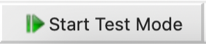
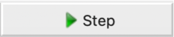

# Analysis of noisy 3D nuclei
**Tutorial for the Association of Biomolecular Research Facilities - Ligh Microscopy Research Group (ABRF/LMRG)**

## **Proposal:**

Segment the objects in a fluorescence z-stack image and provide:

- Centroid location in microns (um) for each nucleus: x, y, and z c
- Coordinates listed in separate columns. Labels x, y, and z.
- Integrated Intensity. Label intensity.
- Volume in cubic microns (um^3). Label volume.
- 3D volume image of your segmented image

## **Input:**

Four different z-stack images that vary in their signal-to-noise ratio
and the clustering of their objects of nuclei in 3D cell culture.

Voxel dimensions: 0.124x0.124x0.200 um

Calibration Image: Voxel dimensions: 1x1x1 um

## **Importing data in CellProfiler**

1. Highlight the **Images** module.

   1. Drag-and-drop the images you will analyze into the Images module window.

```{image} images/image20.png
:width: 700
:align: center
```

Load the pipeline file (.cppipe). Drag-and-drop the file or go to
File->Import->Pipeline from File…

> Note: The pipeline should populate all information needed, but it’s
always a good practice to check if everything is fine.
%
> **Tip: Use the  to learn more or if you have questions.**

2. Highlight the **NameAndType** module.

%
> The **NamesAndTypes** module gives each image a meaningful name by
> which modules in the analysis pipeline will refer to it. This module
> will also let you define an image stack that should be processed as a
> whole 3D volume.

3. Assign a name to: All images This is the simplest choice and the appropriate one because we have only one kind of image.

4. Process as 3D: Yes Selecting “Yes” will load the files as volumes

5. Populate the fields for “Relative Pixel Spacing”. This calibration affects modules that handle 3D images as volumes.


>The relative pixel spacing was provided and is 0.124 um in x and y and
0.200 um in z. To run the calibration file please change the relative
pixel spacing to 1x1x1 um.

6. Assign the images “variable names” that describe the contents in the image. For example, use the name "Nuclei", "DNA", “DAPI” or something else that will remind you what the image is.
7. Hit the "update" button to populate

```{image} images/image7.png
:width: 700
:align: center
```


## This analysis pipeline can be divided into three main parts: Image processing,segmentation and measurement/export.

```{image} images/image28.png
:width: 400
:align: center
```
<br>

## **Image processing:**

The image set provided varies in signal-to-noise ratio, before
attempting to segment the nuclei in these images, conditioning the
images with filters and various image processing methods will improve
segmentation results.

1. Hit the  button.

>**Tip:** You can select different image sets. For that you can hit the  button, or you can go to the
main tab, hit the test tab and choose another image set 
> <br>
>```{image} images/image16.png
>:width: 200
>:align: center
>```
<br>

2. **GaussianFilter** module This module will blur the image and remove part of the noise. Filtering an image with a Gaussian filter can be helpful if the foreground signal is noisy or near the noise floor.
   1. Select the input image: Nuclei (from **NamesAndTypes** module),
   2. Name the output image: GaussianFilter,
   3. Sigma: 1 (larger sigmas induce more blurring).

```{image} images/image4.png
:width: 700
:align: center
```

Hit the  button and a new window will pop up with a resulting image
that should look like this. The image can vary depending on the Image
set chose.

```{image} images/image25.png
:width: 700
:align: center
```

The resulting image is still noisy in image set 3 and 4, so we added a
**ReduceNoise** module to perform a non-local mean noise reduction.
Instead of only using a neighborhood of pixels around a central pixel
for denoising, such as in **GaussianFilter**.

3. **ReduceNoise** module. This module performs non-local means of noise reduction. This will run a 5x5 pixel patch with a maximal distance of 2 pixels to search for patches to use for denoising using a cut-off of 0.2.

> **NOTE** This module is quite time consuming, don't worry if it takes several seconds to run.

   1. Select the output image: GaussianFilter (from **GaussianFilter** module).
   2. Name the output image: ReduceNoise
   3. Size: 5
   4. Distance: 2
   5. Cut-off distance: 0.2

```{image} images/image13.png
:width: 700
:align: center
```

>**Tip: The image tools on the top toolbar may be helpful to see the
details on your image/objects:**

```{image} images/image5.png
:width: 400
:align: center
```

The 1st icon from the left lets you reset the view back to the original
view.

The 2nd and 3rd icons let you step backwards and forwards through any
changes you made to the view.

The 4th icon lets you change the view by moving in any direction in the
display, by clicking and dragging.

The 5th icon lets you change the view by zooming, by dragging and
drawing a box to zoom in on.

```{image} images/image10.png
:width: 700
:align: center
```

## **Segmentation**

Now all objects on different image sets have similar dispersion patterns
so we can start the segmentation process. **Tip:** To view pixel
intensities in an open image, move your mouse over the image, the pixel
intensities will appear in the bottom bar of the display window.

1. **Threshold** module. This module produces a binary, or black and white, image based on a threshold that can be pre-selected or calculated automatically using one of many methods. After the threshold value has been determined, the Threshold module will set pixel intensities below the value to zero (black) and above the value to one (white).
   1. Select the input image: ReduceNoise (from **ReduceNoise** module)
   2. Name the output image: Threshold
   3. Threshold strategy: Global (We choose a global threshold strategy here because our background is relatively uniform after the image processing steps of this pipeline).
   4. Threshold method: Otsu (automatically-calculated threshold method because it can adapt to changes in lighting conditions between images (in this case we have images with different pixel intensities).
   5. Two-class or three-class thresholding: Three classes (separate three major pixel levels \[foreground, mid-level and
        background\]).
   6. Assign pixels in the middle intensity: Background (the middle
      : intensity pixels levels are noise in these images).
   7. Threshold smoothing scale: 1.5 (Smoothing improves the uniformity of the resulting objects, by removing jagged edges caused by
        noise in the acquired image).
   8. Threshold correction factor: 1

```{image} images/image24.png
:width: 700
:align: center
```

```{image} images/image3.png
:width: 700
:align: center
```

2. **Watershed** module. This module is used to separate different objects in an image, which in this case will assign which nuclei.
   1. Use advanced settings: No
   2. Select the input image: Threshold (from **Threshold** module)
   3. Name the output object: Watershed
   4. Generate from: Distance (we don’t have markers to guide the segmentation process so the markers and other inputs for the algorithm will be automatically generated based on the footprint size).
   5. Footprint: 10 (define the dimensions of the window used to scan the input image for local maxima, this will create a local maxima from a binary image that will be at the centers of objects. Large footprint will suppress local maximas that are close together into a single maxima, so two or more objects will be segmented as one. Small footprint can lead to
   oversegmenation, this means one nuclei segmented as two or more objects.
   6. Downsample: 3 (reduce processing time without losing data).

```{image} images/image17.png
:width: 700
:align: center
```

```{image} images/image23.png
:width: 700
:align: center
```

**Note:** Sometimes the processing and the segmentation steps can shrink
or dilate your original structures. In this pipeline the objects are
shrinked after the segmentation, you could test this using an image with
a known object size.

3. **DilateObjects** module. This module dilates your objects and

   : smooths the edges.
   1. Select the input object: Watershed (from **Watershed** module)
   2. Name the output object: RealsizeNuclei
   3. Structuring element: Octahedron (Size: 1) (dilate the objects using an octahedron profile with a size of 1).

```{image} images/image29.png
:width: 700
:align: center
```

```{image} images/image6.png
:width: 700
:align: center
```

> **Note**: The colors are assigned at random and will vary in each run of the module.

## **Measure and export data**

Now that the nuclei have been segmented, measurements can be made using
modules from the **Measurements** category. This study is asking for 3
particular measurements:

-  Centroid location (x, y and z)

- Integrated intensity

- Volume

In this case we need two modules to extract this information,
**MeasureObjectIntensity** and **MeasureObjectSizeShape** modules.

**Note:** When applying these measurements, be careful to measure the
original images, not rescaled or processed images.

1. **MeasureObjectIntensity** module

   1. Select images to measure: Nuclei (original image from **NamesAndTypes** module)
   2. Select objects to measure: RealsizeNuclei (from **DilateObjects** module) to have all the intensity measurements from the object.

```{image} images/image8.png
:width: 700
:align: center
```

**Note:** The measure modules will provide several features for
identified objects and at this point we cannot choose which measurement,
so the module will extract all intensity features possible.

```{image} images/image9.png
:width: 700
:align: center
```

2. **MeasureObjectSizeShape module**

   1. Select object sets to measure: RealsizeNuclei (from **DilateObjects** module)
   2. Calculate the Zernike features: No
   3. Calculate the advanced features: No

```{image} images/image2.png
:width: 700
:align: center
```

```{image} images/image1.png
:width: 700
:align: center
```

## **Creating visuals**

1. Add the **RescaleIntesity** module to your pipeline. This module lets you rescale the intensity of the input images by any of several methods. You should use caution when interpreting intensity and texture measurements derived from images that have been rescaled because certain options for this module do not preserve the relative intensities from image to image.
   1. Select the input image image: Nuclei (from **NamesAndTypes** module)
   2. Name the output image: RescaleIntensityNuclei
   3. Rescaling method: Stretch each image to use the full intensity range (Find the minimum and maximum values within the unmasked part of the image (or the whole image if there is no mask) and rescale every pixel so that the minimum has an intensity of zero and the maximum has an intensity of one).

```{image} images/image19.png
:width: 700
:align: center
```

```{image} images/image22.png
:width: 700
:align: center
```

2. **OverlayObjects** module. This module overlay the objects as colored masks on the image. We recommend overlaying onto rescaled images,which will be easier to visualize outside of CellProfiler.
   1. Input: RescaleIntensityNuclei (from **RescaleIntensity** module)
   2. Name the output image: OverlayObjects
   3. Objects: RealsizeNuclei (from **DilateObjects** module)
   4. Opacity: 0.3 (Increase this value to decrease the transparency of the colorized object labels).

```{image} images/image12.png
:width: 700
:align: center
```

3. **SaveImages** module. This module saves image or movie files. Because CellProfiler usually performs many image analysis steps on many groups of images, it does not save any of the resulting images to the hard drive unless you specifically choose to do so with the SaveImages module. You can save any of the processed images created by CellProfiler during the analysis using this module. You can choose from many different image formats for
saving your files. This allows you to use the module as a file format converter, by loading files in their original format and then saving them in an alternate format.
   01. Select the type of image to save: Image
   02. Select the image to save: OverlayObjects (from **OverlayObjects** module)
   03. Select method for constructing file names: From image filename (use this option to avoid reassignment of your images)
   04. Select image name for file prefix: Nuclei (select the original image name from NamesAndTypes module)
   05. Append a suffix to the image file name?: Yes
   06. Text to append to the image name: Overlay (just add Overlay in the end of your original image file name)
   07. Saved file format: tiff (tiff is a lossless format, but you can choose others depending on what you need to do with this images)
   08. Image bit depth: 8-bit integer (this bit depth is easily read outside Cell Profiler)
   09. Save with lossless compression: Yes
   10. Output file location: Default Output Folder (or create a new folder just for this images)
   11. Overwrite existing files without warning?: No (prevent file overwritten)
   12. When to save: Every cycle (Save every image set)
   13. Record the file and path information to the saved image?: No
   14. Create subfolders in the output folder: No

```{image} images/image14.png
:width: 700
:align: center
```

4. **ConvertObjectsToImage** module. Transform objects in image (provide a 3D volume image of the segmented image)

   1. Select the input objects: RealsizeNuclei (from **DilateObjects** module)
   2. Name the output image: NucleiObjects3D
   3. Select the color format: Grayscale

```{image} images/image11.png
:width: 700
:align: center
```

## **Export measurements**

It’s good practice to place all export modules at the end of your
pipeline. CellProfiler automatically calculates execution times for each
module that was run before the export module. By placing your export
modules at the end of your pipeline, you will have access to module
execution times for each module in your pipeline. Save the output of the
measurement modules using **ExportToSpreadsheet** or
**ExportToDatabase**.

**ExportToSpreadsheet** module. This module exports measurements into
one or more files that can be opened in Excel or other spreadsheet
programs. This module will convert the measurements to a comma-, tab-,
or other character-delimited text format and save them to the hard drive
in one or several files, as requested.

01. Select the column delimiter: Comma (“,”)

02. Output file location: Default Output Folder

03. Add a prefix to file names: Yes

04. Filename prefix: MyExpt\_

05. Overwrite existing files without warning: No

06. Add image metadata columns to your object data file: No

07. Add image file and folder names to your object data file: No

08. Representation of Nan/Inf: NaN

09. Select the measurements to export: Yes

10. Press the button to select measurements:

    1. RealsizeNuclei:

       1. AreaShape: Center: X, Y and Z
       2. Volume

    2. Intensity: IntegratedIntensity

11. Calculate the per-image mean values for object measurements?:No

12. Calculate the per-image median values for object measurements?:No

13. Calculate the per-image standard deviation values for object measurements?:No

14. Output file location:Default Output Folder|

15. Create a GenePattern GCT file?:No

16. Export all measurement types?:No

17. Data to export: RealsizeNuclei

18. Use the object name for the file name?: No

19. File name: Nuclei.csv

20. Data to export: Experiment

21. Use the object name for the file name?: No

22. File name: Metadata.csv

```{image} images/image27.png
:width: 700
:align: center
```

### **Results overview:**

```{image} images/image18.png
:width: 700
:align: center
```

## **Congratulations!** 
The nucleus has been segmented, measured and exported. 


**The End**
