**ABRF/LMRG**

**Image Analysis Study**

**Nuclei in 3D cell culture images (and associated calibration
image[s])**

**Proposal:**

Segment the objects in a fluorescence z-stack image and provide:

-  Centroid location in microns (um) for each nucleus: x, y, and z c

-  Coordinates listed in separate columns. Labels x, y, and z.

-  Integrated Intensity. Label intensity.

-  Volume in cubic microns (um^3). Label volume.

-  3D volume image of your segmented image

**Input:**

Four different z-stack images that vary in their signal-to-noise ratio
and the clustering of their objects of nuclei in 3D cell culture.

Voxel dimensions: 0.124x0.124x0.200 um

Calibration Image

Voxel dimensions: 1x1x1 um

**TimeConsumingProtocol** - 92s for four images

/Users/mcruz/Documents/Tutorials/ABRFTutorial/3DNuclei/3DNucleiPipelineComputeConsumingFinal.cppipe

**Importing data in CellProfiler**

1. Highlight the **Images** module.

   a. Drag-and-drop the images you will analyze into the Images module
         window.

.. image:: images/image20.png
   :width: 6.5in
   :height: 5.86111in

Load the pipeline file (.cppipe). Drag-and-drop the file or go to
File->Import->Pipeline from File…

Note: The pipeline should populate all information needed, but it’s
always a good practice to check if everything is fine.

|image3| **Tip: Use the question mark button to learn more or if you have
questions.**

2. Highlight the **NameAndType** module.

..

   The **NamesAndTypes** module gives each image a meaningful name by
   which modules in the analysis pipeline will refer to it. This module
   will also let you define an image stack that should be processed as a
   whole 3D volume.

a. Assign a name to: All images This is the simplest choice and the
      appropriate one because we have only one kind of image.

b. Process as 3D: Yes Selecting “Yes” will load the files as volumes

c. Populate the fields for “Relative Pixel Spacing”. This calibration
      affects modules that handle 3D images as volumes.

The relative pixel spacing was provided and is 0.124 um in x and y and
0.200 um in z. To run the calibration file please change the relative
pixel spacing to 1x1x1 um.

d. Assign the images “variable names” that describe the contents in the
      image. For example, use the name "Nuclei", "DNA", “DAPI” or
      something else that will remind you what the image is.

e. Hit the "update" button to populate

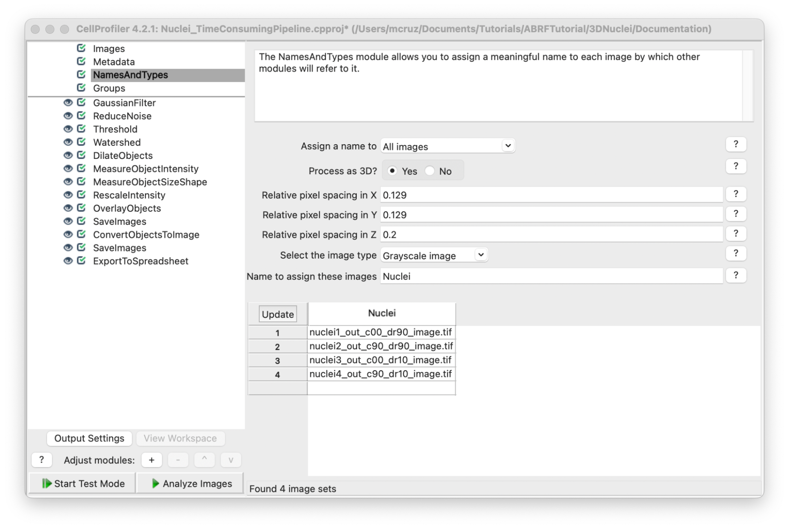

This pipeline can be divided into three main parts: Image processing,
segmentation and measurement/export.

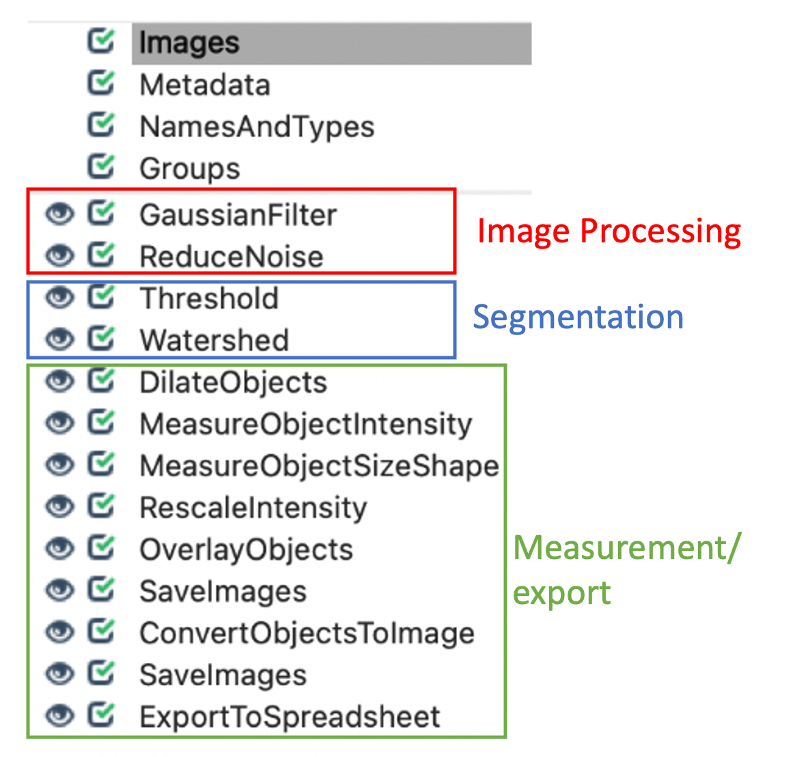

**Image processing:**

The image set provided varies in signal-to-noise ratio, before
attempting to segment the nuclei in these images, conditioning the
images with filters and various image processing methods will improve
segmentation results.

1. Hit the start test mode button.

**Tip:** You can select different image sets. For that you can go to the
main tab, hit the test tab and choose another image set or you can hit
the Next Image Set button.

|image1|\ |image2|

2. **GaussianFilter** module This module will blur the image and remove
      part of the noise. Filtering an image with a Gaussian filter can
      be helpful if the foreground signal is noisy or near the noise
      floor.

   a. Select the input image: Nuclei (from **NamesAndTypes** module),

   b. Name the output image: GaussianFilter,

   c. Sigma: 1 (larger sigmas induce more blurring).

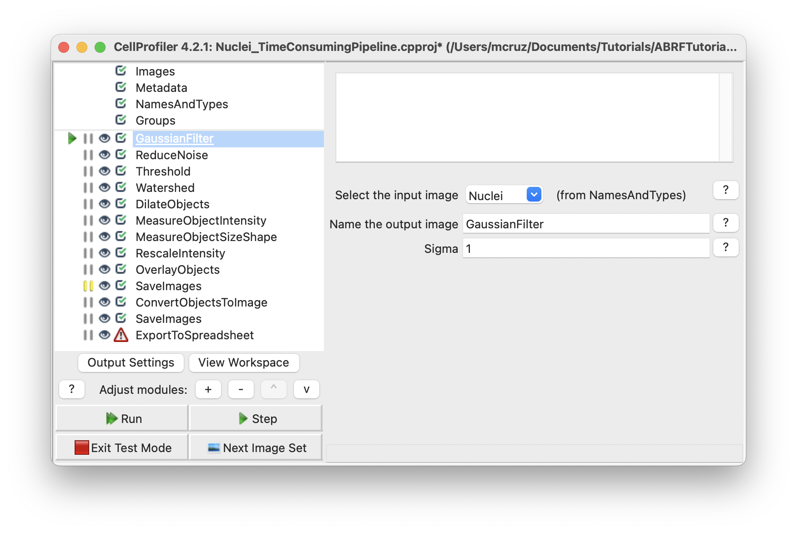

Hit the Step button and a new window will pop up with a resulting image
that should look like this. The image can vary depending on the Image
set chose.

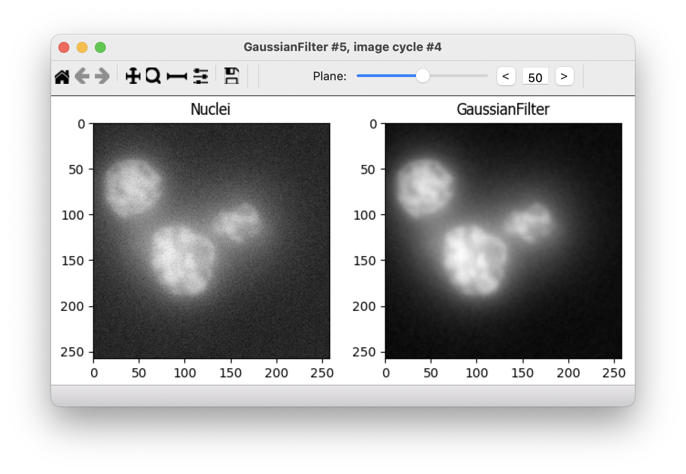

The resulting image is still noisy in image set 3 and 4, so we added a
**ReduceNoise** module to perform a non-local mean noise reduction.
Instead of only using a neighborhood of pixels around a central pixel
for denoising, such as in **GaussianFilter**.

3. **ReduceNoise** module. This module performs non-local means of noise
      reduction. This will run a 5x5 pixel patch with a maximal distance
      of 2 pixels to search for patches to use for denoising using a
      cut-off of 0.2.

   a. Select the output image: GaussianFilter (from **GaussianFilter**
         module).

   b. Name the output image: ReduceNoise

   c. Size: 5

   d. Distance: 2

   e. Cut-off distance: 0.2

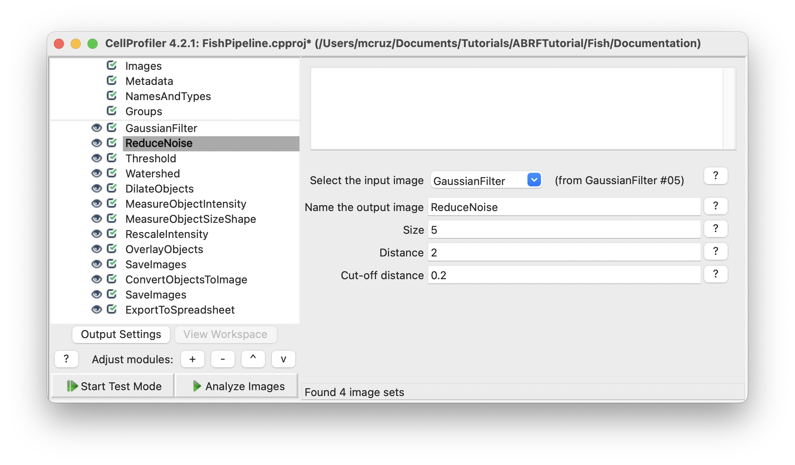

**Tip: The image tools on the top toolbar may be helpful to see the
details on your image/objects:**

.. image:: images/image5.png
   :width: 2.25521in
   :height: 0.32617in

The 1st icon from the left lets you reset the view back to the original
view.

The 2nd and 3rd icons let you step backwards and forwards through any
changes you made to the view.

The 4th icon lets you change the view by moving in any direction in the
display, by clicking and dragging.

The 5th icon lets you change the view by zooming, by dragging and
drawing a box to zoom in on.

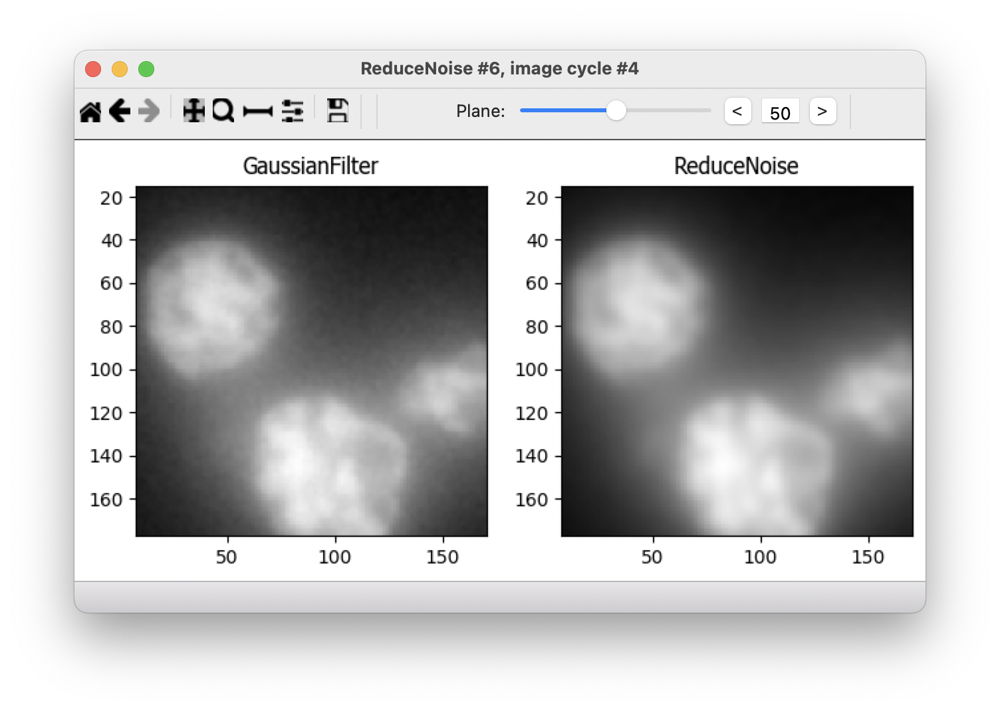

**Segmentation**

Now all objects on different image sets have similar dispersion patterns
so we can start the segmentation process. **Tip:** To view pixel
intensities in an open image, move your mouse over the image, the pixel
intensities will appear in the bottom bar of the display window.

1. **Threshold** module. This module produces a binary, or black and
      white, image based on a threshold that can be pre-selected or
      calculated automatically using one of many methods. After the
      threshold value has been determined, the Threshold module will set
      pixel intensities below the value to zero (black) and above the
      value to one (white).

   a. Select the input image: ReduceNoise (from **ReduceNoise** module)

   b. Name the output image: Threshold

   c. Threshold strategy: Global (We choose a global threshold strategy
         here because our background is relatively uniform after the
         image processing steps of this pipeline).

   d. Threshold method: Otsu (automatically-calculated threshold method
         because it can adapt to changes in lighting conditions between
         images (in this case we have images with different pixel
         intensities).

   e. Two-class or three-class thresholding: Three classes (separate
         three major pixel levels [foreground, mid-level and
         background]).

   f. Assign pixels in the middle intensity: Background (the middle
         intensity pixels levels are noise in these images).

   g. Threshold smoothing scale: 1.5 (Smoothing improves the uniformity
         of the resulting objects, by removing jagged edges caused by
         noise in the acquired image).

   h. Threshold correction factor: 1

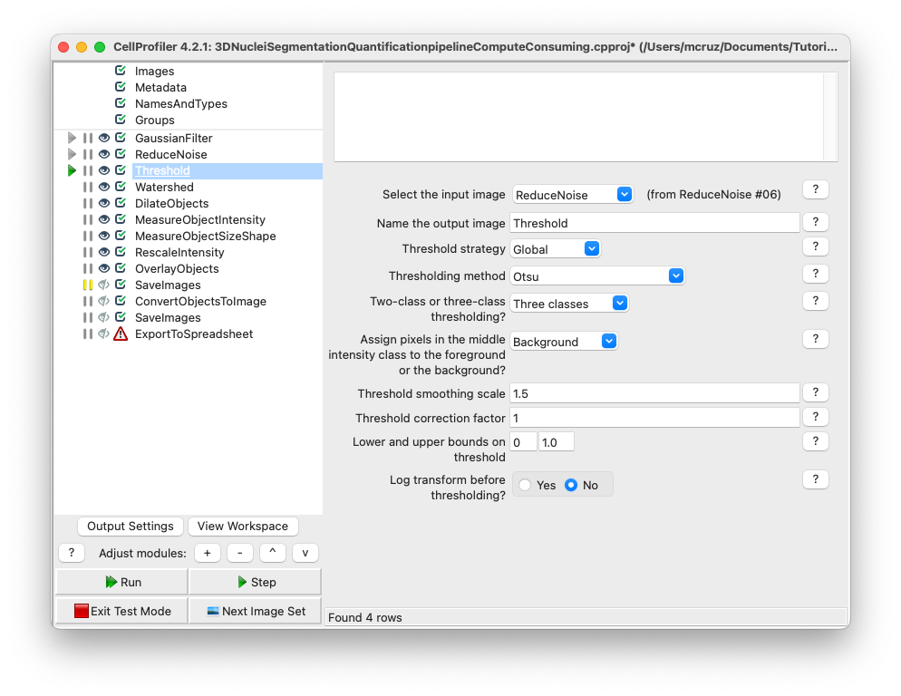

.. image:: images/image3.png
   :width: 5.22396in
   :height: 4.58771in

2. **Watershed** module. This module is used to separate different
      objects in an image, which in this case will assign which nuclei.

   a. Use advanced settings: No

   b. Select the input image: Threshold (from **Threshold** module)

   c. Name the output object: Watershed

   d. Generate from: Distance (we don’t have markers to guide the
         segmentation process so the markers and other inputs for the
         algorithm will be automatically generated based on the
         footprint size).

   e. Footprint: 10 (define the dimensions of the window used to scan
         the input image for local maxima, this will create a local
         maxima from a binary image that will be at the centers of
         objects. Large footprint will suppress local maximas that are
         close together into a single maxima, so two or more objects
         will be segmented as one. Small footprint can lead to
         oversegmenation, this means one nuclei segmented as two or more
         objects.

   f. Downsample: 3 (reduce processing time without losing data).

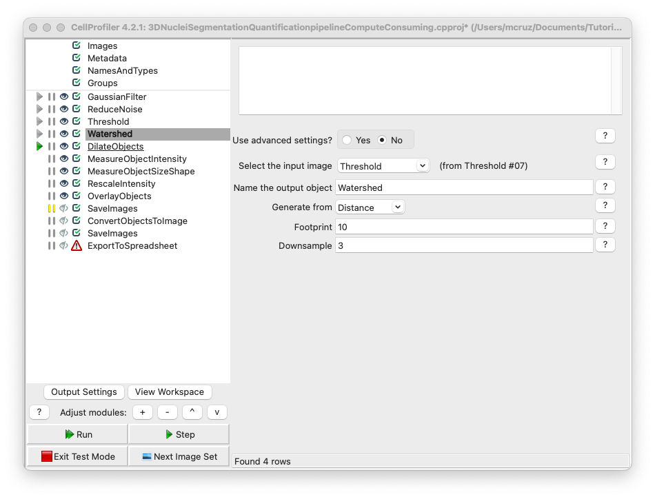

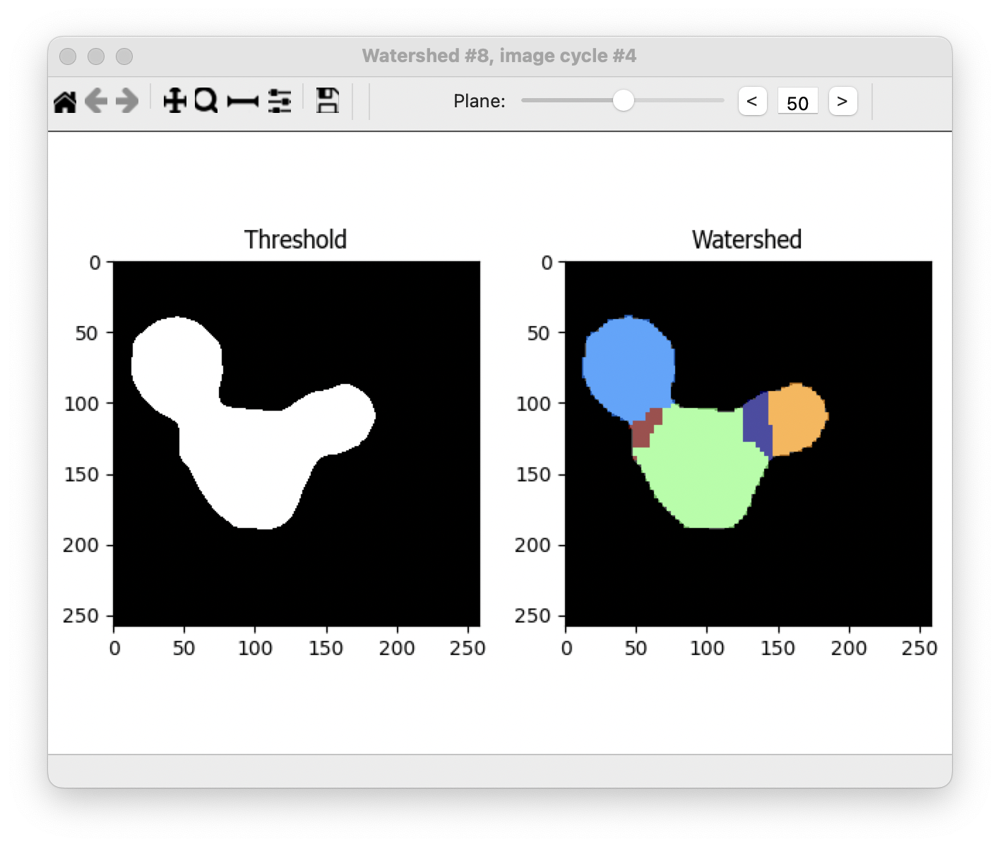

**Note:** Sometimes the processing and the segmentation steps can shrink
or dilate your original structures. In this pipeline the objects are
shrinked after the segmentation, you could test this using an image with
a known object size.

3. **DilateObjects** module. This module dilates your objects and
      smooths the edges.

   a. Select the input object: Watershed (from **Watershed** module)

   b. Name the output object: RealsizeNuclei

   c. Structuring element: Octahedron (Size: 1) (dilate the objects
         using an octahedron profile with a size of 1).

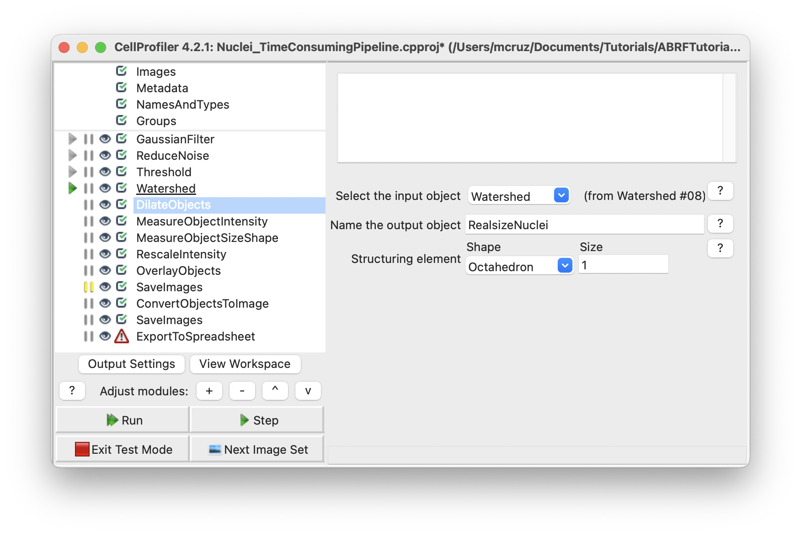

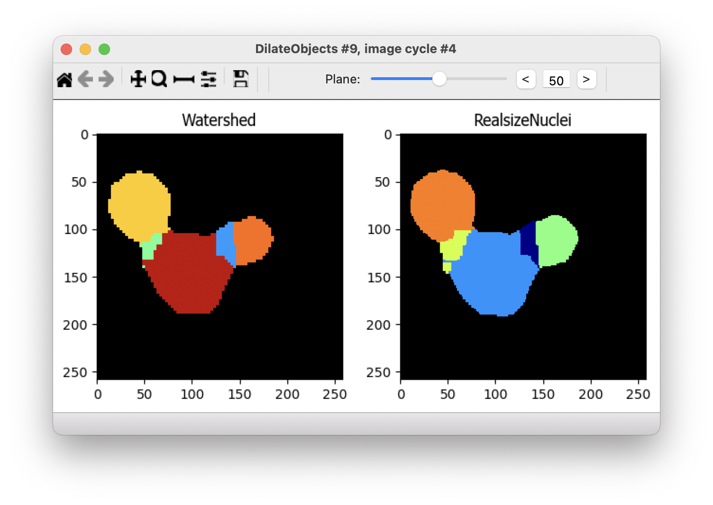

Note: The colors will vary.

**Measure and export data**

Now that the nuclei have been segmented, measurements can be made using
modules from the **Measurements** category. This study is asking for 3
particular measurements:

Centroid location (x, y and z),

Integrated intensity and

Volume

In this case we need two modules to extract this information,
**MeasureObjectIntensity** and **MeasureObjectSizeShape** modules.

**Note:** When applying these measurements, be careful to measure the
original images, not rescaled or processed images.

1. **MeasureObjectIntensity** module

   a. Select images to measure: Nuclei (original image from
         **NamesAndTypes** module)

   b. Select objects to measure: RealsizeNuclei (from **DilateObjects**
         module) to have all the intensity measurements from the object.

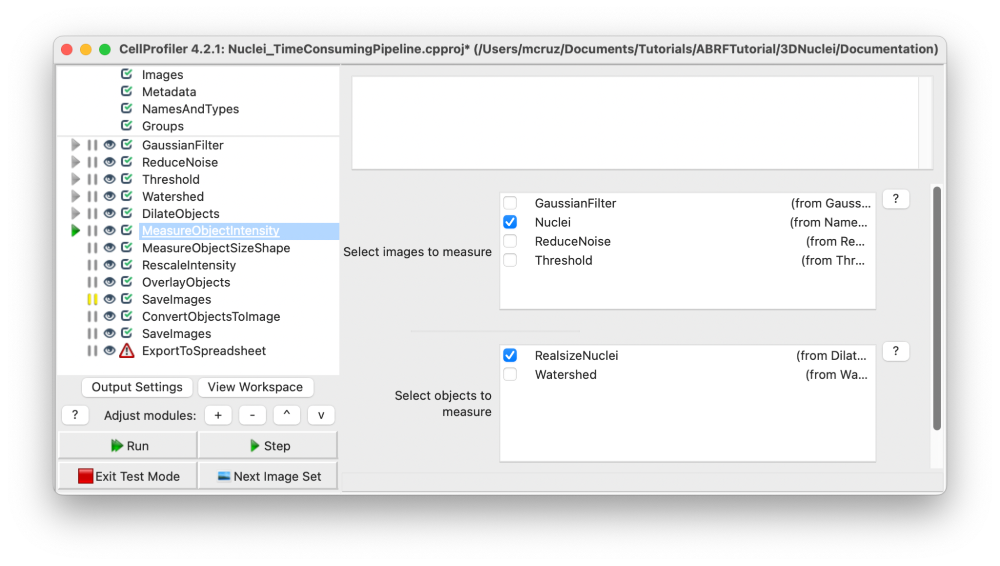

**Note:** The measure modules will provide several features for
identified objects and at this point we cannot choose which measurement,
so the module will extract all intensity features possible.

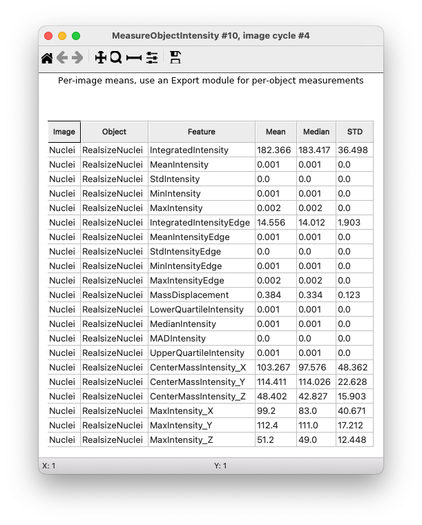

2. **MeasureObjectSizeShape module**

   a. Select object sets to measure: RealsizeNuclei (from
         **DilateObjects** module)

   b. Calculate the Zernike features: No

   c. Calculate the advanced features: No

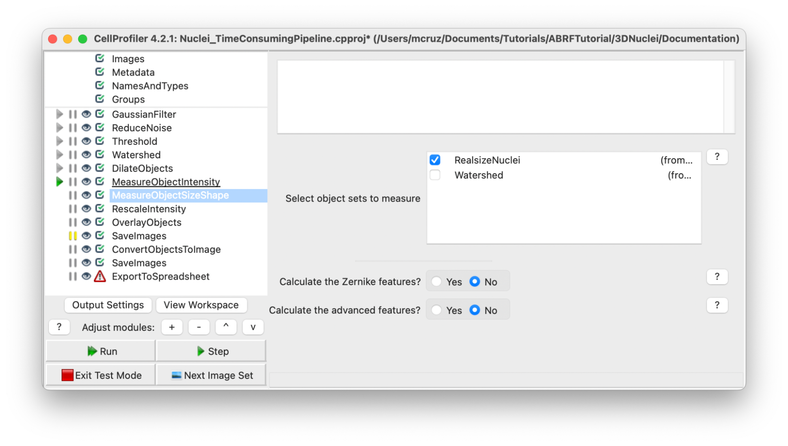

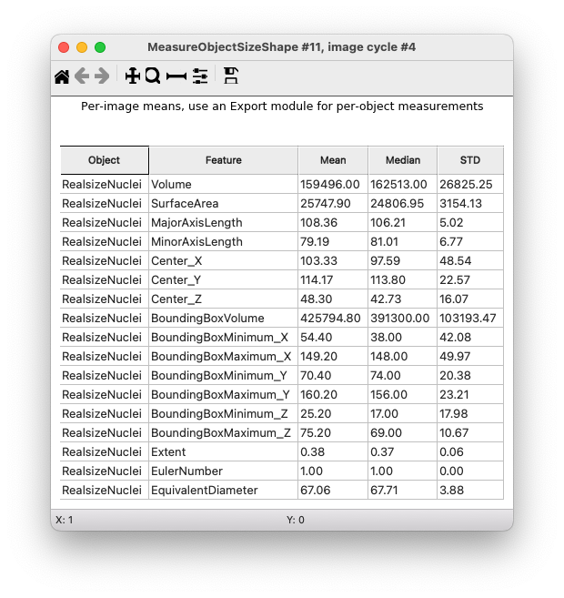

**Creating visuals**

1. Add the **RescaleIntesity** module to your pipeline. This module lets
      you rescale the intensity of the input images by any of several
      methods. You should use caution when interpreting intensity and
      texture measurements derived from images that have been rescaled
      because certain options for this module do not preserve the
      relative intensities from image to image.

   a. Selecting the input image image: Nuclei (from **NamesAndTypes**
         module)

   b. Name the output image: RescaleIntensityNuclei

   c. Rescaling method: Stretch each image to use the full intensity
         range (Find the minimum and maximum values within the unmasked
         part of the image (or the whole image if there is no mask) and
         rescale every pixel so that the minimum has an intensity of
         zero and the maximum has an intensity of one).

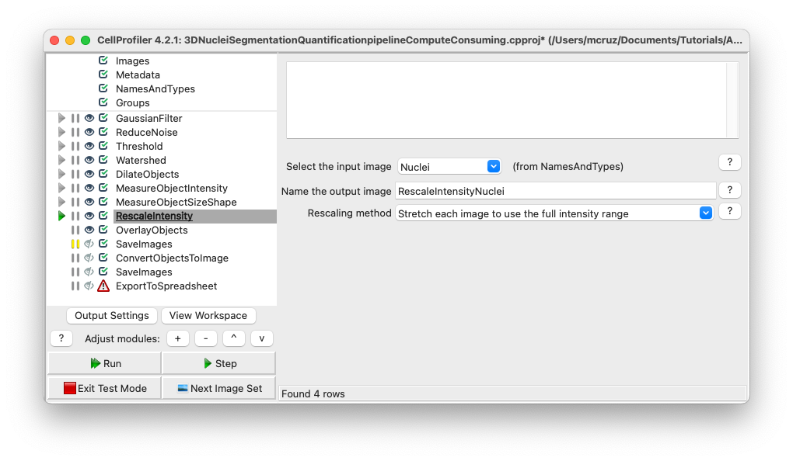

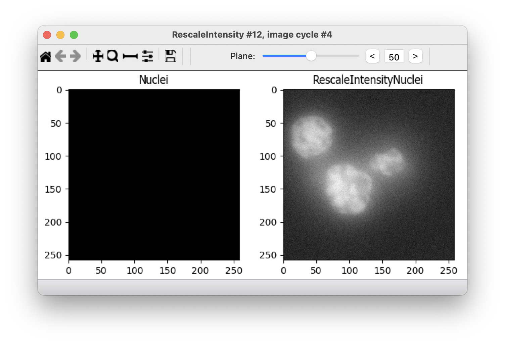

2. **OverlayObjects** module. This module overlay the objects as colored
      masks on the image. We recommend overlaying onto rescaled images,
      which will be easier to visualize outside of CellProfiler.

   a. Input: RescaleIntensityNuclei (from **RescaleIntensity** module)

   b. Name the output image: OverlayObjects

   c. Objects: RealsizeNuclei (from **DilateObjects** module)

   d. Opacity: 0.3 (Increase this value to decrease the transparency of
         the colorized object labels).

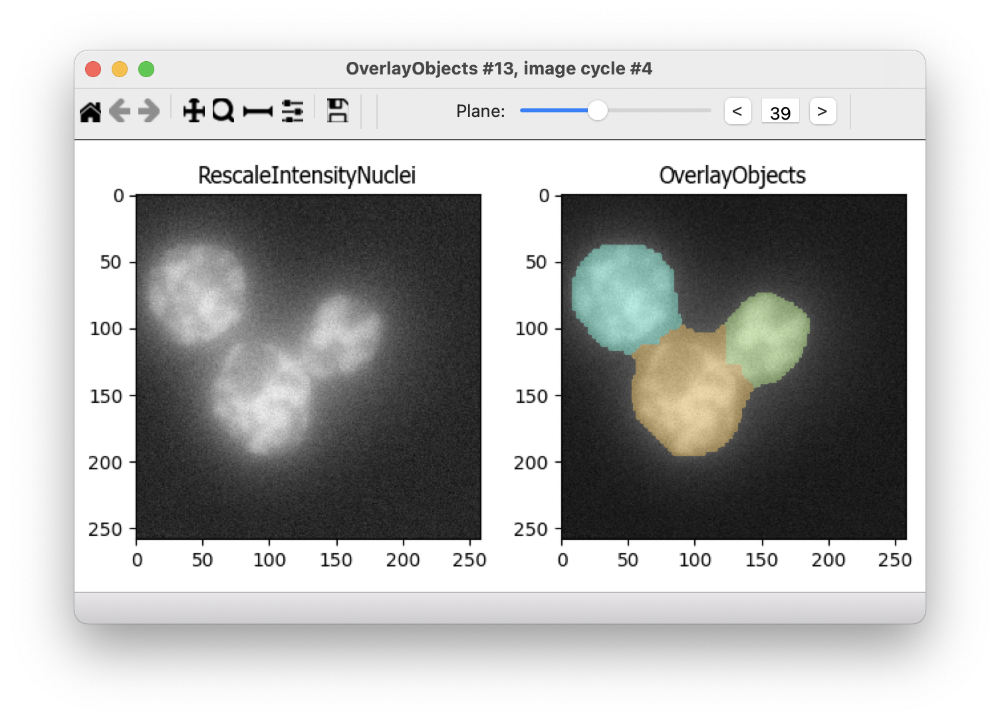

3. **SaveImages** module. This module saves image or movie files.
      Because CellProfiler usually performs many image analysis steps on
      many groups of images, it does not save any of the resulting
      images to the hard drive unless you specifically choose to do so
      with the SaveImages module. You can save any of the processed
      images created by CellProfiler during the analysis using this
      module. You can choose from many different image formats for
      saving your files. This allows you to use the module as a file
      format converter, by loading files in their original format and
      then saving them in an alternate format.

   a. Select the type of image to save: Image

   b. Select the image to save: OverlayObjects (from **OverlayObjects**
         module)

   c. Select method for constructing file names: From image filename
         (use this option to avoid reassignment of your images)

   d. Select image name for file prefix: Nuclei (select the original
         image name from NamesAndTypes module)

   e. Append a suffix to the image file name?: Yes

   f. Text to append to the image name: Overlay (just add Overlay in the
         end of your original image file name)

   g. Saved file format: tiff (tiff is a lossless format, but you can
         choose others depending on what you need to do with this
         images)

   h. Image bit depth: 8-bit integer (this bit depth is easily read
         outside Cell Profiler)

   i. Save with lossless compression: Yes

   j. Output file location: Default Output Folder (or create a new
         folder just for this images)

   k. Overwrite existing files without warning?: No (prevent file
         overwritten)

   l. When to save: Every cycle (Save every image set)

   m. Record the file and path information to the saved image?: No

   n. Create subfolders in the output folder: No

.. image:: images/image14.png
   :width: 6.5in
   :height: 5.18056in

4. **ConvertObjectsToImage** module. Transform objects in image (provide
      a 3D volume image of the segmented image)

   a. Select the input objects: RealsizeNuclei (from **DilateObjects**
         module)

   b. Name the output image: NucleiObjects3D

   c. Select the color format: Grayscale

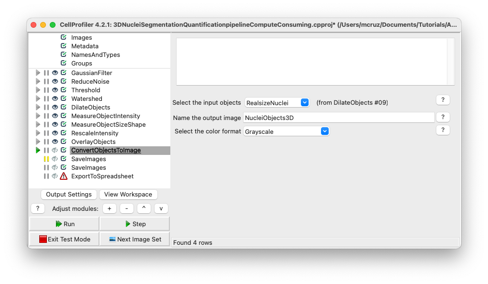

   5. **SaveImages** module. This option will allow you to visualize the
   segmentations outside Cell Profiler.

**Export measurements**

It’s good practice to place all export modules at the end of your
pipeline. CellProfiler automatically calculates execution times for each
module that was run before the export module. By placing your export
modules at the end of your pipeline, you will have access to module
execution times for each module in your pipeline. Save the output of the
measurement modules using **ExportToSpreadsheet** or
**ExportToDatabase**.

**ExportToSpreadsheet** module. This module exports measurements into
one or more files that can be opened in Excel or other spreadsheet
programs. This module will convert the measurements to a comma-, tab-,
or other character-delimited text format and save them to the hard drive
in one or several files, as requested.

a. Select the column delimiter: Comma (“,”)

b. Output file location: Default Output Folder

c. Add a prefix to file names: Yes

d. Filename prefix: MyExpt\_

e. Overwrite existing files without warning: No

f. Add image metadata columns to your object data file: No

g. Add image file and folder names to your object data file: No

h. Representation of Nan/Inf: NaN

i. Select the measurements to export: Yes

j. Press button to select measurements:

   i.  RealsizeNuclei:

       1. AreaShape: Center: X, Y and Z

       2. Volume

   ii. Intensity: IntegratedIntensity

k. Calculate the per-image mean values for object measurements?:No

l. Calculate the per-image median values for object measurements?:No

m. Calculate the per-image standard deviation values for object
      measurements?:No

n. Output file location:Default Output Folder\|

o. Create a GenePattern GCT file?:No

p. Export all measurement types?:No

q. Data to export: RealsizeNuclei

r. Use the object name for the file name?: No

s. File name: Nuclei.csv

t. Data to export: Experiment

u. Use the object name for the file name?: No

v. File name: Metadata.csv

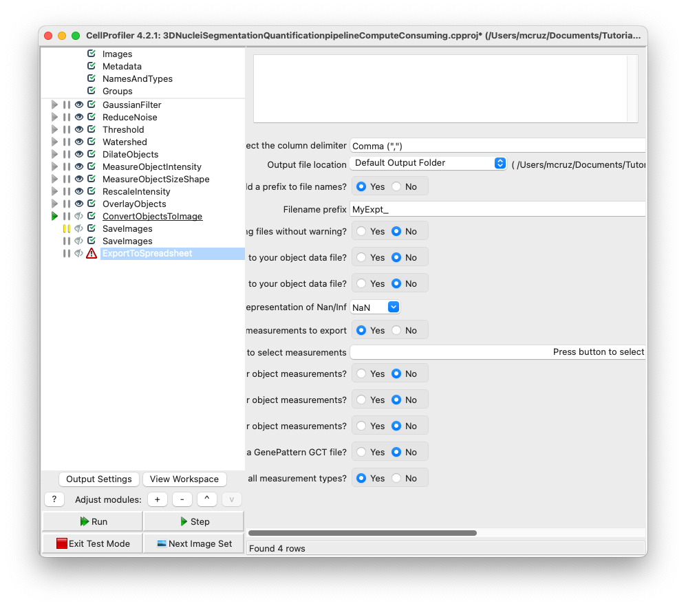

**Results overview:**

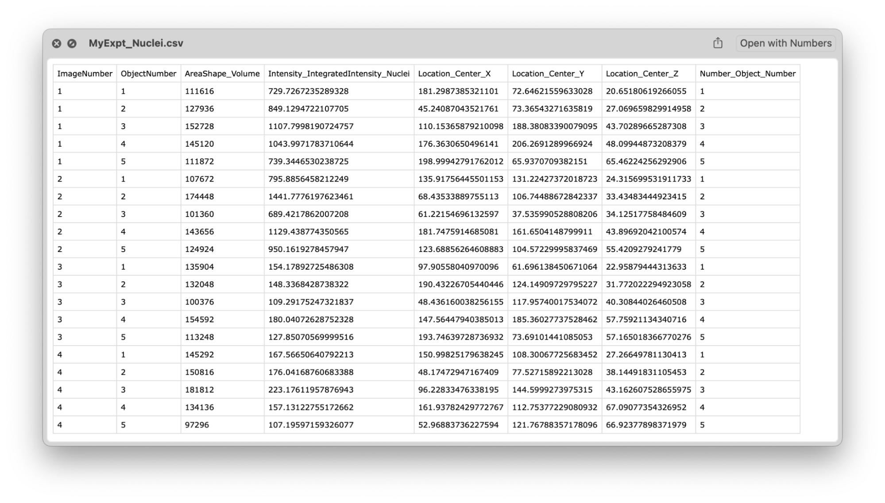

**Congratulations!** The nucleus has been segmented, measured and
exported. Now we need to convert the units from the csv file generated
in Cell Profiler to microns and create a new table with just the values
asked by the Study (X, Y, Z positions, Integrated Intensity and volume
for each nuclei).

For this purpose we create an interactive colab notebook that will ask
you the X, Y and Z values to calculate the Voxel (um^3), you need to
upload the csv generated by Cell Profiler to finally export a new csv
file with the normalized values.

https://colab.research.google.com/drive/1xvkJFG6GqBl1H0VorbOvtnyiUMPpXZmU?usp=sharing

**End**

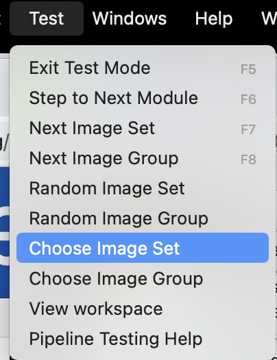
.. |image2| image:: images/image21.png
   :width: 2.22671in
   :height: 0.93229in
.. |image3| image:: images/image15.png
   :width: 0.53646in
   :height: 0.39615in
