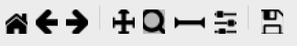
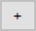
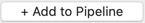

# Beginner segmentation and organelle analysis:

## A computer exercise using CellProfiler


Beth Cimini, Barbara Diaz-Rohrer, Esteban Miglietta, Paula Llanos, Mario Cruz and Rebecca Senft.
<br>
Broad Institute of MIT and Harvard, Cambridge, MA.

## **Background information:**

The images in this experiment come from the [Broad Bioimage
Benchmark Collection](https://data.broadinstitute.org/bbbc/BBBC022/).
They are fields of U2OS cells imaged in five channels (Cell Painting
assay; see Gustafsdottir et al., 2013).

>### The **Cell Painting** assay 
>
>is a high-content, high-throughput imaging technique used to capture a wide array of cellular phenotypes in response to diverse perturbations. Briefly, cells are treated with a variety of drugs, environmental changes or genetic perturbations (using CRISPR, for example) and then fixed and stained with six fluorescent dyes that mark different cellular compartments, including nuclei, cytoplasm, endoplasmic reticulum, Golgi apparatus, mitochondria, and actin. 
>
>High-resolution images are then captured using automated fluorescence microscopy, and image analysis algorithms (like the one we will use in this tutorial) are applied to extract thousands of morphological features. These features are used to create a high dimensional **"morphological profile"** (consisting of up to several thousand features) for each perturbation. 
>
>Finally, by comparing and clustering the morphological profiles of cells treated with different compounds, researchers can identify potential new drug candidates, assess their toxicity or understand the mechanism of action of existing drugs; or, in combination with genetic perturbations, these profiles assays can be used to determine the function of genes or to understand the underlying mechanisms of genetic diseases and potential therapeutic interventions.

```{figure} ./TutorialImages/Fig1.png
:width: 900
:align: center

Figure 1: Cell Painting assays are commonly run on multiwell plates and several Images ('Sites') are taken from each well. Each image contains information of 6 different cellular dyes, imaged in 5 channels.
```

## **Goals of this exercise:**

This exercise will give you the chance to practice finding segmentation parameters for
larger “parent” objects (nucleus, cell, and cytoplasm) and show you ways
to pull out smaller features in your image by segmenting organelles
within the cells and nuclei (like nucleoli or mitochondria). You will also be shown how to use
RelateObjects so that you can relate the average counts, distances, and
measurements of the smaller “child” organelles to their larger “parent”
objects (i.e., cell and nucleus).

## **Materials necessary for this exercise:**

The images are contained in the **images** folder; these 50 images (10
sites imaged in 5 channels) represent 5 mock treated wells from a single
384 well plate experiment.

## **Exercise instructions:**

Read through the steps below and follow instructions where stated. Steps where you must figure out a solution are marked with 🔴 **TO DO.**

### **1. Load starting pipeline (2 min)**

- Start CellProfiler by double-clicking the desktop icon: 
- Drag and drop the `‘segmentation_start.cppipe’` file into the `‘Analysis modules’` pane on the left.

    > Alternatively, you can also import a pipeline by going to `File` in the main menu (top), then `Import  >  Pipeline from file`

```{figure} ./TutorialImages/Fig2.png
:width: 700
:align: center

 Figure 2: **Main CellProfiler window**. To load images, drag and drop images into the right area. To load a pipeline (.ccpipe or .ccproj files), drag and drop the pipeline file into the left area.
```

###  **2. Load images**


- Click on the **Images** module in the top left corner of the **Input** pane on CellProfiler window.
- Drag and drop the folder named `'images_Illum-corrected'` into the `Drop files and folders here` pane. It should automatically populate.

    > Alternatively, you can also load the images by double clicking in the `Drop files and folders here` pane and using the pop-up window to select them.

```{figure} ./TutorialImages/Fig3.png
:width: 700
:align: center

*Figure 3: The **Images** module, grey out files will **not** be available for downstream modules*
```
> **TIP**: You can use the `‘Filter images?’` options to filter out any file that you don't want CellProfiler to process. For example, if `‘Images only’` is selected, all files that are not images will be filtered out (they appear greyed out).

- You can open and examine any image by double clicking on them
- 🔴 **TO DO.** Open an image and familiarize yourself with the tools in the image toolbar: 

  > **TIP** you can manually adjust brightness and contrast in the image display by right-clicking on it and going to `'Adjust Contrast'` 

-------------------------------------------------------------------------------------------------------------------------
###  **3. [OPTIONAL STEP] Set up the input modules (10min)**
  
  > *You can skip this step ig you prefer, it will not affect the rest of the pipeline, as these modules have been properly set up in the starting pipeline.*

The four input modules (**Images**, **Metadata**, **NamesAndTypes**, and **Groups**) are crucial for any CellProfiler pipeline because they define how images are loaded and organized.

- The **Metadata** module is already configured. With it, you can extract information that is required for you analysis and which is not contained within the images themselves (thus, the name 'Metadata'):

  - In this case, the module extracts the **Plate**, **Well**, **Site** and **ChannelNumber** from the image files' names.

    - This situation is a rather simple one, but if your own data is more complex, there are other ways of obtaining metadata. You can `Add another extraction method` and choose which images to apply them to.  
    - You can also add a file which adds extra Metadata per image.

  - The module uses a `'regular expression'` (also known as RegEx), a sort of template that fits all the file names and allows to obtain data from them.

  - Click on the magnifying glass at the end of the regular expression box for each extraction method to see how it works.

  -  Let's analyze the example used in this tutorial:  
>**`^(?P<Plate>.*)_(?P<Well>[A-P]{1}[0-9]{2})_site(?P<Site>[0-9])_Ch(?P<ChannelNumber>[1-5]).tif`**  

> Expressions contained between parentheses are VARIABLE and are captured into named variables (denoted as `(?P<VariableName>)`).
>
> Expressions outside parentheses are CONSTANT and should be present in ALL image file names (like the underscores and the '.tif')
>
> `^`: Start the regular expression
>
>`(?P<Plate>.*)`: Extract all the characters before the first underscore character (_) and assign them to the measurement **"Plate"** for the image. 
>
>`(?P<Well>[A-P]{1}[0-9]{2})`: Extract a single (denoted as {1}) uppercase letter from A to P (denoted as [A-P]). Then, extract the next two digits ({2}) between [0-9] and assign it to the measurment **"Well"** for the image.  
>
>`site(?P<Site>[0-9])`: After the constant string "site", extract the next two digits {2} between [0-9] and assign it to the measurement **"Site"** for the image.
>
>`Ch(?P<ChannelNumber>[1-5])`: After the constant string "Ch", extract the next digit between [1-5] and assign it to the measurement **"ChannelNumber"** for the image.

>If you want to learn more about how these regular expressions work or how to adapt them to other situations, click on the  button.

```{figure} ./TutorialImages/Fig4.png
:width: 650
:align: center

*Figure 4: The **Metadata** module, columns in table correspond to metadata categories*
```

- In the **NamesAndTypes** module, we assign names to the images and configure image sets (i.e., all the different channels for a field of view). We will use the metadata we extracted in the previous module to make that association possible.

  - This module is also fully configured already, but scroll and look through the configuration to see how we use the **ChannelNumber** obtained from the **Metadata** module to assign names to each image (There are several other ways to create correct mappings, but these may serve as a helpful example to refer to in your own work).


```{figure} ./TutorialImages/Fig5.png
:width: 800
:align: center

*Figure 5: Image mapping using extracted metadata*
```

  - Scroll to the bottom of the **NamesAndTypes** module settings to see how the image sets are constructed ‘`Image set matching’` is set to `‘Metadata’`. Each image channel is set to ‘Well → Site’.


```{figure} ./TutorialImages/Fig6.png
:width: 800
:align: center

*Figure 6: Image set matching using extracted metadata*
```

- For this exercise the **Groups** module is not needed so it is set to ‘No’, this module can be useful when you have more than one plate, or different movies.

> **For more information and examples on how to configure the Input modules we have created a blog and video tutorial that can be accessed [here](https://carpenter-singh-lab.broadinstitute.org/blog/input-modules-tutorial).**
--------------------------------------------------------------------------------------------------------------------------

## Build the analysis pipeline

Now, you are ready to start building your image analysis pipeline. But, **what IS an analysis pipeline?**

Basically, it is a series of sequential processes, in which the output of one process serves as the input of one of the following ones.

Thus, the order in which this processes are executed is **very** important, as is the proper naming of the inputs and the outputs (as you will see in this tutorial)

  > During the construction of the pipeline, you will see two symbols appearing next to the modules:
  >
  >  -  Checked box means that the module is activated and well configured
  >  -  This means that there is an error in the configuration of the module. You can hover with your mouse on it to get information on the problem.
  >     - Because the pipeline is sequential, it is possible that changing an upstream module will generate errors on a downstream module.
  >  - You can click on any of the two symbols above to inactivate the module, which is signaled as . This means that the module (and any output it produces) is no longer a part of the pipeline and will be skipped.
  >
  >  - The  icon means that the module output will be visible (it will pop-up in a new window or tab) when you run the pipeline.
  >
  >  - The  icon means that the module output will not be visible when you run the pipeline.

The usefulness of building a pipeline is that you can apply the same series of processing/analysis steps to all the image dataset, which makes the analysis both fast and reproducible. However, while constructing the pipeline, we don't want to run our unfinished pipeline on ALL the images every time we try something new. That's why CellProfiler has a `'Test Mode'`, which allows you to run every step individually and separately one a SINGLE IMAGE at a time. Once your pipeline has at least one non-input module in it, you can activate this mode by clicking on  in the lower-left of the window. 
When you are done developing your pipeline, you can exit the `'Test Mode'` by clicking on  and then finally run the entire pipeline on your complete image dataset using the  button.

###  **4. IdentifyPrimaryObjects – Nuclei (10min)**

> **AIM: use the nuclear channel to segment (isolate and identify all the pixels belonging to) each nuclei.**

- Add an **IdentifyPrimaryObjects** module to the pipeline. Do this by clicking on the   button in the bottom left corner of the CellProfiler window, which will pop up a small window called `‘Add modules’`. Navigate to the `Object Processing` category and select **IdentifyPrimaryObjects**. Double click on the module or click on .

  > **Tip**: You can also use the `'Find Modules'` search bar at the top of the ‘Add modules’ window to search all modules by name.

```{figure} ./TutorialImages/Fig8.png
:width: 400
:align: center

*Figure 8: The 'Add Modules' window, modules are divided in categories based on their function*
```


- Select `'OrigDNA'` image as your input image from the drop-down menu. `'OrigDNA'` is the name assigned to the nuclei channel in **NamesAndTypes** module. You can check it in the setting of Input Modules described before. 
- Change the name of the output objects to ‘Nuclei’.

- Enter '`Test Mode'` by clicking on .\

- Hit  to run the module. A new window will pop up showing you the original input image (top left) and the results of running the module. 
  - In this case, you can see the segmented nuclei both as outlines on top of the original image (bottom left) and as labeled objects (top right).
    
    > Notice that the colors in the labeled objects are assigned at random and might change ecery time you run the module.
  
  - On the outlines display pane (bottom left) you can see three different colors; green is for accepted objects, orange for objects touching the border, and pink for objects outside the diameter range.
  - On the table pane (bottom right) there is useful information that you can use to adjust your segmentation settings, like the median diameter, and the threshold.
-  **How does your segmentation look?**

```{figure} ./TutorialImages/Fig9.png
:width: 700
:align: center

*Figure 9: The **IdentifyPrimaryObjects** module output, you can use the information in this window to modify your segmentation parameters*
```

- Use the  at the top of the window to activate the Zoom tool. Click and drag the mouse on the image to zoom in on an area that was segmented poorly.
 

- **🔴 TO DO**: Improve your segmentation of nuclei:

  - Select `‘Yes’` for the `‘Use advanced settings?’` option, then change some of the parameters:

    - Adjust the threshold method, may lead to better (or worse!) results.
    - Adjust the declumping settings.

  - Hit  after each change to rerun the module and see how the new parameters affect the segmentation.
 
  - Adjust the segmentation parameters until you feel you’re ready to move on to identifying the cells around the nuclei.
  
  > The segmentation should be good but **doesn’t need to be perfect** before you move on.
  >
  > On that topic, we recommend checking this blog post on [When To Say ‘Good Enough’](https://carpenter-singh-lab.broadinstitute.org/blog/when-to-say-good-enough).
  
  <br>

### **5. IdentifySecondaryObjects – Cells (5min)**

> **AIM: segment each cell individually using the previously segmented nuclei as a guide**

Since we don't have a cellular marker that labels homogenously the whole cell, we will use the `'OrigActin_Golgi_Membrane'` channel, which is the closest we have.

- After the **IdentifyPrimaryObjects**, add a **IdentifySecondaryObjects** module.
- Select the `'OrigActin_Golgi_Membrane'` image as your input image, select the `'Nuclei'` objects (created by the previous module) as input objects and change the name to `'Cells'`.

> The **IdentifySecondaryObject** module uses a "primary" object (in this case, the `'Nuclei'`) as a reference to find a "secondary" object, which contains the "primary". The "primary" is used as seed from which the "secondary" expands out.

- Hit  to run the module. 
 
- In this module output, the outline colors correspond to the seed object (green-Nuclei) and the segmented objects (magenta-Cell)

- **How does your segmentation look?**

```{figure} ./TutorialImages/Fig10.png
:width: 700
:align: center

*Figure 10: The **IdentifySecondaryObjects** module output*
 
```

- **🔴 TO DO**: Improve cell segmentation

  - Adjust the thresholding method.
  - Test the effects of using the various methods for identifying secondary objects (Propagation, Watershed-Image Distance-N, etc) and, if using Propagation, the regularization factor.
  - Examine the segmentation and adjust the module parameters until you feel you’re ready to test them on another image

  > Remember, **they don’t need to be perfect!**

### **6. Test the robustness of your segmentation parameters across images (5min)**

It’s (relatively!) easy to come up with a good set of segmentation parameters for a single image however we aim to create a set of parameters that can segment cells on all the images on an experiment.

- To test the parameters, there are two options to change the image you are working on in Test Mode:

  - Click on the  at the bottom left corner,   
  
    or

  - Go to `‘Test’` on the top menu bar → `Choose Image Set` to bring up a list of the images in your experiment, select the image you want to test, and press the `‘OK’` button.

  - You can also use the `'Test'` menu to choose a random image set

```{figure} ./TutorialImages/Fig11.png
:width: 700
:align: center

*Figure 11: A section of the `‘Choose Image Set’` menu.*
```

- Run tthe new image set you selected in test mode for your first 2 modules (through your **IdentifySecondaryObjects** step).

  - You can do it by clicking the  button, or
  - You can activate the pause button () on the module after **IdentifySecondaryObjects** and hit , this will run all modules before the pause.
 

```{figure} ./TutorialImages/Fig12.png
:width: 400
:align: center

*Figure 12: A section of the ‘Analysis modules’ pane.*
```

- Examine the output – did your nuclear and cellular segmentation hold up compared to the first images you looked at?
- **🔴 TO DO**: Adjust the parameters to get comparable results to the first image. Once your segmentation is good, try it on another image.

### **7. IdentifyTertiaryObjects- Cytoplasm (2min)**

> **AIM: Identify the Cytoplasm of the cell**

The `'Cells'` objects that we just identified contain both the cytoplasm of the cells and the nucleus. However the nucleus and the cytoplasm are two very distinct cellular compartments and, thus, we want to be able to make measurements in each of them separately. 

Fortunately, to identify the cytoplasm, all we have to do is to subtract the `'Nuclei'` object, from the `'Cells'`object. We can do this using the **IdentifyTertiaryObjects** module

- After the **IdentifySecondaryObjects** module, add an **IdentifyTertiaryObjects** module.

- Create an object called `'Cytoplasm'` using the `'Cells'` and `'Nuclei'` objects you’ve created.

  - Select the larger and smaller identified objects from the drop-down menu.
  - Change the name of the objects to be identified.
  - ‘Shrink smaller object prior to subtraction?’ should both set to ‘No’.

### **8. Segment the nucleoli (15min)**

> **AIM: Segment a more challenging cellular compartment: the nucleoli**

So far, we have used untransformed images for object detection, but not
all objects can be segmented from raw images. CellProfiler contains a
variety of image processing modules that can aid segmentation. For this
exercise, we will use two such modules, but there are other ones you can
explore.

We will segment the nucleoli using the `'OrigRNA'` channel, in which all nucleic acids (DNA and RNA) are labeled, both inside and outside the nucleus (using Syto, a commercial dye). This means some trouble, because:
  - Not only the nucleoli but also the nuclei are labeled, which means that the nucleoli will not contrast so well with their background (the nucleus)
  - There are RNA spots in the cytoplasm which are NOT nucleoli, and we don't want to identify those.

The next 3 modules will help address these issues to create the `'Nucleoli'` object. Look at the output from each to see how the image is transformed to aid in segmentation.

- After the **IdentifyTertiaryObjects** module, add an **EnhanceOrSuppressFeatures** module.

  - **EnhanceOrSuppressFeatures** is a module that helps enhance parts of an image, in this case, punctate objects or `‘Speckles’`. As we are looking for nucleoli, we apply this to the RNA channel (`'OrigRNA'`) image and call the output `‘FilteredRNA’`.

  **🔴 TO DO: Enhance nucleoli spots**

  - Change the input image from the drop-down menu to `‘OrigRNA’`
  - Change the name of the output image to `‘FilteredRNA’`
  - Change the feature size to see how this affects the output and find a value that works well.
    >**NOTE**: be careful when using large numbers as the module might take a long time to run
  - See below for an example of results to aim for:

```{figure} ./TutorialImages/Fig13.png
:width: 700
:align: center

*Figure 13. The **EnhanceOrSuppress** module output, enhancing the OrigRNA image allows you to isolate nucleoli against the nucleoplasmic background signal.*
```

- After the **EnhanceOrSuppressFeatures** module, add an **MaskImage** module.

- **MaskImage** allows you to create a version of the `‘FilteredRNA’` image called `‘RNA_in_Nuclei’` where all the pixels except the ones you specify are set to an intensity of 0. In this case, we set to 0 any pixel not inside a nucleus. By doing this, we can decrease the likelihood of detecting cytoplasmic RNA dots.

  **🔴 TO DO: Mask the RNA image to show only the nuclear region**

  - Change the input image from the drop-down menu to ‘FilteredRNA’.
  - Change the name of the output image to ‘RNA_in_Nuclei’.
  - Use the objects ‘Nuclei’ as the mask.
  - See below for an example of results to aim for:

```{figure} ./TutorialImages/Fig14.png
:width: 700
:align: center

*Figure 14. The **MaskImage** module output, the contrast was adjusted to show that the intensity of the pixels outside the nuclei are now set to 0.*
```

- After the **MaskImage** module, add an **IdentifyPrimaryObject** module.
  - **IdentifyPrimaryObjects** is used to find the nucleoli. This is a Primary object segmentation because we are not using another object as a seed (i.e., starting point), and are only segmenting based off the intensity in our `‘RNA_in_Nuclei’` image.

  **🔴 TO DO: Segment nucleoli**

  - Change the input image from the drop-down menu to `‘RNA_in_Nuclei’`
  - Change the name of the objects to `‘Nucleoli’`
  - Adjust the segmentation parameters until you are satisfied with the results.

  > **Tip**: you can use a similar strategy to segment mitochondria using the `'OrigMito'` channel

  **🔴 TO DO**: Add an **OverlayOutlines** module at this point to overlay the identified nucleoli on the `'Orig_RNA'` image to assure yourself that the segmentation not only matches the speckle enhanced `'FilteredRNA'` image, but also looks accurate on the unprocessed image as well. This is not strictly necessary but can be a nice “sanity check”.

  - **Goal**: display outlines of your nucleoli and your nuclei on the unprocessed `'OrigRNA'` image.
  - Name the output image `'SanityCheck'`
  - Here’s an example of what that could look like (red=Nuclei, green=Nucleoli):


```{figure} ./TutorialImages/Fig15.png
:width: 700
:align: center

*Figure 15. The **OverlayOutlines** module output, all detected nucleoli are within the nuclei.*
```


### **9. 🔴 TO DO: Add measurement modules to your pipeline (10min)**

- After your segmentation of the nucleoli, add as many object measurement modules as you would like.
  - Some suggested modules to add: **MeasureObjectIntensity**, **MeasurebjectSizeShape**, **MeasureColocalization**, **MeasureObjectNeighbors**.
  > **IMPORTANT!** 
  >
  >If you choose to include the **MeasureColocalization** module, we highly recommend setting the `'Calculate the Manders coefficients using Costes auto threshold'` option to `'NO'`. Otherwise, this module can be very time-consuming
 
- Which objects do you think would be valuable to measure with each of these modules? 
- Which channels would you measure your objects in? 

For a typical Cell Painting experiment you would add as many measurements as possible, but that isn’t necessary here; however, do make sure every object gets at least some measurements.

> **IMPORTANT NOTE**: there are many more measurement modules and, while we encourage you to explore them and some of them like **MeasureCorrelation**, **MeasureTexture** and **MeasureObjectIntensityDistribution** can produce valuable data for downstream profiling, they can be memory-intensive and/or slow. So, for the sake of running this analysis within a reasonable time, they should **not** be added for this example pipeline.

### **10. Relate Nucleoli to their corresponding Nuclei using the RelateObjects module (5min)**

Right now, you have segmented the nucleoli independently. However, we would like to associate every `'Nucleoli'` to their respective `'Nuclei'`.

- **🔴 TO DO:** Add a **RelateObjects** module and configure it to relate `‘Nucleoli’` to `‘Nuclei’`.

```{figure} ./TutorialImages/Fig16.png
:width: 700
:align: center

*Figure 16: The **RelateObjects** module output.*
 
```
Relating the objects allows you to create per-parent means (e.g., for this cell, what is the average size of an individual mitochondrion) and calculate distances from the child objects to the edge and/or the center of the parent (e.g., how far is each nucleolus from the center of the nucleus).

### **11. Export measurements**

- Add a **ExportToSpreadsheet** module at the end of the pipeline.
- In `'Output file location'` select `'Default Output Folder'`
  - You can change the `'Default Output Folder'` by clicking the  button at the bottom left corner of the window
- Leave all the default settings (as shown in Figure 17)
  - You can pick and choose which measurements to export by selecting `'No'` in the `'Export all measurement types?'` setting

  > **Note** that a  appears next to the module. This is not an error. If you hover over it with your mouse, you will see that it is just a warning saying that '**ExportToSpreadsheet** will not produce output in Test Mode'. The measurements will only be saved when you run the pipeline for all images (see next section).

```{figure} ./TutorialImages/Fig17.png
:width: 700
:align: center

*Figure 17: The **ExportToSpreadsheet** module.*
 
```

### **12. Save overlay images** **[OPTIONAL]**

As we are exporting the results of our analysis, it can also be worthwhile to save the SanityCheck images we made previously because they are useful as a control of your segmentations and to share your work with others!

- Add a **SaveImages** module at the end of the pipeline.
- Choose `'SanityCheck'` as the image to save.
- We want to name the resulting image after the OrigRNA image that was used to create it. 
  - In the `'Select method to construct file names'` field, leave '`From iamge filename'`.
  - In the `'Select image name for file prefix'` field, select '`OrigRNA'`.
- Add `'_overlay'` as a suffix to the saved images. Then, the image name will be the original filename + `'_overlay'`
- In `'Output file location'` select `'Default Output Folder sub-folder'` and name that sub-folder `'overlay_images'`
  - You can change the `'Default Output Folder'` by clicking the  button at the bottom left corner of the window.
- Leave the rest of the settings as they are in the default (as shown in Figure 18)


```{figure} ./TutorialImages/Fig18.png
:width: 700
:align: center

*Figure 18: The **SaveImages** module.*
 
```

### **13. Run the pipeline**
Now you have a pipeline that works well across different images. It is time to run it through your entire dataset and collect the results!

- Exit test mode by clicking on the  button.

- Turn all the  symbols to  so that module outputs don't pop up during analysis.
  - You can also do this by going to `'Windows'` in the main menu (top of the screen) and selecting `'Hide All Windows On Run'`

- Then, click on  button at the bottom left corner.
 
- Explore the spreadsheets created for each object.

<br>

**CONGRATULATIONS!! YOU HAVE SUCCESSFULLY RUN YOUR FIRST CELL PROFILER PIPELINE!**
