Segmentación y análisis de organelas:
==========================================

Un ejercicio de computadora usando CellProfiler
=================================================

Beth Cimini, Barbara Diaz-Rohrer y Rebecca Senft
------------------------------------------------------

Broad Institute
-------------------

**Sobre las imágenes de este ejercicio:**

Las imágenes en este experimento provienen de la `Broad Bioimage
Benchmark Collection <https://data.broadinstitute.org/bbbc/BBBC022/>`__.
Se tratan de campos de células U2OS con cinco canales (ensayo de Cell 
Painting; ver Gustafsdottir et al., 2013)

|image1| 

*Figura 1: Imágenes y canales de un ensayo de Cell Painting.*

**Objetivos de este ejercicio:**

Este ejercicio te permitirá practicar la búsqueda de parámetros de 
segmentación para segmentación para objetos 'padres' más grandes (núcleo, 
célula y citoplasma) y te mostrará cómo extraer características más 
pequeñas de tu imagen segmentando organelas dentro de las células y los 
núcleos. También te mostrará cómo utilizar el módulo *RelateObjects* para 
que puedas relacionar los recuentos medios, las distancias y las medidas 
de las organelas 'hijas' más pequeñas con sus objetos 'padres' más grandes 
(es decir, la célula y el núcleo).

**Materiales necesarios para este ejercicio:**

Las imágenes están contenidas en la carpeta **images**; estas 50 imágenes (10 imágenes en 5 canales) representan 5 pocillos tratados de un experimento de una placa de 384 pocillos.

**Instrucciones del ejercicio**

Lee los pasos siguientes y sigue las instrucciones que se indican. Los 
pasos en los que debe encontrar una solución están marcados con **🔴 PARA HACER.**

**1. Cargar el pipeline de inicio (2 min)**
''''''''''''''''''''''''''''''''''''''''''''''

- Inicia CellProfiler haciendo doble clic en el icono del escritorio: |image2|

- Arrastra y suelta el archivo 'segmentation_start.cppipe' en el panel 'Analysis modules' de la izquierda.

- Aparecerán 2 módulos.

**2. Configurar los módulos de entrada (10min)**
''''''''''''''''''''''''''''''''''''''''''''''''''

Los cuatro módulos de entrada (*Images, Metadata, NamesAndTypes y Groups*) son cruciales para cualquier pipeline de CellProfiler porque definen cómo las imágenes se cargan y organizan en CellProfiler.

- Haz clic en el módulo *'Images'* en la esquina superior izquierda de la ventana de CellProfiler.

- Arrastra y suelta la carpeta 'images' en el panel 'Drag and drop files here'. Debería poblarse automáticamente. Observa que las imágenes de corrección de iluminación (con extensión '.npy') están incluidas en este conjunto de datos.

- Observa que si la opción 'Filter images?' está configurado en 'Images only', los archivos '.npy' aparecen en gris.

|image3| 

*Figura 2: El módulo de Imágenes, los archivos en gris no estarán disponibles para los módulos posteriores*

**🔴 PARA HACER**: Personaliza el filtro para **incluir** los archivos '.npy'.

- En el módulo 'Metadata', ya deberían estar presentes y configurados tres métodos de extracción de metadatos:

   - El primero extrae metadatos de Pocillo, Sitio y Canal de todos los archivos de imagen, excepto de las imágenes de corrección de iluminación ('.npy').

   - El segundo extrae metadatos de Placa de la carpeta de imágenes.

   - El tercero extrae metadatos de Placa de las funciones de corrección de iluminación.

- Haz clic en la lupa al final del cuadro de expresión regular para cada método de extracción para ver cómo funciona.

- Regresa al módulo 'Metadata' y presiona 'Update'. Ahora deberías ver varias columnas, revísalas para asegurarte de que tengas 5 números de canal diferentes, 1 placa, 2 sitios y 5 pocillos diferentes.

|image4|

*Figura 3: El módulo de Metadatos, las columnas en la tabla corresponden a categorías de metadatos*

- En el módulo 'NamesAndTypes', asignamos nombres a las imágenes y configuramos conjuntos de imágenes (es decir, todos los diferentes canales para un campo). El mapeo de canales aquí es un poco complicado: tenemos un conjunto único de imágenes de corrección de iluminación (un archivo '.npy' por canal) que se asigna a cada pocillo y sitio. Utilizaremos los metadatos que extrajimos en el módulo anterior para hacer posible esa asociación.

- El módulo 'NamesAndTypes ya está completamente configurado, pero desplázate y revisa la configuración para ver las dos formas diferentes de mapear imágenes a nombres de canal que se demuestran aquí. (Hay varias otras formas de crear mapeos correctos, pero estos pueden servir como un ejemplo útil para consultar en tu propio trabajo).

- Los archivos de imagen '.tif' se asignan un nombre mediante los Metadatos extraídos en el módulo anterior (específicamente ChannelNumber)

|image5|

*Figura 4: Mapeo de imágenes usando los metadatos extraídos*

- Las funciones de corrección de iluminación '.npy' se asignan un nombre basado en una cadena única en el nombre del archivo (como 'IllumER')

|image6|

*Figura 5: Mapeo de imágenes usando el nombre del archivo*

- Dado que solo hay un conjunto de funciones de corrección de iluminación para toda la placa, los conjuntos de imágenes no pueden construirse simplemente utilizando 'Image set matching' como 'Order'.

- Desplázate hasta la parte inferior de 'NamesAndTypes' para ver cómo se construyen los conjuntos de imágenes. 'Image Set Matching' está configurado en 'Metadata'.

   - Cada canal de imagen se configura como 'Placa → Pocillo → Sitio'.

   - Cada función de corrección de iluminación se configura como 'Placa → (None) → (None)'

|image7|

*Figura 6: Coincidencia de conjunto de imágenes usando metadatos extraídos*

- Para este ejercicio, el módulo 'Groups' no es necesario, por lo que se configura como 'No'. Este módulo puede ser útil cuando tienes más de una placa o películas diferentes.

- Para obtener más información y ejemplos sobre cómo configurar los módulos de entrada, hemos creado un blog y un tutorial en video que se pueden acceder aquí (en inglés): https://carpenter-singh-lab.broadinstitute.org/blog/input-mod

**3. Examina la salida del módulo CorrectIlluminationApply. (2 min)**
''''''''''''''''''''''''''''''''''''''''''''''''''''''''''''''''''''''''

Dado que los objetivos de los microscopios no suelen tener un patrón de iluminación completamente uniforme, aplicar una función de corrección de iluminación puede ayudar a mejorar nuestra segmentación y mediciones al compensar esto. Presta atención a la parte superior del campo de visión para ver el mayor efecto de la corrección.

- Ingresa al modo de prueba haciendo clic en el botón 'Start Test Mode'en la esquina inferior izquierda de la ventana y presiona 'Step' para ejecutar el módulo *CorrectIlluminationApply*.

- Examina brevemente la salida del módulo *CorrectIlluminationApply*; podrás ver que las funciones de corrección de iluminación muestran una iluminación desigual en todo el campo de visión.

- Estas funciones se crearon promediando y suavizando las 3456 imágenes de esta placa, por lo que las áreas tenues en la función de corrección de iluminación son áreas del campo de visión que son consistentemente más tenues en lamyoría de esas imágenes.

- También ten en cuenta que, aunque las funciones de corrección de iluminación para cada canal son similares, no son idénticas; por lo tanto, cada canal en tus propios experimentos debe corregirse independientemente.

|image8|

*Figura 7: Aplicación de la función de correción de iluminación*

**4. Identificar objetos primarios - Núcleos (10 min)**
'''''''''''''''''''''''''''''''''''''''''''''''''''''''''

A continuación, haremos un primer intento de identificar núcleos y células en nuestra imagen inicial.

- Después del módulo *CorrectIlluminationApply*, agrega un módulo *IdentifyPrimaryObjects* (de la categoría 'Image Processing'). Hazlo haciendo clic en el signo '+' en la esquina inferior izquierda de la ventana de CellProfiler, lo que abrirá una pequeña ventana llamada 'Add modules'.

   - *Consejo:* También puedes usar la barra de búsqueda en la parte superior de la ventana 'Add modules' para buscar todos los módulos por nombre.

|image9|

*Figura 8: La ventana 'Add modules', los módulos se dividen en categorías basados en su función*

- Crea objetos llamados 'Nuclei' segmentando en el canal 'Hoechst':

   - Selecciona la imagen 'Hoechst' como tu imagen de entrada desde el menú desplegable.

   - Cambia el nombre de los objetos de salida a 'Nuclei'.

- Presiona 'Step' para ejecutar el módulo. ¿Cómo se ve tu segmentación?

- En el panel de visualización de contornos (esquina inferior izquierda) puedes ver tres colores diferentes; el verde es para objetos aceptados, el naranja para objetos que tocan el borde y el magenta para objetos fuera del rango de diámetro.

- En el panel de tabla (esquina inferior derecha) hay información útil que puedes usar para ajustar tus configuraciones de segmentación, como el mediana del diámetro y el umbral.

|image10|

*Figura 9: La salida del módulo IdentifyPrimaryObjects, puedes usar la información en esta ventana para modificar tus parámetros de segmentación.*

- Usa la lupa en la parte superior de la ventana para hacer zoom en un área que se segmentó mal.

**🔴 PARA HACER: Mejora tu segmentación de núcleos:**

   - Selecciona 'Yes' para la opción 'Use advanced settings?', luego cambia algunos de los parámetros:

      - Ajusta el método de umbralización (Thresholding method). Esto puede dar mejores (o peores!) resultados.

      - Ajusta la configuración de desagrupamiento ('Method to distinguish clumped objects').

   - Presiona 'Step' para volver a ejecutar y ver cómo los cambios afectan la segmentación.

   - Ajusta los parámetros de segmentación hasta que sientas que estás listo para pasar a identificar las células alrededor de los núcleos; la identificación debe ser buena, pero no necesita ser *perfecta* antes de avanzar.

**5. Identificar objetos secundarios - Células (5 min)**
''''''''''''''''''''''''''''''''''''''''''''''''''''''''''

- Después de *IdentifyPrimaryObjects*, agrega un módulo *IdentifySecondaryObjects*.

- Crea un objeto llamado 'Células' que se basa en los objetos primarios 'Núcleos' que acabas de crear; selecciona la imagen 'Ph_golgi' como tu imagen de entrada, núcleos como objetos de entrada y cambia el nombre a 'Células'.

- Presiona 'Step' para ejecutar el módulo. ¿Cómo se ve tu segmentación?

- Para este módulo, los colores de contorno corresponden a la semilla del objeto (verde-núcleos) y los objetos segmentados (rosa-célula).

|image11|

*Figura 10: La salida del módulo IdentifySecondaryObjects*

**🔴 PARA HACER:** Mejora la segmentación celular

   - Examina la segmentación y ajusta los parámetros de segmentación hasta que sientas que estás listo para probarlos en otra imagen; no necesitan ser perfectos.

   - Ajusta el método de umbralización (Thresholding method).

   - Prueba los efectos de usar los diversos métodos para identificar objetos secundarios (Propagation, Watershed-Image, Distance-N, etc.) y, si usas Propagation, el factor de regularización.

**6. Prueba la robustez de tus parámetros de segmentación en varias imágenes (5 min)**
''''''''''''''''''''''''''''''''''''''''''''''''''''''''''''''''''''''''''''''''''''''''

Es (relativamente) fácil encontrar un buen conjunto de parámetros de segmentación para una sola imagen, sin embargo, nuestro objetivo es crear un conjunto de parámetros que pueda segmentar células en todas las imágenes de un experimento.

- Para probar los parámetros, hay dos opciones para cambiar la imagen en la que estás trabajando en el modo de prueba.

   - Haz clic en 'Next Image Set' en la esquina inferior izquierda, o

   - Ve a 'Test' en la barra de menú superior → 'Choose Image Set' para mostrar una lista de las imágenes en tu experimento, selecciona la imagen que deseas probar y presiona el botón 'OK'.

      - Consejo: también puedes usar el menú de prueba para elegir un conjunto de imágenes al azar ('Coose Random Iage Set').

|image12|

*Figura 11: Una sección del menu ‘Choose Image Set’*

- Luego, ejecuta esa imagen en modo de prueba para tus primeros 3 módulos (hasta tu paso de *IdentifySecondaryObjects*).

   - Puedes hacerlo haciendo clic en el botón de paso, o

   - Puedes agregar un botón de pausa en el módulo después de *IdentifySecondaryObjects* y presionar 'Run', esto ejecutará todos los módulos antes de la pausa.

|image13|

*Figura 12: Una sección del panel de módulos de análisis*

- Examina la salida: ¿se mantuvo tu segmentación nuclear y celular en comparación con las primeras imágenes que observaste?

**🔴 PARA HACER: Ajusta los parámetros para obtener resultados comparables a los de la primera imagen. Una vez que tu segmentación sea buena, pruébala en otra imagen.**

**7. Identificar objetos terciarios - Citoplasma (2min)**
''''''''''''''''''''''''''''''''''''''''''''''''''''''''''

- Después del módulo *IdentifySecondaryObjects*, agregar un módulo *IdentifyTertiaryObjects*.

- Crear un objeto llamado Citoplasma utilizando los objetos Célula y Núcleo que has creado.

- Seleccionar los objetos identificados más grandes y más pequeños del menú desplegable.

- Cambiar el nombre de los objetos a identificar.

- La opción 'Reducir el tamaño del objeto más pequeño antes de la sustracción' ('Shrink smaller object prior to subtraction?') debe estar configurada en 'No'.

**8. Examinar los pasos utilizados para segmentar los Nucleolos (15min)**
''''''''''''''''''''''''''''''''''''''''''''''''''''''''''''''''''''''''''

Hasta ahora, hemos utilizado imágenes no transformadas para la detección de objetos, pero no todos los objetos pueden ser segmentados a partir de imágenes en bruto. CellProfiler contiene una variedad de módulos de procesamiento de imágenes que pueden ayudar en la segmentación. Para este ejercicio, utilizaremos dos de estos módulos, pero hay otros que puedes explorar.

Los siguientes 3 módulos tienen que ver con la creación de los objetos Nucleolos. Observa la salida de cada uno para ver cómo la imagen se transforma para ayudar en la segmentación.

- Después del módulo *IdentifyTertiaryObjects*, agregar un módulo *EnhanceOrSuppressFeatures*.

- *EnhanceOrSuppressFeatures* es un módulo que ayuda a mejorar partes de una imagen, en este caso, objetos puntuales o 'manchas' (Speckles). Como estamos buscando nucleolos, aplicamos esto a la imagen del canal de ARN ('Syto') y llamamos la salida 'ARN_filtrado'.

**🔴 PARA HACER: Mejorar las spots de los nucleolos**

   - Cambiar la imagen de entrada del menú desplegable a 'Syto'.

   - Cambiar el nombre de la imagen de salida a 'ARN_filtrado'.

   - Cambiar el 'Feature Size' para ver cómo afecta la salida y encontrar un valor que funcione bien.

   - Ver a continuación un ejemplo de los resultados a los que se debe apuntar:

|image14|

*Figura 13. La salida del módulo EnhanceOrSuppressFeatures, mejorando la imagen de Syto te permite aislar los nucleolos contra la señal nucleoplásmica de fondo.*

- Después del módulo *EnhanceOrSuppressFeatures*, agregar un módulo *MaskImage*.

- *MaskImage* te permite crear una versión de la imagen 'ARN_filtrado' llamada 'SytoNuclei' donde todos los píxeles excepto los que especifiques se establecen en una intensidad de 0. En este caso, establecemos en 0 cualquier píxel que no esté dentro de un núcleo. Al hacer esto, podemos disminuir la probabilidad de detectar puntos de ARN citoplasmático.

   **🔴 PARA HACER: Enmascarar la imagen de ARN para mostrar solo los 'Núcleos'**

   - Cambiar la imagen de entrada del menú desplegable a 'ARN_filtrado'.

   - Cambiar el nombre de la imagen de salida a 'SytoNuclei'.

   - Usar los objetos 'Núcleos' como máscara.

   - Ver a continuación un ejemplo de los resultados a los que se debe apuntar:

|image15|

*Figura 14. La salida del módulo MaskImage, el contraste se ajustó para mostrar que la intensidad de los píxeles fuera de los núcleos ahora se establece en 0.*

- *IdentifyPrimaryObjects* se utiliza para encontrar los Nucleolos. Esta es una segmentación de objetos primarios porque no estamos utilizando otro objeto como semilla (es decir, punto de inicio) y solo estamos segmentando en función de la intensidad en nuestra imagen 'SytoNuclei'.

**🔴 PARA HACER: Segmentar los nucleolos**

   - Cambiar la imagen de entrada del menú desplegable a 'SytoNuclei'.

   - Cambiar el nombre de los objetos a 'Nucleolos'.

   - Ajustar los parámetros de segmentación hasta que estés satisfecho con los resultados de la segmentación.

**🔴 PARA HACER**: Agregar un módulo *OverlayOutlines* en este punto para superponer los nucleolos identificados en la imagen original de 'Syto' para asegurarte de que la segmentación no solo coincida con la imagen 'SytoNuclei' mejorada con manchas, sino que también se vea precisa en la imagen sin procesar. Esto no es estrictamente necesario, pero puede ser un buen punto de control.

   - Objetivo: mostrar contornos de tus nucleolos y tus núcleos en la imagen sin procesar de 'Syto'.

   - Aquí tienes un ejemplo de cómo podría verse (rojo = núcleos, verde = nucleolos):

   - Consejo: puedes usar una estrategia similar para segmentar las mitocondrias utilizando el canal 'Mito'

|image16|

*Figura 15. La salida del módulo OverlayOutlines, todos los nucleolos detectados están dentro de los núcleos.*

**9. 🔴 PARA HACER: Agregar módulos de medición a tu pipeline (10min)**
''''''''''''''''''''''''''''''''''''''''''''''''''''''''''''''''''''''''

- Después de la segmentación de los nucleolos, agregar tantos módulos de medición de objetos como desees, hemos agregado un *MeasureObjectIntensity*.

- Algunos módulos sugeridos para agregar: *MeasureObjectSizeShape*, *MeasureObjectIntensity*, *MeasureGranularity* y *MeasureObjectNeighbors*.

- ¿Qué objetos crees que serían valiosos para medir con cada uno de estos módulos? ¿En qué canales medirías tus objetos? Para un experimento típico de Cell Painting, agregarías tantas mediciones como sea posible, pero eso no es necesario aquí; sin embargo, asegúrate de que cada objeto reciba al menos algunas mediciones. 

**Nota**: Si bien *MeasureCorrelation*, *MeasureTexture* y *MeasureObjectIntensityDistribution* pueden producir datos valiosos para generar el perfil morfológico de la imagen, pueden ser intensivos en el uso de memoria y/o lentos, por lo que no deben agregarse a este ejemplo en pos del tiempo de ejecución del pipeline.

**10. Relacionar objetos (5min)**
''''''''''''''''''''''''''''''''''

**🔴 PARA HACER:** Agregar un módulo *RelateObject* y configurarlo para relacionar 'Nucleolos' con 'Núcleos'.

|image17|

*Figura 16: La salida del módulo RelateObject.*

Relacionar los objetos te permite crear promedios por padre (por ejemplo, para esta célula, ¿cuál es el tamaño promedio de una mitocondria individual?) y calcular distancias desde los objetos secundarios al borde y/o al centro del objeto 'padre' (por ejemplo, ¿qué tan lejos está cada nucleolo del centro del núcleo?).

**11. Ejecutar el pipeline (opcional)**
''''''''''''''''''''''''''''''''''''''''

- Si tienes tiempo, agrega un módulo Exportar a hoja de cálculo al final.

- Salir del modo de prueba ('Exit Test Mode').

- Haz clic en el botón 'Output Settings' en la esquina inferior izquierda.

- Cambia la carpeta de salida predeterminada al directorio donde desees guardar los archivos de salida.

- Haz clic en el botón 'Analyze Images' en la esquina inferior izquierda.

- Explora las hojas de cálculo creadas para cada objeto.

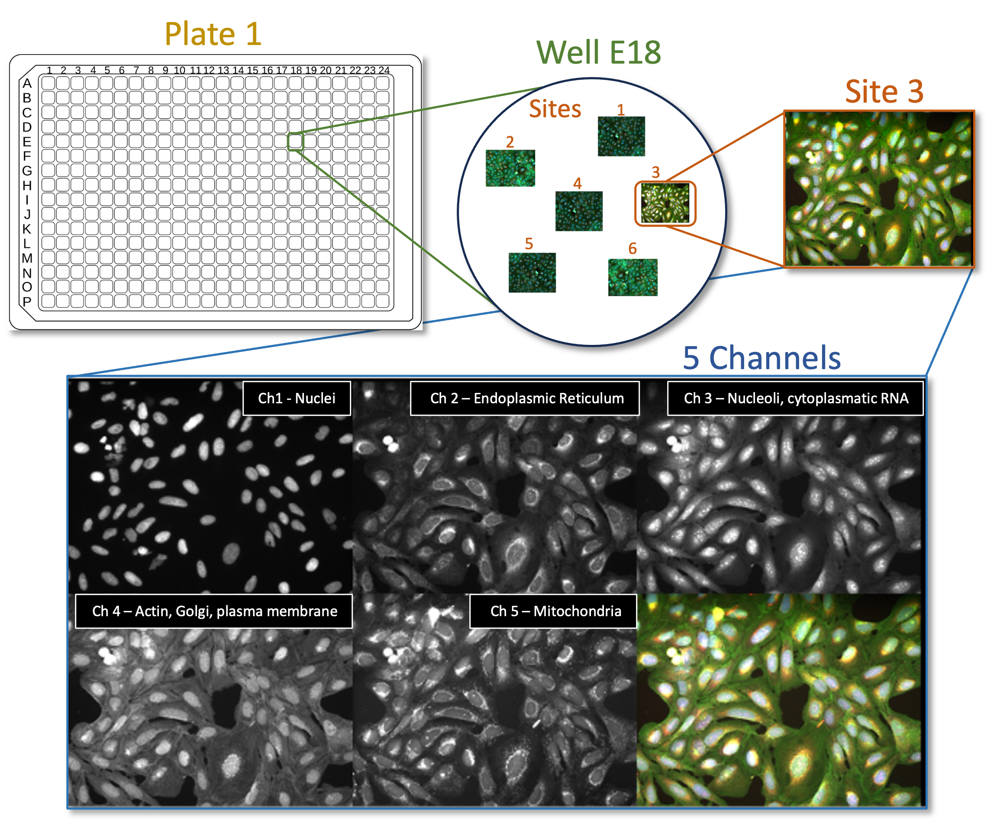
.. |image2| image:: ./TutorialImages/icon.png
   :width: 0.26065in
   :height: 0.26065in
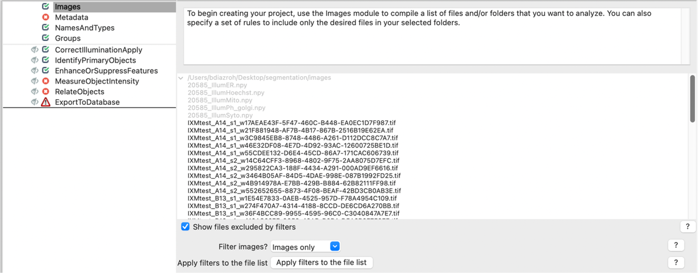
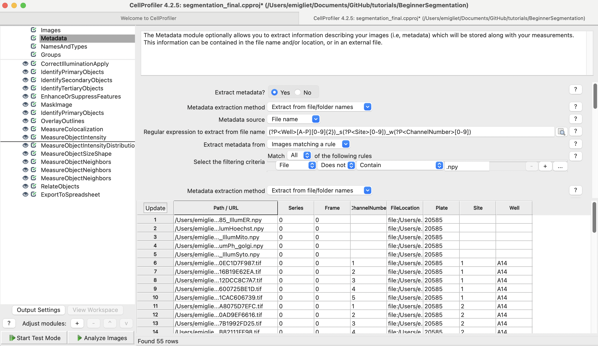
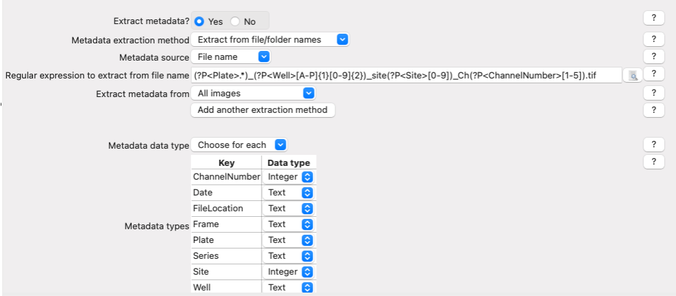
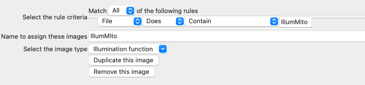
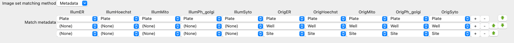
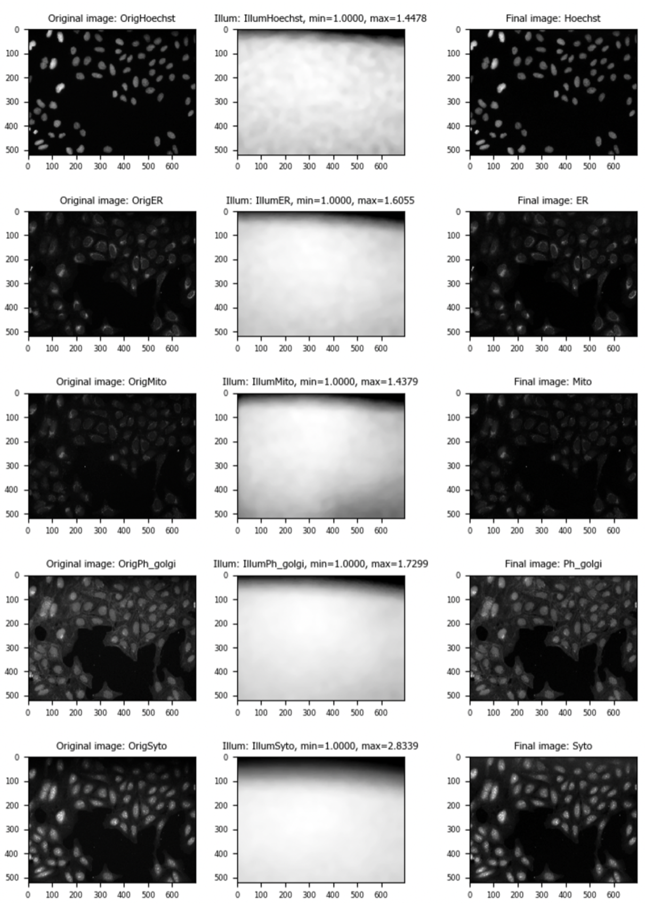
.. |image9| image:: ./TutorialImages/Fig8.png
   :width: 1000
   :scale: 40 %
   :align: middle
.. |image10| image:: ./TutorialImages/Fig9.png
   :width: 1000
   :scale: 70 %
   :align: center
.. |image11| image:: ./TutorialImages/Fig10.png
   :width: 1000
   :scale: 70 %
   :align: center
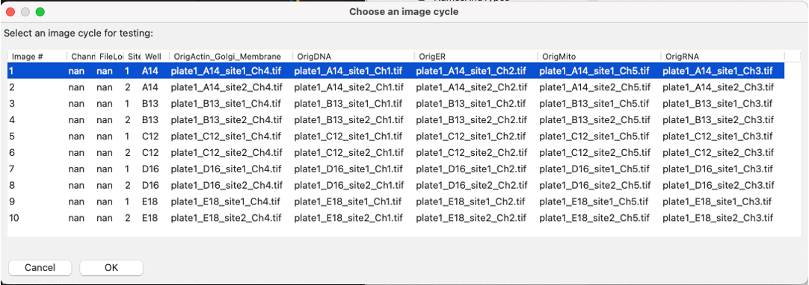
.. |image13| image:: ./TutorialImages/Fig12.png
   :width: 1000
   :scale: 40 %
   :align: center
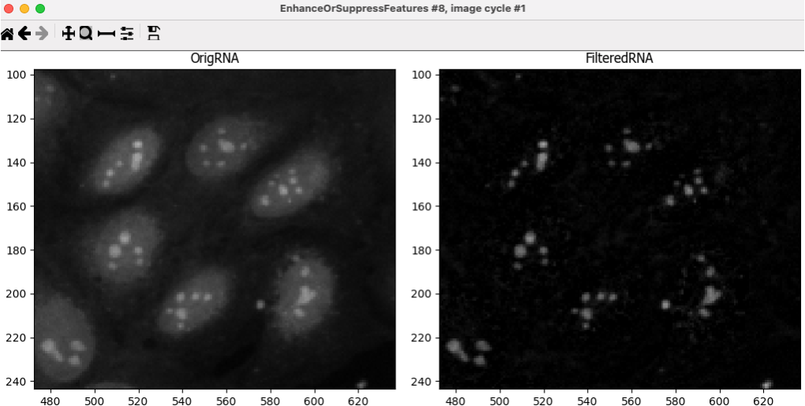
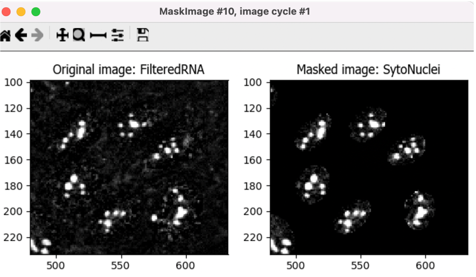
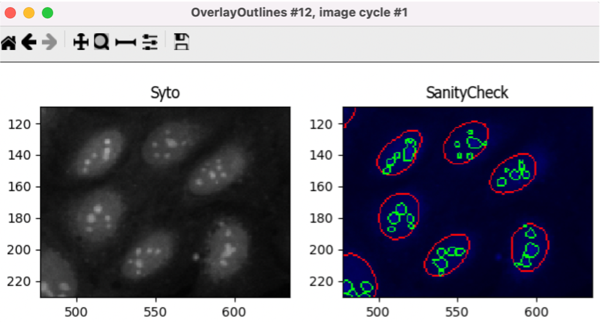
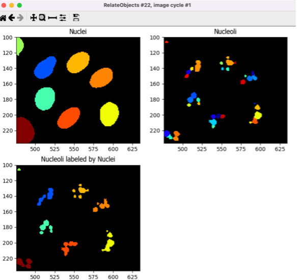
