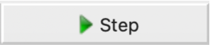

# **UnmixColors tutorial**

The **UnmixColors** module creates separate images per dye stain for histologically
stained images.

This module creates separate grayscale images from a color image stained
with light-absorbing dyes. Dyes are assumed to absorb an amount of light
in the red, green and blue channels that increases proportionally in
each channel with increasing amounts of stain; the hue does not shift
with increasing staining. The module separates two or more stains,
producing grayscale images that look similar to fluorescent images and
thus can be analyzed similarly. There are several pre-set dye
combinations; since the exact dye appearance can vary between users and
due to issues such as lighting conditions, there is also a custom mode
that allows you to calibrate how your dyes look in your exact tissue.
Some commonly known stains are actually mixes of 2 or more dyes and thus
must be specified by all of their individual dye components.

For example:

- Hematoxylin-Eosin: Hematoxylin + Eosin
- Giemsa: Methylene Blue + Eosin

> **Note:** Mixes of single color fluorescent images should be unmixed
with the **ColortoGray** module.

## **Technical notes:**

This module is adapted from the ImageJ plugin, Colour_Deconvolution.java
written by A.C. Ruifrok, whose paper forms the basis for this code.

## **Goals of this exercise:**

In this exercise, we will guide you to separate stained samples through
the UnmixColors module using reference absorbances and calculate your
absorbance in the Custom mode.

## **Materials necessary for this exercise:**

- Histopathological image of parathyroid adenoma. Hematoxylin and eosin
  : stain in a slide.

**Example 1:** Parathyroid Adenoma
<br>
  
        /…/Input/Exampe1Parathyroid_Adenoma.jpg

**Example 2:** Parathyroid Adenoma
<br>
  
        /…/Input/Example2Parathyroid_adenoma.jpg

## **Importing data in CellProfiler**

1. Highlight the **Images** module.
2. Drag-and-drop the Example 1 image only into the Images module window.

```{figure} ./images/image13.png
:width: 600
:align: center
```

3. Highlight the **NameAndType** module.

Assign a name to: All images

Select the image type: Color image

1. Assign the images “variable names” that describe the contents in the
   : image. For example, use the name "HE" or "Hematoxylin-Eosin" or
     something else that will remind you what the image is.
2. Hit the **"update"** button to populate

```{image} images/image11.png
:width: 600
:align: center
```

## The **UnmixColors module:**

Add the **UnmixColor** module to the pipeline. Double click or right
click on the white rectangular area below Groups or click the **+** button
in front of the Adjust modules, this pops up the Add modules window,
search the **UnmixColors** module and double click in it.

```{image} images/image1.png
:width: 600
:align: center
```
<br>
Using the **UnmixColors** module, try to separate the hematoxylin from
the eosin staining in this new example.

- Select the input color image: HE (or whatever the name you give for
  : your images in **NamesAndTypes** module)
- Name the output image as Hematoxylin
- Choose the Stain as Hematoxylin
- Add another stain
- Name this new output image as Eosin
- Choose the Stain as Eosin

> **Tip: Use the  to learn more or if you have questions.**

```{image} images/image14.png
:width: 600
:align: center
```

Hit the  (left bottom of the window) and test your **UnmixColor** module pressing the  button. The result of the **UnmixColors**
module should pop-up and show you a Hematoxylin image (Nucleus) and an Eosin image (cytoplasm).

```{image} images/image8.png
:width: 600
:align: center
```

**Note:** If there are other cells/components that you also want to
separate by color, choose the stain that most closely resembles the
color you want. Please note that if you are looking to simply split a
color image into red, green and blue components, use the **ColorToGray**
module rather than **UnmixColors**. The  button to the right of Stain can help you choose the correct Stain.

```{image} images/image4.png
:width: 600
:align: center
```

**Tip: The image tools on the top toolbar may be helpful to see the
details on your image/objects:**

```{image} images/ImageToolbar.png
:width: 400
:align: center
```

The 1st icon from the left lets you reset the view back to the original
view.

The 2nd and 3rd icons let you step backwards and forwards through any
changes you made to the view.

The 4th icon lets you change the view by moving in any direction in the
display, by clicking and dragging.

The 5th icon lets you change the view by zooming, by dragging and
drawing a box to zoom in on.

Zoom in on the image in order to see the quality of the separation.

```{image} images/image7.png
:width: 600
:align: center
```

Most of the time the Stain settings does a good job with the standard
Stain, but If you are not happy with your results you can try different
combinations of stains to match the structure/color you want to segment
later.

For example you can right-click the **UnmixColors** module and Duplicate it in your pipeline.

Change the Hematoxylin stain for Feulgen Stain and the Eosin Stain for
Azocarmine. 
> **(!) Remember to rename the output images to stay Hematoxylin and Eosin**

Observe the difference between the first and the second separation.

```{image} images/image6.png
:width: 600
:align: center
```

**Now let’s try another example of the same type of tissue and staining
(Example 2 image):**

Please go back to your **Images** Module

1\. Clear the file list (Right click inside the file box -> click in the
last option Clear File List)

2. Drag and drop the Example 2 image.

Hit run to run your two **UnmixColors** modules to try to separate the
hematoxylin from the eosin staining in this new example.

```{image} images/image5.png
:width: 600
:align: center
```
<br>

## **Common issues and troubleshooting:**

Sometimes the same kind of tissue stained in different days or acquired
in different illumination conditions will produce different patterns of
absorbance and none of the Stain combinations results in a proper stain
separation even in slides of similar tissues stained with the same dyes.

If this happens, you can try other combinations, or choose the custom
Stain option. In this case there are two options, input the RGB
absorbance values if known or, far more commonly, estimate it using
small cropped image regions where only one of your stains is present
(region that contains the color absorbance of interest, purple and pink
in this image).

```{image} images/image9.png
:width: 600
:align: center
```

If you choose the second option, we suggest you make the cropped
absorbance images in FIJI. (Open your image in FIJI, zoom in the region
of interest and duplicate small regions where only one of your stains is
present \[in this case, one purple and another pink region\] and save
these images);

While we encourage you to do this step yourself in FIJI, we do provide
reference images you can try
(UnmixColorsTutorial/CustomReferenceImages/)

```{image} images/image10.png
:width: 600
:align: center
```
<br>

CellProfiler can then use this to estimate your RGB absorbance.

Inside the **UnmixColors** module when you choose the **Custom Stain**
option a new option will appear, the ‘Estimate absorbance from image’
button, so you can click on it and choose the purple or pink image to
estimate the RGB absorbance. Cell Profiler will automatically calculate
the absorbance for you.

After estimating both Stains you can now test the color separation using
the Test Mode.

```{image} images/image2.png
:width: 600
:align: center
```

> **Note:** If the resulting image doesn’t match your expectation you can
try again using other regions to estimate your RGB absorbance.

### **Congratulations, you finished the Unmix Colors Tutorial.**

## **References:**

<https://cellprofiler-manual.s3.amazonaws.com/CellProfiler-4.2.1/modules/imageprocessing.html>

Ruifrok AC, Johnston DA. (2001) “Quantification of histochemical
staining by color deconvolution.” Analytical & Quantitative Cytology &
Histology, 23: 291-299.

## **Images sources:**

> **Example 1**: Parathyroid Adenoma 6 by euthman.jpg ([CC
2.0](https://creativecommons.org/licenses/by/2.0/), 1148 x 765
pixels, file size: 441 KB,
<https://www.flickr.com/photos/euthman/4703621316/in/photolist-8aDhKf>)

> **Example 2**: Parathyroid_adenoma_histopathology\_(2).jpg ‎([CC
3.0-SA](https://creativecommons.org/licenses/by-sa/3.0/deed.en), 600
× 452 pixels, file size: 172 KB,
<https://commons.wikimedia.org/wiki/File:Parathyroid_adenoma_histopathology_(2).jpg>)
