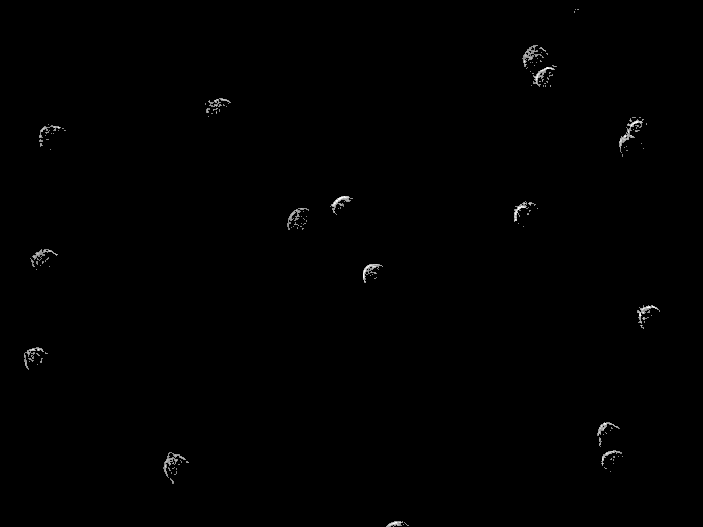
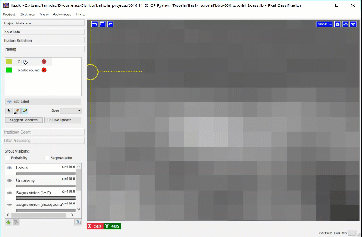
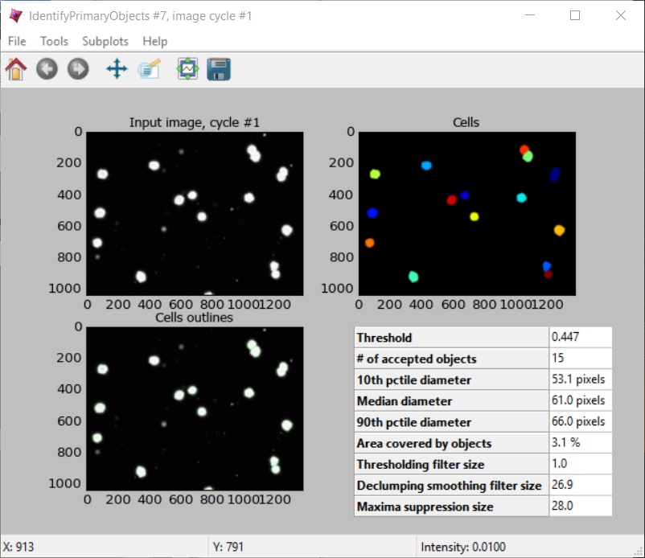

# CellProfiler Tutorial: pixel-based classification

# Introducing Ilastik

CellProfiler is capable of accurate and reliable segmentation of cells by utilizing a broad collection of classical image processing methods. Peruse the documentation on the [IdentifyPrimaryObjects](http://d1zymp9ayga15t.cloudfront.net/CPmanual/IdentifyPrimaryObjects.html) module, for example, to get a sense of these, e.g., thresholding, declumping, and watershed. However, despite the many problems CellProfiler can readily solve, certain types of images are particularly challenging. For instance, when the biologically relevant objects are defined more by texture and context than raw intensity many [classical image processing techiques](http://a.co/dYfHezt) can be foiled; DIC images of cells are a common biological example.

Thankfully, machine learning, particularly [pixel-based classification](https://en.wikipedia.org/wiki/Contextual_image_classification) has yielded powerful techniques that can often solve these challenging cases. [ilastik](http://ilastik.org/) is an open-source tool built for pixel-based classification, and, when combined with CellProfiler, the range of biology that can be quantified from images is greatly expanded beyond monocultures of monolayers to include increased complexity such as tissues, organoids, or [co-cultures](https://www.ncbi.nlm.nih.gov/pubmed/26687239).

Now, let’s take a look at how ilastik can be used together with CellProfiler!

# I. DIC conundrum

Consider segmenting DIC images, such as those within the imageset [BBBC030](https://data.broadinstitute.org/bbbc/BBBC030/). The goal will be to identify individual Chinese Hamster Ovary (CHO) cells and the regions they occupy.

A straightforward thresholding of this image yields poor results, because the cells have almost the same pixel intensity values (and sometimes even darker!) as the background. There is therefore no true foreground for these cells based solely upon an intensity histogram. Thresholding renders the CHO cells into moon-like crescents. While these fragments could be useful for simple cell counting, most metrics of morphology will be inaccurate. Now, note that there is a module, EnhanceOrSuppressFeatures, that is specifically capable of transforming DIC images into something that is readily segmented. But let's pretend for a moment we didn't have that option...

1. Open CellProfiler.
1. Drag-and-drop a BBBC030 image into the **Images** module.
1. Add the **ApplyThreshold** module to the pipeline. The input to the module will be the image placed in the Images module by default.
1. Run the pipeline and take not of the output.

# II. Pixel-based classification with ilastik

ilastik employs pixel-based classification and complements CellProfiler. The CHO cells within the DIC image are obvious to the human eye, because we can discern that each cell is defined by a characteristic combination of light and dark patterns. These same patterns can be detected with the machine-learning algorithms within ilastik.

The machine-learning implemented by ilastik requires user annotation about what is background and what is a CHO cell before it can automatically make this determination across a set of images. ilastik provides a user interface for labeling, tagging, and identifying the objects of interest within an image. This annotation creates what is referred to in machine learning as a training set.

## Annotation with 2 Labels

1. Open ilastik
1. Start a *Pixel Classification* project.
1. Load a BBBC030 image by drag-and-drop into the **Input Data** window.

    Now explore the image within the ilastik gui. Here are some shortcuts that may prove useful are:
      * *Ctrl + mouse-wheel* = zoom.
      * The keyboard shortcut *Ctrl-D* will show the grid Ilastik uses to partition the image for processing.
      * Zoom-in far enough that the grid is no longer visible. This will speed up the *Live Update*.

    Begin by labeling pixels for two classes: a background class and a CHO cell class.

1. Open the **Training** window.
1. Click the **+** button of the Training window to add a label. Add two labels named *background* and *CHO*.
1. Using the paint brush tool, label pixels (one at a time) for each class until you are satisfied with the segmentation.

We recommend creating labels for each class one pixel at a time, rather than by making scribbles, to minimize the chance of [over-fitting](https://en.wikipedia.org/wiki/Overfitting), i.e. too much information about any given area can cause classification to do poorly in other slightly-dissimilar areas. To label one pixel at a time, we’ll need to zoom in far enough to resolve the individual pixels in the image. The image below shows how closely we must view individual cells before the pixels of the image become clear.

Using a brush size of 1, we click a single pixel from each class: one within a single CHO cell and the other in the surrounding background. In the next image, the annotation color of the CHO cell is yellow and the annotation color of the background is green. Activating *Live Update* reveals the segmentation looks similar to the results from thresholding. This outcome is promising considering this classification was determined by 1 feature and 1 pixel each for the *CHO* and *background* labels.

Adding more labels, one pixel at a time, we continue to refine the segmentation. Toggling the *Segmentation* and *Uncertainty* views provides real-time feedback that can guide the labeling process. Areas of high uncertainty will be aqua-blue, so annotating those areas will be most beneficial to training the program which pixels belong to which class. You should also view the predicted segmentation, and annotate pixels that are not currently segmented properly.

Continue until it seems that additional labels do not change the results, or a subset of the pixels begin “flipping” between CHO cell and background. Check and label other cells in the image, as well as in other images, to make sure the diversity in your experiment is represented in the training set.

## Export the probability maps

When satisfied with the results, export the probability maps.

1. Open the **Prediction Export** window.
1. Click the **Choose Export Settings** window.
1. Change **Transpose to Axis Order** to `cyx`.
1. Change **Format** to `tiff sequence`.
1. Close the export settings dialog box and click the **Export All** button.

# III. Segmenting probabilities with CellProfiler

The probability map images created with ilastik can then be processed by CellProfiler to identify and measure the CHO objects within the DIC images. The probability map images are grayscale images and can be treated as if they were the result of a “stain” for the cells.  In other words, we have transformed the patterns and texture of intensity in the DIC image into an image where the intensity reflects the likelihood that a given pixel belongs to a cell. The image below demonstrates how the IdentifyPrimaryObjects module successfully segments all the CHO cells.

1. Open CellProfiler.
1. Load the *pixel_based_classification.cpppipe* pipeline file.
1. Add the exported probability maps to the **Images** module.
1. Run the pipeline and review the segmentation.

# IV. Pixel classification with multi-channel images

## Annotate the images

1. Create a TIFF stack of 3 mouse images using FIJI.
  1. Image > Stacks > Images to Stack
1. Save the stack as a TIFF file.
1. Start a new ilastik pixel classification project.
1. Drag-and-drop the stack into the Input Data window.
1. Right-click the image and **Edit Properties**. Change the axes to `cyx`.
1. In the training window create 6 labels:
    * background
    * background_between_cells
    * bright_spots_in_blue_cells
    * blue_cells
    * red_cells
    * green_cytoplasm
1. Annotate the image adding a few pixels for each class. Then follow the single-pixel method introduced earlier.
1. When you're satisfied with your results, export the probability maps.

## Segment the probability maps

Let's segment the red cells.

1. Open CellProfiler
1. Add the 5th probability image and the raw images to the **Images** module.
1. Configure **NamesAndTypes** such that there are 4 images in each set: The 3 raw images and the probability map for red cells.
1. Add the **IdentifyPrimaryObjects** module to the pipeline and segment the probability map.
1. Add the **GrayToColor** module and assign each raw image to a color R, G, or B.
1. Add the **OverlayOutlines** module to the pipeline. Overlay the red cells objects onto the color image. Review the accuracy of the segmentation.
